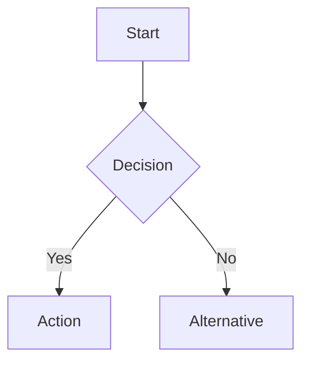

# Obsidian Vault Manager

Create and manage Obsidian-compatible markdown files with proper syntax, linking, and vault conventions.

## Why This Skill Exists

Standard markdown and Obsidian markdown are different. Obsidian uses wiki-links `[[like this]]`, has its own callout syntax, supports YAML frontmatter for metadata, and works with plugins like Dataview and Templater. This skill ensures Claude produces notes that work natively in Obsidian without manual fixing.

## Core Obsidian Syntax

### YAML Frontmatter

Every note should start with frontmatter. Use it for metadata that Obsidian and plugins (Dataview, Templater) can query:

```yaml
---
title: Note Title
created: 2026-02-07
updated: 2026-02-07
tags:
  - tag1
  - tag2
status: draft | active | complete | archived
type: note | project | meeting | daily | moc | reference
aliases:
  - Alternative Name
cssclasses: []
---
```

Key rules:
- Tags in frontmatter use `tags:` array (no `#` prefix)
- Inline tags in body text use `#tag` syntax
- Date format: `YYYY-MM-DD` (Obsidian standard)
- Keep frontmatter clean — only include fields that are actually used

### Wiki-Links (NOT standard markdown links)

Obsidian uses wiki-links for internal references. Always prefer these over standard markdown links for internal vault references:

```markdown
[[Note Name]]
[[Note Name|Display Text]]
[[Note Name#Heading]]
[[Note Name#Heading|Display Text]]
```

For external URLs, use standard markdown links: `[Display Text](https://example.com)`

### Embedded Content

```markdown
![[Image.png]]
![[Image.png|400]]           <!-- width constraint -->
![[Another Note]]             <!-- embed entire note -->
![[Another Note#Section]]     <!-- embed specific section -->
```

### Callouts

Obsidian uses a specific callout syntax (not standard markdown blockquotes):

```markdown
> [!note] Title
> Content of the callout

> [!warning] Important
> This is a warning callout

> [!tip] Pro Tip
> Helpful information

> [!question] Open Question
> Something to investigate

> [!example] Example
> Demonstration content

> [!info] Context
> Background information

> [!abstract] Summary
> Brief overview

> [!todo] Action Required
> Task description
```

Foldable callouts (collapsed by default):
```markdown
> [!note]- Collapsed Title
> This content is hidden until clicked
```

### Tags

Two styles, both valid:
```markdown
# In frontmatter (preferred for categorisation)
tags:
  - project/act
  - status/active

# Inline (preferred for contextual tagging)
This relates to #storytelling and #empathy-ledger
```

Nested tags use `/` separator: `#project/act-farm`, `#status/in-progress`

### Task Lists

```markdown
- [ ] Unchecked task
- [x] Completed task
- [/] In progress
- [-] Cancelled
```

### Dataview Queries

If the vault uses the Dataview plugin:

````markdown
```dataview
TABLE status, updated
FROM #project
WHERE status != "archived"
SORT updated DESC
```

```dataview
LIST
FROM [[]]
WHERE type = "meeting"
SORT created DESC
LIMIT 10
```

```dataview
TASK
FROM "Projects"
WHERE !completed
GROUP BY file.link
```
````

### Mermaid Diagrams

Obsidian renders Mermaid natively:

````markdown

````

## Note Templates

### Project Note

```markdown
---
title: Project Name
created: YYYY-MM-DD
updated: YYYY-MM-DD
type: project
status: active
tags:
  - project
  - project/project-name
---

# Project Name

## Overview
Brief description of the project.

## Goals
-

## Current Status

> [!info] Status as of YYYY-MM-DD
> Summary of where things stand.

## Key Links
- Repository: [GitHub](url)
- Live: [URL](url)
- Related: [[Related Project]]

## Notes

## Tasks
- [ ]

## Related
- [[Person involved]]
- [[Meeting about this]]
```

### Meeting Note

```markdown
---
title: Meeting — Topic
created: YYYY-MM-DD
type: meeting
attendees:
  - "[[Person Name]]"
tags:
  - meeting
  - project/relevant-project
---

# Meeting — Topic

**Date:** YYYY-MM-DD
**Attendees:** [[Person 1]], [[Person 2]]
**Related:** [[Project Note]]

## Agenda
1.

## Notes

## Decisions
-

## Actions
- [ ] @[[Person]] — Action item — Due: YYYY-MM-DD

## Follow-up
- Next meeting:
```

### Person Note

```markdown
---
title: Person Name
created: YYYY-MM-DD
type: person
organisation:
role:
tags:
  - person
  - org/organisation-name
last_contact: YYYY-MM-DD
relationship: partner | funder | advisor | storyteller | team
---

# Person Name

## Context
How we know them, what they care about.

## Interactions
- **YYYY-MM-DD** — [[Meeting Note]] — Summary

## Related
- [[Organisation]]
- [[Project]]
```

### Map of Content (MOC)

```markdown
---
title: Topic MOC
created: YYYY-MM-DD
type: moc
tags:
  - moc
  - topic
---

# Topic Name

## Overview
Brief description of this knowledge area.

## Key Notes
- [[Note 1]] — brief description
- [[Note 2]] — brief description

## Sub-Topics
### Sub-Topic A
- [[Note 3]]
- [[Note 4]]

## Related MOCs
- [[Other MOC]]
```

### Daily Note

```markdown
---
title: "YYYY-MM-DD"
created: YYYY-MM-DD
type: daily
tags:
  - daily
---

# Day Name, Month D, YYYY

## Focus Today
-

## Notes

## Tasks
- [ ]

## End of Day
### What went well
### What needs attention
```

## Vault Organisation

Recommended folder structure:

```
vault/
├── 00-Inbox/              # Quick capture, unsorted
├── 01-Daily/              # Daily notes
├── 02-Projects/           # Active project notes
├── 03-Areas/              # Ongoing areas of responsibility
├── 04-Resources/          # Reference material
├── 05-Archive/            # Completed/inactive
├── 06-Meetings/           # Meeting notes
├── 07-People/             # Person notes
└── Maps/                  # Maps of Content (MOCs)
```

## File Naming Conventions

- Descriptive names: `Empathy Ledger Strategy.md` not `EL-001.md`
- Dates in filenames for temporal notes: `2026-02-07 Meeting with NIDA.md`
- No special characters except hyphens and spaces
- Title case: `C-Suite Agent System.md`

## When Creating Obsidian Notes

1. Always include YAML frontmatter with at least `title`, `created`, `type`, and `tags`
2. Use wiki-links `[[]]` for all internal references
3. Use callouts `> [!type]` for structured information blocks
4. Include a `## Related` section with wiki-links at the bottom
5. Use Dataview-compatible frontmatter fields so notes are queryable
6. Link generously — Obsidian's graph view rewards dense linking
7. Use `#tag/subtag` for hierarchical categorisation
8. Write the `.md` file to the workspace folder and provide a `computer://` link
