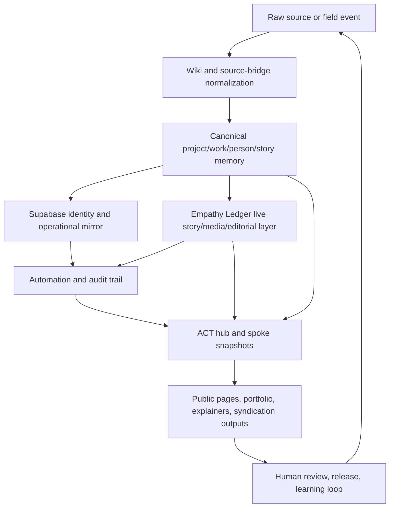

# Living Ecosystem System - Execution Brief

> [!abstract] Purpose
> This is the top-level brief for turning ACT's current hub, wiki, Empathy Ledger, Supabase, and spoke sites into one living ecosystem system that updates itself more reliably and reduces manual publishing/admin effort.

## Executive Read

The architecture already exists in principle and partly in code:

- the wiki/Obsidian graph is the durable memory
- Empathy Ledger is the live story, media, and editorial layer
- Supabase is the operational ledger and automation runtime
- the ACT public hub is the face

The problem is not lack of ideas. The problem is convergence.

Right now the system still relies on:

- split repos with overlapping canon
- script-driven syncs spread across multiple codebases
- partial automation instead of one orchestrated loop
- human knowledge living in too many places at once

The goal is to turn that into one operating system:

1. capture new knowledge once
2. normalize it once
3. update the right canonical object once
4. propagate it to hub, spokes, portfolio, and share outputs automatically
5. keep humans only at the trust, narrative, and release boundaries

## Verified System Shape

### Durable memory

The ACT knowledge model already follows the Karpathy-style LLM knowledge-base pattern:

- raw/source capture
- bridge summaries
- canonical markdown wiki
- synthesis artifacts

See:
- [[02-wiki-obsidian-living-knowledge|ACT Wiki + Obsidian Living Knowledge OS]]

### Public composition

The public ACT hub is already being framed as a living system rather than a static brochure:

- hub pages
- ecosystem page
- projects
- wiki
- ask
- art/works

See:
- [[05-public-hub-spokes-and-art-portfolio|Public Hub, Spokes, and Art Portfolio]]

### Live content layer

Empathy Ledger already has the right primitives for:

- story and media packaging
- editorial selections
- scheduled publishing
- syndication
- consent and revocation

See:
- [[04-agentic-publishing-and-syndication|Agentic Publishing and Syndication]]

### Operational ledger

Supabase already acts as the runtime system for:

- sync state
- identities and permissions
- queued automation state
- audit trails and webhook processing

See:
- [[03-data-sync-and-ledger|Data Sync and Ledger]]

### Human trust boundaries

Human checkpoints are already clearly necessary at:

- naming and canon
- public narrative
- cultural safety and consent
- release approval
- regression and production verification

See:
- [[06-human-requirements-and-testing|Living Ecosystem Site - Human Requirements and Testing]]

## Core Problem Statement

The system is conceptually correct but operationally fragmented.

That fragmentation currently shows up as:

- multiple repos that still imply different "centers"
- canon drift between what docs say is primary and what still exists on disk
- generated snapshots without one visible orchestration owner
- too much manual movement between knowledge, content, media, and public release

## Target System

## The Five Workstreams

### 1. Canon convergence

Decide and enforce:

- which repo/site is the umbrella hub
- which repos are live spokes
- which repos are legacy, archive, or sandboxes
- which surfaces are canonical versus generated mirrors

### 2. Knowledge operating system

Standardize:

- source capture
- bridge notes
- canonical note ownership
- update rules for projects, works, people, and story memory

### 3. Data and ledger orchestration

Build one explicit write sequence:

- resolve identity
- validate schema
- write primary record
- append ledger
- trigger mirrors and hooks

### 4. Public hub, spokes, and portfolio

Make the public system coherent:

- hub as front door
- spokes as contextual surfaces
- works/portfolio as reusable public objects
- cross-site navigation that stays legible

### 5. Agentic publishing

Turn one approved source packet into:

- story draft
- editorial excerpt
- image explainer
- video explainer
- share copy
- syndication payloads

## Human Requirements

These are the minimum human decisions still required:

1. Name the canonical umbrella hub and archive policy.
2. Decide which site owns canonical work copy.
3. Decide who approves public-facing generated copy.
4. Decide who signs off cultural safety and consent-sensitive publishing.
5. Decide what can auto-publish versus queue for review.
6. Decide the release captain / QA owner roles for this system.

Full governance details:
- [[06-human-requirements-and-testing|Living Ecosystem Site - Human Requirements and Testing]]

## Testing Requirements

The system is not done unless it is testable across layers.

Minimum required verification:

- targeted type/build checks on touched lanes
- preview browser checks for hub/spoke/portfolio paths
- live-content verification from EL-derived feeds
- schema and identity verification for data writes
- release-gate sign-off before production
- post-release monitoring and rollback rules

Full testing matrix:
- [[06-human-requirements-and-testing|Living Ecosystem Site - Human Requirements and Testing]]

## Recommended Execution Order

### Phase 1 - Converge canon

- declare primary hub, primary spokes, and archive set
- stop repo-level ambiguity
- document one public-system map

### Phase 2 - Lock the knowledge contract

- formalize bridge-note and canonical-note rules
- define the canonical project/work/person/story packet
- stop identity drift upstream

### Phase 3 - Build the orchestrator

- one job graph for syncs and propagation
- one append-only ledger pattern
- one retry/error model

### Phase 4 - Build the publishing packet

- source packet schema
- story/media/explainer/share outputs
- human approval at the right boundaries

### Phase 5 - Harden the public system

- unify hub/spoke navigation
- connect portfolio objects cleanly
- make public pages update from canonical snapshots and approved live signals

## Deliverables Produced By The Agent Swarm

- [[02-wiki-obsidian-living-knowledge|ACT Wiki + Obsidian Living Knowledge OS]]
- [[03-data-sync-and-ledger|Data Sync and Ledger]]
- [[04-agentic-publishing-and-syndication|Agentic Publishing and Syndication]]
- [[05-public-hub-spokes-and-art-portfolio|Public Hub, Spokes, and Art Portfolio]]
- [[06-human-requirements-and-testing|Living Ecosystem Site - Human Requirements and Testing]]

## Practical Next Step

The next best move is not more ad hoc backend cleanup.

It is a short implementation sprint that produces:

1. a canonical repo/surface map
2. a canonical source packet schema
3. one orchestrated sync/publish job
4. one portfolio object model
5. one release checklist that humans can actually run

Once those exist, the system can start compounding instead of being hand-carried.
