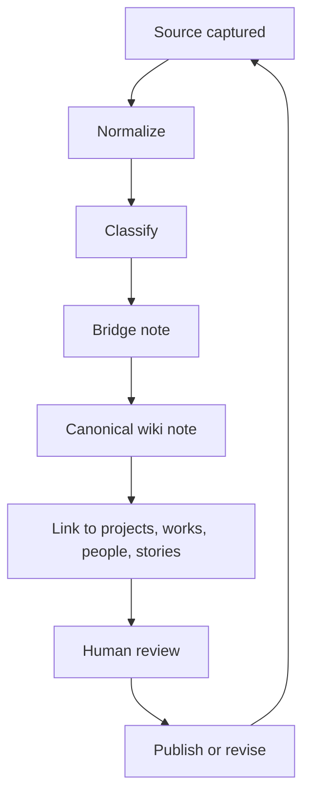

# ACT Wiki + Obsidian Living Knowledge OS

> [!info] Purpose
> This note defines the operating model for [[ACT wiki]], [[Obsidian]], and a Karpathy-style living knowledge system: one where source material, project memory, people memory, and story memory are continuously normalized into a linked, reviewable, human-steered knowledge graph.

## Current state (verified)

- The ecosystem already uses a source/compiled split: raw inputs, working notes, and generated outputs are separate artifacts.
- Obsidian-compatible notes are used for durable handoffs and long-lived context.
- ACT concepts are linkable as wiki-links, which makes notes navigable and composable.
- The knowledge system must remain provenance-aware: every claim should still be traceable to a source note, doc, meeting, repo, or database record.
- Canonical updates still need a human decision for naming, scope, privacy, and publication.

## Target state

- One living knowledge layer across projects, works, people, and stories.
- Every important source becomes either:
  - a canonical wiki note, or
  - a bridge note that points to a canonical note and preserves provenance.
- New facts should update the minimum canonical node, then propagate by link.
- Generated notes should be queryable, reviewable, and safe to refresh without losing context.

## Ingestion loop

### Loop steps

1. Capture the source.
2. Normalize names, dates, entities, and claims.
3. Classify the source type: project, work, person, story, decision, or reference.
4. Create or update a bridge note with provenance.
5. Update the canonical note if the source changes meaning or priority.
6. Link from related notes instead of duplicating content.
7. Mark what changed and what is still pending human approval.
8. Re-ingest when the source changes.

## Source-bridge model

Use a two-layer structure:

- Source note: raw or near-raw capture, with provenance, timestamps, and quotes.
- Bridge note: the normalization layer that maps source material into the ACT knowledge graph.

### Why this matters

- Source notes preserve evidence.
- Bridge notes preserve meaning.
- Canonical notes preserve the current truth.
- This keeps [[wiki]] useful without making it a pile of unverified summaries.

### Bridge note responsibilities

- Identify the source.
- Record what changed.
- Map source entities to canonical entities.
- Record unresolved ambiguity.
- Link to the canonical page that should receive updates.

## How the memory domains should update

### Projects

- Update when scope, status, owner, milestone, or decision changes.
- Keep a single canonical project page per project.
- Add links to active code, deploys, docs, and decisions.
- Record the latest verified status at the top.

### Works

- Update when a tangible output changes: article, brief, page, note, deck, design, deployment, or artifact.
- Keep the work page focused on what shipped or was produced.
- Link the work back to its project, people, and source notes.

### People

- Update when role, involvement, consent, affiliation, or preferred naming changes.
- Keep person notes identity-first and consent-aware.
- Separate facts, claims, and relationship context.
- Avoid rewriting a person note from a single transient source unless it is verified.

### Story memory

- Update when a narrative is repeated, clarified, or canonized.
- Store the story as a sequence of claims, not a blob of prose.
- Preserve quotes, dates, and speaker/source attribution.
- Keep story memory linked to project, people, and source evidence.

## Human requirements and decisions

> [!warning] Human gate
> The system should never silently promote a note to canonical status without a human decision.

- Humans decide canonical names and aliases.
- Humans decide what is public, private, or internal only.
- Humans decide whether a claim is factual, provisional, or disputed.
- Humans decide when a bridge note can overwrite a canonical note.
- Humans decide when a source is too weak to ingest.
- Humans decide whether a story is a lived account, a working hypothesis, or a published narrative.

## Implementation rules

- Prefer links over duplication.
- Prefer narrow updates over full rewrites.
- Prefer bridge notes for ambiguous or changing material.
- Prefer one canonical note per entity.
- Prefer provenance over convenience.
- Prefer human review before publication.

## Testing and verification checklist

- [ ] Note starts with valid YAML frontmatter.
- [ ] Internal references use wiki-links, not markdown links.
- [ ] Every major claim can point to a source.
- [ ] Bridge note names the source and the canonical target.
- [ ] Project, work, person, and story updates are separated.
- [ ] Human decisions are explicit where publication, naming, or privacy is involved.
- [ ] No note duplicates canonical content without a reason.
- [ ] Update timestamps are current.
- [ ] Links resolve to the intended ACT concept notes.
- [ ] The note can survive a re-ingestion pass without losing provenance.

## Operating rule of thumb

If a fact matters tomorrow, put it in a canonical note. If a fact is still moving, put it in a bridge note first. If a fact is uncertain, keep it source-bound until a human decides.
