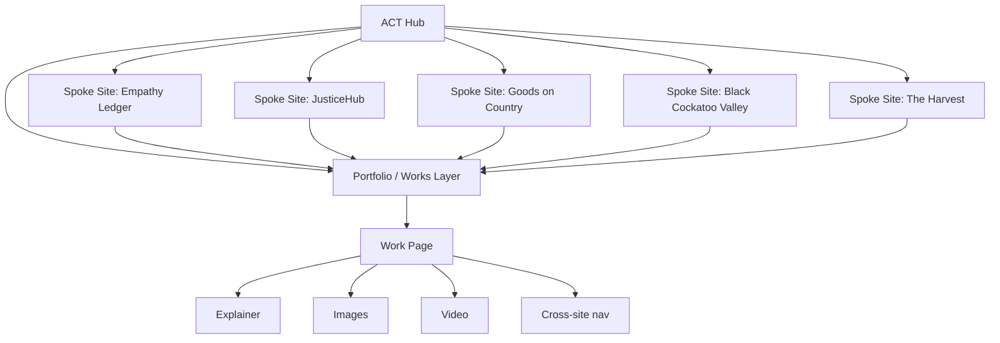

# Public Hub, Spokes, and Art Portfolio

## Summary
The public-facing architecture is a hub-and-spoke system:
- the ACT hub is the editorial front door
- spoke sites carry distinct project identities
- the portfolio/works layer is the shared public catalogue
- cross-site navigation keeps the ecosystem legible
- the art portfolio packages explainers, images, and video as first-class public objects

## Current State (Verified)
> [!info] Verified live
> The ACT public hub and spoke surfaces are live in production, and the flagship public section renders on the current deploys.

- [ACT hub](https://act-regenerative-studio.vercel.app/projects) is live and shows the public flagship section.
- [Empathy Ledger](https://empathyledger.com/) is live and shows the public flagship fields / CTA surface.
- The public surface now behaves as a shared ecosystem entry point rather than isolated pages.
- The hub/spoke pattern is already visible in production; this is not a greenfield concept.

> [!note] Not fully verified yet
> The dedicated portfolio/works layer is defined as the next public-architecture step. The architecture is in place conceptually, but every media-rich work page still needs final content QA.

## Target State
The target is one coherent public system:

1. The ACT hub is the canonical top-level gateway.
2. Each spoke site preserves its own tone and audience, but shares a common portfolio model.
3. Every public work has one canonical record, with the ability to appear on multiple spokes.
4. The portfolio layer supports explainers, images, and video without flattening them into generic CMS cards.
5. Navigation always makes the ecosystem legible: hub, spoke, work, related work, back again.

## Information Architecture

### Layers

| Layer | Purpose | What it owns |
|---|---|---|
| Hub | Public front door and ecosystem index | Canonical framing, top-level navigation, featured works |
| Spokes | Project-specific public sites | Local identity, project-specific context, audience-specific entry points |
| Portfolio / Works | Shared catalogue of public works | Canonical work records, metadata, media references, explainer copy |
| Work Page | Individual public item | Title, summary, body explainer, image set, video, related links |
| Media Blocks | Presentation primitives | Alt text, captions, poster frames, loading behavior, fallbacks |

## Portfolio System Behavior

- A work is not just a page; it is a reusable public object.
- A work can live on one spoke, or be referenced across multiple spokes.
- The hub can feature a work without duplicating the work itself.
- Each work should support:
  - a plain-language explainer
  - one or more images
  - optional video
  - related links to sister works or sister spokes
- Media should degrade gracefully:
  - images need alt text
  - video needs poster/fallback copy
  - slow connections should still get the explainer and the core metadata
- The portfolio layer should make it easy to distinguish:
  - what is canonical copy
  - what is local context
  - what is a media asset

## Cross-Site Navigation

Navigation should do three jobs:

1. orient people inside the current site
2. show the wider ecosystem
3. move people between hub, spokes, and portfolio items without confusion

### Required navigation patterns
- Hub header links to major spokes and the portfolio index.
- Spoke headers link back to the hub.
- Work pages include:
  - back to hub
  - back to spoke
  - next / related work
- Footer navigation should repeat the ecosystem structure for low-friction discovery.

### Navigation rules
- Keep labels short and human.
- Do not bury the hub behind a generic "home" label if the page is the ecosystem index.
- Avoid duplicate menus with different meanings.
- Use consistent naming for the same spoke across all surfaces.

## Art Portfolio: Explain, Show, Move

The art portfolio is the public-facing expression of the works layer.

### Required content pattern
- Explainer: why the work exists and what it means.
- Images: one hero image plus supporting images where relevant.
- Video: when motion or voice is central to the work.
- Context note: who it is for, where it lives in the ecosystem, and what the related work is.

### Presentation rules
- The explainer comes before the gallery.
- Images should support the narrative, not replace it.
- Video should have a clear poster frame and a short description.
- If a work is sensitive or community-specific, the copy should say so explicitly.

## Human Requirements / Decisions

> [!question] Decisions that still need humans
> These are not purely technical decisions. They affect public meaning and editorial control.

- Decide which site owns canonical work copy when a work appears on multiple spokes.
- Decide which works are hub-featured versus spoke-only.
- Decide image order, cover image, and preferred video excerpt for each public work.
- Decide how much context is public versus kept for internal notes.
- Decide whether a work is public by default or explicitly published.
- Decide who approves sensitive media before it is exposed publicly.

### Editorial standards
- Every public work needs a clear owner.
- Every image needs alt text.
- Every video needs a caption or description.
- Every public page needs a back path to the hub.
- Every spoke needs a consistent local identity while still reading as part of the same ecosystem.

## Testing / Verification Checklist

- [ ] Hub loads in production and shows the flagship / ecosystem index.
- [ ] Each spoke site loads from a clean browser session.
- [ ] Hub-to-spoke and spoke-to-hub navigation works in both directions.
- [ ] Portfolio index displays the intended works, not stale copies.
- [ ] A work page renders the explainer before media.
- [ ] Image assets load without layout breakage.
- [ ] Video assets load with poster / fallback behavior.
- [ ] Alt text is present for all public images.
- [ ] Mobile navigation still exposes the hub and spoke links.
- [ ] Cross-site links preserve the correct canonical work identity.
- [ ] Sensitive or private works are not exposed on public surfaces.

## Open Questions

- Should the portfolio layer live primarily on the ACT hub, or should each spoke own a local portfolio view that shares the same work records?
- Which works are hub-indexed by default versus hidden unless a spoke surfaces them?
- What is the minimum media bundle for a work to be considered "public ready"?
- How much of the art portfolio should be explanatory text versus media-first browsing?

