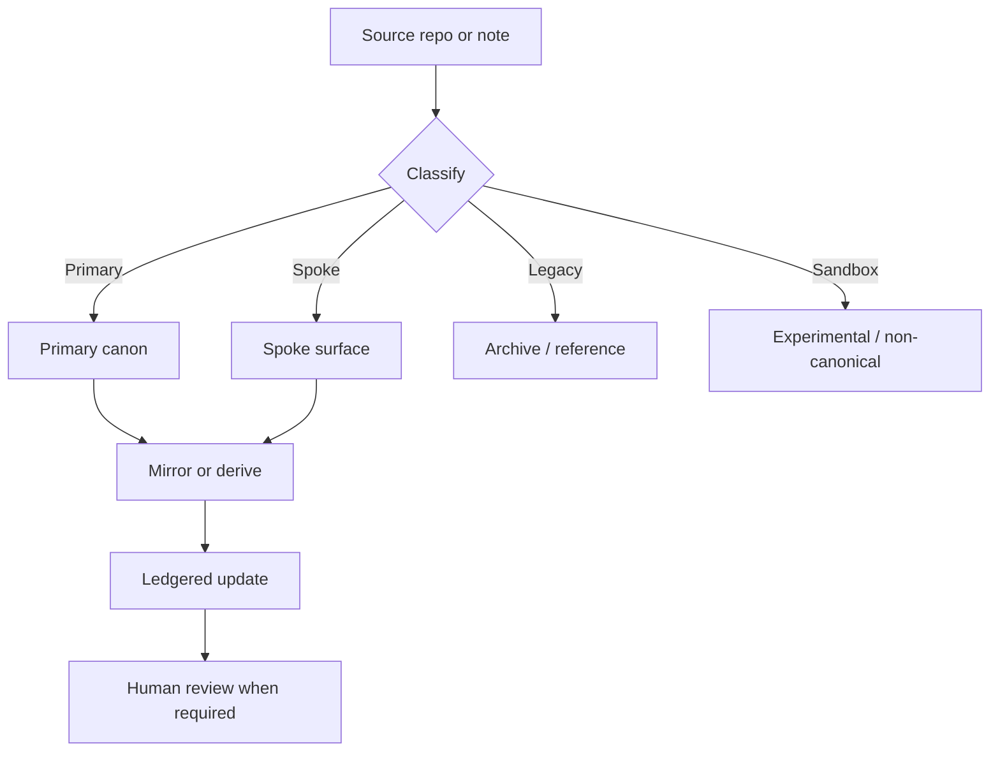

# 08. Phase 1 Canon Convergence Pack

> [!abstract] Scope
> This pack defines the first pass at canon convergence for the living ecosystem system: inventory, classification, archive policy, human decisions, and verification gates.

> [!important] Read order
> Use this note with [[Living Ecosystem System - Execution Brief]], [[03-data-sync-and-ledger|Data Sync and Ledger]], [[04-agentic-publishing-and-syndication|Agentic Publishing and Syndication]], [[05-public-hub-spokes-and-art-portfolio|Public Hub, Spokes, and Art Portfolio]], and [[06-human-requirements-and-testing|Human Requirements and Testing]].

## Current Repo / Site Inventory

### Verified

| Asset | Type | Current role | Evidence |
|---|---|---|---|
| ACT hub | public site | live umbrella front door | Verified live in production in [[05-public-hub-spokes-and-art-portfolio|Public Hub, Spokes, and Art Portfolio]] |
| Empathy Ledger | public site | live content/story spoke | Verified live in production in [[05-public-hub-spokes-and-art-portfolio|Public Hub, Spokes, and Art Portfolio]] |
| Supabase | data platform | runtime ledger and automation store | Verified as the operational ledger layer in [[03-data-sync-and-ledger|Data Sync and Ledger]] |
| Wiki / Obsidian | knowledge layer | durable memory and canonical notes | Verified as living knowledge system in [[02-wiki-obsidian-living-knowledge|ACT Wiki + Obsidian Living Knowledge OS]] |
| Command Center | internal app | operational/admin surface | Verified as the monorepo dashboard lane in the repo conventions |

### Inferred from gathered canon

| Asset | Type | Proposed role | Why this classification fits |
|---|---|---|---|
| JusticeHub | spoke site / project surface | spoke | It belongs in the public ecosystem, but not as the umbrella front door |
| Goods on Country | spoke site / project surface | spoke | It reads as a distinct project identity with its own audience and context |
| Black Cockatoo Valley | spoke site / project surface | spoke | Distinct project voice; should remain legible as a spoke, not a hub |
| The Harvest | spoke site / project surface | spoke | Distinct project voice; should remain legible as a spoke, not a hub |
| ACT wiki | knowledge graph | primary canon source | It is the durable memory layer, not a runtime publishing surface |
| Existing legacy dashboards / historical surfaces | archive | legacy | Reference value only; should not be promoted back into live canon |
| Sandbox or experimental notes / outputs | sandbox | non-canonical | Useful for exploration, not for public or operational truth |

> [!note] Classification rule
> If a surface is public, stable, and intended to carry the ecosystem narrative, classify it as primary or spoke.
> If it exists only to support the system, classify it as supporting infrastructure.
> If it is historical, stale, or superseded, classify it as legacy/archive.
> If it is exploratory or disposable, classify it as sandbox.

## Proposed Canon Classification

### Primary

- ACT hub
- ACT wiki / canonical knowledge graph
- Supabase operational ledger
- Empathy Ledger public content layer where it publishes live flagship/story surfaces

### Spoke

- JusticeHub
- Goods on Country
- Black Cockatoo Valley
- The Harvest

### Legacy

- Archived dashboards
- Superseded content snapshots
- Old canonical copies that are now replaced by living notes or current public surfaces

### Sandbox

- Experiment notes
- temporary drafts
- prototype outputs
- unreleased helper pages

## Human Decisions Needed

> [!question] Decisions that still require humans

1. Confirm the final primary list.
   - Is Empathy Ledger a primary surface or a spoke with elevated public status?
   - Is the ACT wiki primary canon or a supporting primary source?
2. Confirm the spoke list.
   - Are JusticeHub, Goods on Country, Black Cockatoo Valley, and The Harvest all live spokes, or are any of them archive-only?
3. Confirm naming conventions.
   - Which names are canonical, which are aliases, and which are display-only?
4. Confirm archive boundaries.
   - What is truly legacy versus what should remain reachable as reference?
5. Confirm migration authority.
   - Which classes of changes may auto-migrate, and which require human approval?
6. Confirm public ownership.
   - Which site owns canonical public copy when a work appears on more than one surface?

## Archive / Migration Policy

### Policy

- Primary surfaces own canonical truth for their lane.
- Spokes may mirror or adapt primary truth, but they must not redefine it independently.
- Legacy content is read-only unless explicitly migrated.
- Sandbox content is never promoted automatically.
- Migration should preserve provenance and historical intent.

### Required migration behaviour

1. Preserve the source record.
2. Write the new canonical destination.
3. Record the mapping from old identity to new identity.
4. Mark the source as migrated, archived, or superseded.
5. Do not delete history unless there is a verified legal or safety reason.
6. Keep a reversible trail for any public-facing move.

### Archive rule of thumb

- If it still informs current public understanding, keep it discoverable.
- If it only exists to prove where something came from, archive it.
- If it is an unresolved experiment, sandbox it.

## Canon Convergence Pattern

### Convergence rules

- Primary canon may write downstream mirrors.
- Spokes may consume primary canon and add local context.
- Legacy surfaces should not become write targets.
- Sandboxes should not feed production updates without explicit promotion.

## Verification Checklist

- [ ] Confirm the primary surfaces with humans before any migration.
- [ ] Verify the site/repo inventory against the live production and repo state.
- [ ] Check that every proposed primary/spoke classification has a reason.
- [ ] Confirm legacy surfaces are read-only or effectively read-only.
- [ ] Confirm sandbox outputs cannot auto-promote to canonical status.
- [ ] Verify naming and alias mappings for each canonical entity.
- [ ] Record provenance for any migrated note, site, or repository mapping.
- [ ] Validate that archive policy preserves history without duplicating authority.
- [ ] Confirm that downstream mirrors remain downstream of the chosen primary source.
- [ ] Re-run targeted checks after any classification change.

## Verified vs Inferred Summary

> [!tip] Verified
> The hub/spoke public architecture, the living wiki model, and the Supabase-led operational ledger are already established in the existing notes and production state.

> [!question] Inferred
> The exact classification of JusticeHub, Goods on Country, Black Cockatoo Valley, and The Harvest as spokes is the current best-fit reading from the gathered canon, but it still needs human confirmation.

## Recommended Next Step

- Resolve the human decisions above.
- Lock the primary/spoke/legacy/sandbox map.
- Use that map as the canonical input for the next migration and sync phase.

## Implemented Artifacts

- `config/living-ecosystem-canon.json` — phase-1 machine-readable canon registry
- `config/living-source-packet.schema.json` — source packet schema for publishing and syndication
- `config/living-source-packet.example.json` — executable example packet for QA and implementation
- `thoughts/shared/templates/source-bridge-note-template.md` — reusable bridge-note template aligned to current wiki/source conventions
- `thoughts/shared/templates/provenance-template.md` — reusable provenance sidecar template
- `scripts/validate-living-ecosystem-config.mjs` — validator for the canon registry and source packet scaffolding
- `wiki/output/living-ecosystem-canon-latest.md` — generated current-state canon report from the registry
