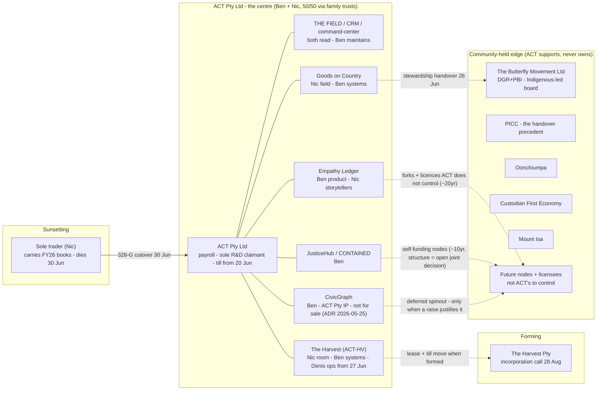
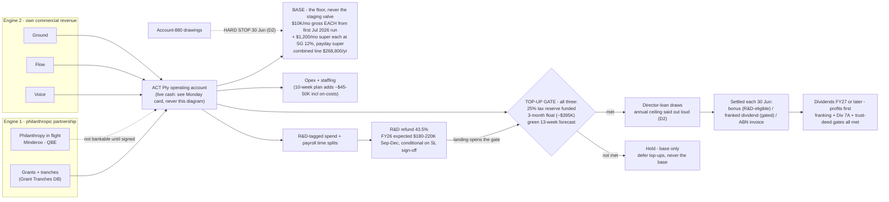
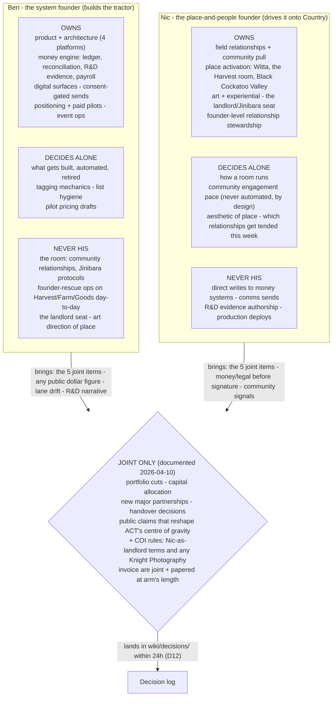
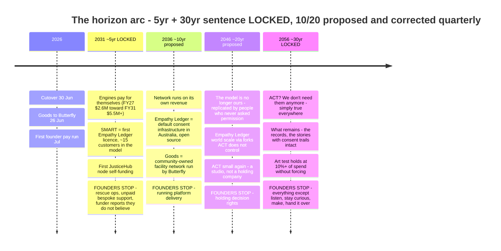
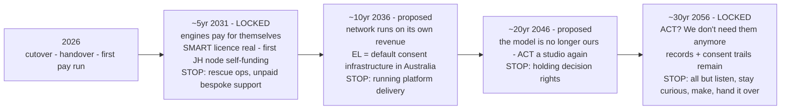
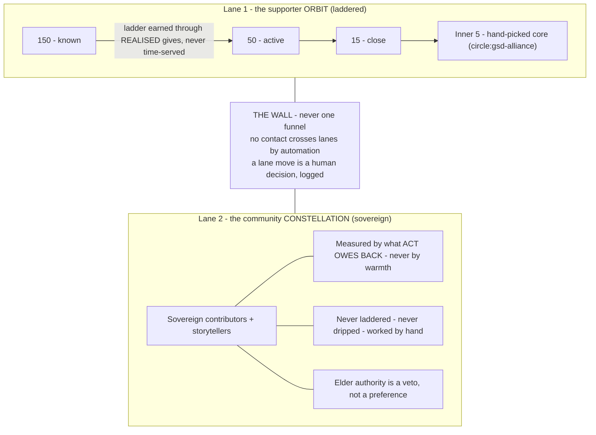
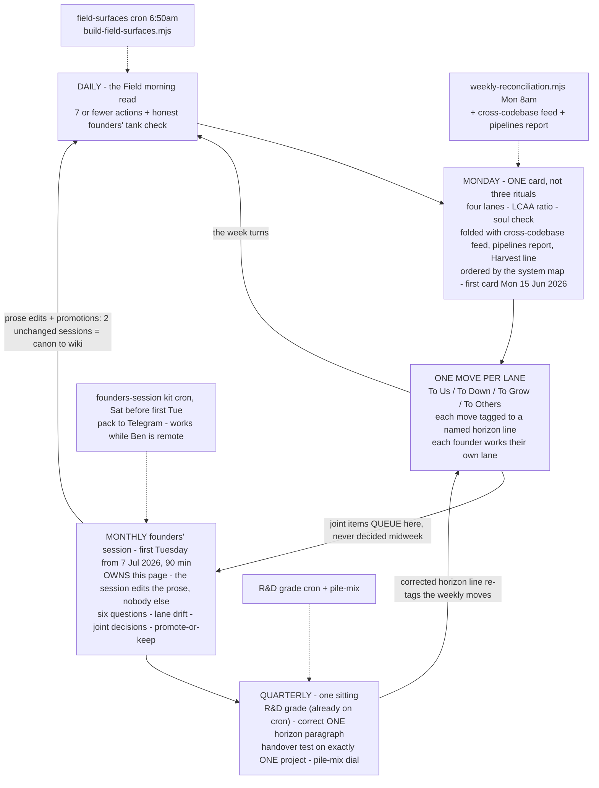
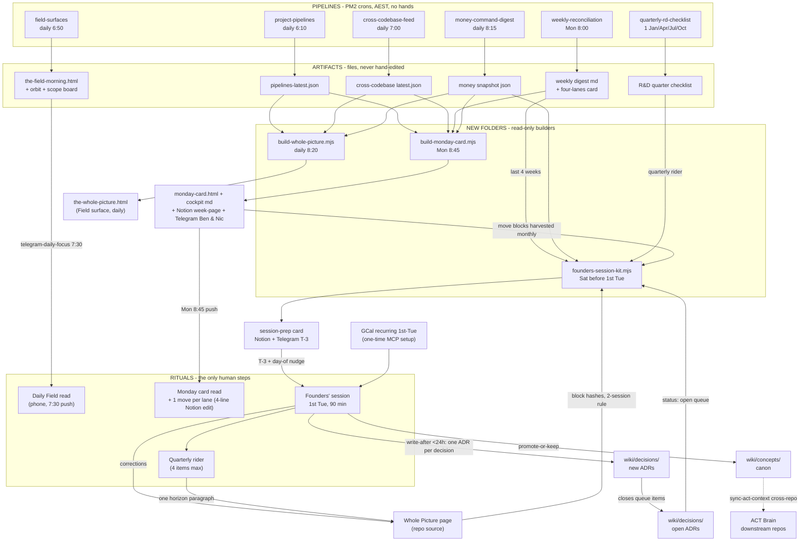

# The Whole Picture: drawn, wired, and on a drumbeat

> Date: 2026-06-10 · For: Ben (build same day) · Status: recommendation, ready to execute
> Subject: how to draw out "A Curious Tractor — The Whole Picture" (page source: `thoughts/shared/plans/2026-06-10-act-whole-picture-founders-os.md`, Notion draft: `thoughts/shared/drafts/act-whole-picture-notion-2026-06-10.md`)
> Items marked (proposed) do not exist yet. Everything else carries its real path.

---

## 1. The recommendation in 8 lines

1. **Doctrine gets drawn in Mermaid**, six blocks in one new repo file `wiki/concepts/the-whole-picture-diagrams.md` (proposed, does not exist yet), GitHub-rendered and git-diffable, pasted into the Notion page as code blocks, edited only at the monthly session.
2. **Live numbers never enter a diagram.** They land on a fourth Field surface, `the-whole-picture.html` (proposed), built by `scripts/build-whole-picture.mjs` (proposed) daily at 8:20am, after the 8:15 money snapshot, on the proven field-surface pattern (`scripts/build-field-surfaces.mjs` exists, cron live, surfaces rebuilt 06:55 this morning).
3. **Dashboard home is generated HTML, not a new app page.** Command-center serves it through the existing `/api/field` routes; a real `/whole-picture` route is v2, built only if Ben drills into it weekly.
4. **Tools:** Mermaid for doctrine, the `build-*.mjs` plain-CSS pattern for live data, Miro exactly once for a 30-minute co-draw with Nic, recharts (already installed, ^3.7.0) only if a trend chart earns it later.
5. **Monday one-card:** new `scripts/build-monday-card.mjs` (proposed), Mon 8:45am, folds four existing cron artifacts into one card pushed to Telegram, Notion, and the Field surface set. First card Mon 15 Jun.
6. **Monthly session kit:** new `scripts/build-founders-session-kit.mjs` (proposed), Saturday before each first Tuesday, first session Tue 7 Jul; the quarterly check rides the same script in Jul/Oct/Jan/Apr, no extra cron.
7. **Nothing hand-maintained.** A number without a verified pipeline renders as "withheld - no pipeline", never a guess. The snapshot's `.cash` field stays off-screen until its writer is traced.
8. **One real risk:** every cron runs on the local PM2 Mac. Confirm before 27 Jun that the host stays home and powered, or pick the cloud fallback (Open choice 1). Without that, the surface goes stale for exactly the six weeks it was built for.

---

## 2. The six diagrams

Three rules govern the set:

- **Doctrine vs data.** A diagram may carry decided constants (the $10K/mo wage, SG 12%, the gate conditions, handover dates) because those change only by joint decision at the session that already edits the page. It may never carry live figures (cash, run-rate, gate status). Live figures live on the surface and the Monday card.
- **One canonical source, two renders.** All six blocks live in `wiki/concepts/the-whole-picture-diagrams.md` (proposed). GitHub renders them; each is pasted into the matching Notion section as a code block with language set to Mermaid. Repo edited first, Notion re-pasted second, only at the monthly session.
- **Conservative Mermaid only.** Notion pins an older mermaid.js. Flowchart, sequence, gantt, class, ER are safe; timeline is unverified there. Every block below is flowchart except the horizon arc, which ships a timeline for GitHub plus a guaranteed flowchart fallback for Notion. No classDef styling (Notion dark mode mangles it), `<br/>` for line breaks, quoted labels.

As of today there is **zero Mermaid on disk** for this page: the draft has no blocks and the target file does not exist. The blocks below are complete and paste-ready; build step 1 is committing them verbatim.

### 2.1 The system map

Form: flowchart LR, four subgraphs (Sunsetting, ACT Pty centre, Forming, Community-held edge). Solid edges hold today; dashed edges are the handover doctrine. The 12th table row ("Org frame FY26") is an accounting frame, not an entity: it stays a table row and a surface banner, never a box.
Lives: repo file + Notion page §2. Also frame 1 of the Miro session.
Source of truth: the system-map table in the page itself; entity facts in `wiki/decisions/act-core-facts.md`.
Refresh: static doctrine; redrawn only when an entity forms, dies, or hands over. The money state per node goes live on the surface instead.



Caption under the diagram: solid = holds today · dashed = handover direction · partnerships sit on the edge with no ownership edge by design.

Wired to: the page §2 table · `wiki/decisions/act-core-facts.md` · live per-node money states on the surface (§3 below) · `thoughts/shared/plans/act-entity-migration-checklist-2026-06-30.md`.

### 2.2 The money engine (a gate diamond, not a sankey)

Form: flowchart LR. Two engines in, ACT Pty in the middle, the base/opex/R&D loop, then the top-up gate as a decision diamond. The gate IS a conditional and a sankey cannot draw one. Mermaid's sankey is explicitly experimental (sankey-beta, CSV syntax, unlikely to render in Notion), and at ACT's scale (two engines, four piles, one gate) a sankey implies flow precision the ledger tagging does not have. recharts has a Sankey component if one is ever truly wanted; not for v1.
Lives: repo file + Notion §4. NOT taken to Miro: this structure is decided (D11.2, Standard Ledger 5 May); the session ratifies, it does not redesign.
Source of truth: migration checklist §11 · `wiki/finance/founder-pay-and-rd-thesis-fy26-fy27.md` · `wiki/finance/act-money-thesis-rebuttal.md` · page §4.
Refresh: static for structure and decided constants. All live numbers stay on the Monday card, `/finance/money-alignment`, and the surface. The diagram says where the gate status lives, not what it is.



Wired to: live gate status + cash on the surface and the Monday card · `/finance/money-alignment` and `/company` (both on `apps/command-center/src/lib/finance/ledger.ts`) · `thoughts/shared/handoffs/money-state-of-play/current.md` · `thoughts/shared/data/money-command-snapshots/`.

### 2.3 The roles split (two columns into a joint gate, not a quadrant)

Form: flowchart TB, two founder subgraphs feeding one joint-gate diamond. Mermaid's quadrantChart plots scatter points and cannot hold text lists, and is untested in Notion. The owns / decides-alone / never stack per founder, with "brings to the session" as the labelled edge, reads exactly like the page's grammar.
Lives: repo file + Notion §3. Also frame 2 of the Miro session: this is the diagram Nic most needs to push back on.
Source of truth: page §3 · `wiki/decisions/2026-04-founder-lanes-and-top-two-bets.md`.
Refresh: static; redrawn only when the founder-lanes decision is updated, which per the promotion rule means a new entry in `wiki/decisions/`.



Wired to: `wiki/decisions/2026-04-founder-lanes-and-top-two-bets.md` · the Harvest hub decision gates (`thoughts/shared/drafts/harvest-operating-hub-notion-2026-06-10.md`) · the decision-log convention (page D12).

### 2.4 The horizon arc (timeline with a guaranteed fallback)

Form: Mermaid `timeline` is the right shape and renders on GitHub, but timeline shipped in mermaid 9.3 and Notion's pinned version is unknown. Ship both: timeline canonical in the repo, flowchart LR fallback for Notion. The 2-minute test: paste the timeline into Notion once; raw text means swap in the fallback and keep the timeline for GitHub. That test also settles Notion's pinned version for every future diagram.
Lives: repo file + Notion §6 (whichever block survives the paste test). Also frame 3 of the Miro session: the 10/20-year lines are explicitly proposed and corrected quarterly, so Nic gets to write on them.
Source of truth: page §6; promotion target `wiki/decisions/2026-horizon-arc.md` (proposed).
Refresh: static with a built-in cadence; the quarterly check corrects exactly one paragraph, so the diagram is re-cut at most quarterly. Lock policy is drawn into the labels.

Primary (repo; test once in Notion):



Fallback (guaranteed in Notion):



Wired to: page §6 · the quarterly check (§4 below) · weekly moves tagged to a named horizon line on the Monday card · the art-test drift light fed by the LCAA ratio `scripts/weekly-reconciliation.mjs` already emits.

### 2.5 The two-lane community model (schematic for doctrine, orbit-viz for data)

Form: schematic flowchart for the DOCTRINE, hard-linked to the live surfaces for the DATA. Do not draw real people in Mermaid: `thoughts/shared/orbit-viz.html` already is the real thing (the v2 tending board, rebuilt after Ben rejected the v1 SVG hairball), refreshed daily at 6:50am. The schematic's only job is making the two-lane rule and the wall legible.
Lives: repo file + Notion §5, with two links directly under it: the live orbit at `/api/field/surface?name=orbit` and the morning read at `?name=morning`.
Source of truth: `wiki/concepts/the-field.md` · `wiki/concepts/energy-orbit.md` · `wiki/concepts/ecosystem-value-exchange.md`.
Refresh: doctrine static; data refreshes daily via the existing `field-surfaces` PM2 cron. Zero new infrastructure.



Caption: the drawing is the rule; the people are live on the orbit tending board (daily 6:50am build). Community-line violations (a storyteller in a drip) are a defect class tracked there, not here.

Wired to: `thoughts/shared/orbit-viz.html` + `thoughts/shared/the-field-morning.html` via `/api/field/surface` · builders `scripts/build-orbit-viz.mjs` / `scripts/build-morning-read.mjs` · `scripts/lib/field-warmth.mjs` · `thoughts/shared/plans/2026-06-03-act-network-circle-action-stages.md`.

### 2.6 The weekly drumbeat loop

Form: flowchart TB drawn as a cycle, with the feeding pipelines as dashed inputs. Mermaid's `journey` type is linear with mood scores; it cannot draw a loop or show feeds. This diagram doubles as the automation spec: every dashed edge must correspond to a real cron (§4 below), or the drumbeat is willpower.
Lives: repo file + Notion §7.
Source of truth: page §7.
Refresh: static; the dashed feeds are verified against `pm2 jlist` whenever the diagram is re-cut.



Wired to: `scripts/weekly-reconciliation.mjs` (Mon 8am; lanes + LCAA + soul check already emitted) · `scripts/build-field-surfaces.mjs` (daily) · `thoughts/shared/cross-codebase-feed/latest.md` · `thoughts/shared/reports/project-pipelines-latest.md` · `wiki/cockpit/four-lanes-today.md`.

### Where each diagram lives (one table)

| Visual | Canonical source (git) | Notion page | Miro session | Live data companion |
|---|---|---|---|---|
| System map | `wiki/concepts/the-whole-picture-diagrams.md` (proposed) | §2 code block | YES, frame 1 | the-whole-picture.html node board |
| Money engine | same file | §4 code block | no (decided, SL-gated) | Monday card · `/finance/money-alignment` · `/company` |
| Roles split | same file | §3 code block | YES, frame 2 | none needed (doctrine only) |
| Horizon arc | same file (timeline + fallback) | §6, fallback unless timeline passes the paste test | YES, frame 3 | quarterly rider flags the paragraph due |
| Two-lane community | same file | §5 code block + 2 links | no (orbit-viz is the workshop surface) | orbit-viz.html + the-field-morning.html, daily |
| Drumbeat loop | same file | §7 code block | no | `pm2 jlist` is the audit; Monday card is the heartbeat |

Rules: repo edited first, Notion re-pasted second, only at the monthly session. The Miro board is disposable scaffolding; after the session its corrections flow back into the repo file and the board is archived. Never let Miro become a third copy of the truth. When a prose block promotes to a wiki file, its diagram moves alongside it (the diagrams file keeps a stub link), so the canon spreads without ever holding two divergent copies.

---

## 3. The dashboard: `the-whole-picture.html` on the field-surface pattern

### The home, and why the alternatives lost

**Primary: a script-generated, self-contained HTML surface** (proposed): `scripts/build-whole-picture.mjs` writing `thoughts/shared/the-whole-picture.html`, cloned from `scripts/build-scope-board.mjs` (the closest donor: inline `const D={...}` JSON + ~25 lines vanilla JS + the shared dark palette).

- **(a) New command-center route** lost for v1. Richest data access (`src/lib/finance/ledger.ts` exports ~50 symbols; `/api/intelligence` already composes 9 sub-fetches; recharts + tremor installed), but the Whole Picture is a reading artifact with a handful of live numbers, not an operating surface. A good route is a multi-day build with TDD'd money aggregations; `/company` already does the operating job. Kept as v2, gated on demonstrated need.
- **(b) Generated HTML won.** Zero server dependency, proven pattern (three Field surfaces rebuilt at 06:55 this morning by the `field-surfaces` cron), data inlined at build time from artifacts existing crons already produce, so "numbers arrive by pipeline" holds by construction.
- **(c) Notion-only** lost. Mermaid code blocks handle the doctrine fine, but live numbers would need a 42nd `sync-*-to-notion` script and Notion cannot do the 12-node health map or staleness greying. Notion stays the reading layer: the founders' page, the diagrams, the Monday card.

**Timing and naming, settled:** the builder runs at **8:20am**, after the 8:15 money snapshot, never 6:50 (a 6:50 build would inline yesterday's money every morning). One canonical filename: `the-whole-picture.html`, matching `the-field-morning.html`.

**Registration (two one-line edits):** add the file to `SURFACE_FILES` in `apps/command-center/src/app/api/field/[...path]/route.ts` and the `SURFACES` map in `apps/command-center/src/app/api/field/surface/route.ts`. It then serves at `/api/field/surface?name=whole` and cross-links to its siblings for free. Optional sidebar entry in `apps/command-center/src/lib/nav-data.ts`.

**Notion display: link out, do not embed.** The surface carries dollar figures; the public-Vercel dual-write trick (`scripts/render-act-now-html.mjs` writes a copy to `apps/command-center/public/`) would put cash positions on an unauthenticated URL, and authed embeds break in Notion's desktop and mobile apps anyway. The page gets one line: "Live node board: [link] - rebuilt daily 8:20am."

### The one screen (wireframe)

```
+- THE WHOLE PICTURE - A Curious Tractor ------------- built 08:20 · Wed 11 Jun -+
| THIS WEEK   19 days to Pty cutover (30 Jun) · Monday card OK 9 Jun             |
| next founders' session: Tue 7 Jul (26d) · spine OK fresh · shipped this wk: N  |
+- THE SYSTEM (12 nodes, page §2) -------------+- THE MONEY ENGINE (page §4) ----+
|  ENTITIES                                    | Receivables         $164.3K [s] |
|  ● ACT Pty (trading)   ◐ sole-trader (wind)  | Grants in flight    $230.0K [s] |
|  ● Butterfly/Goods     ○ A Kind Tractor      | 90d wtd pipeline    $3.33M  [s] |
|  PROJECTS                                    | Tagging coverage    87%     [s] |
|  ● Goods  ● Harvest  ◐ JusticeHub/EL         | -- wage line ------------------ |
|  ◐ CivicGraph                                | $120K each: first pay run in Nd |
|  SYSTEMS                                     | Top-up gate: RULE PENDING 7 Jul |
|  ● Finance spine  ● The Field  ◐ Wiki/Brain  | R&D window: Jul 26 - 30 Apr 27  |
|  ○ Comms/CRM                                 | Cash on hand: WITHHELD, no pipe |
|  ● wired ◐ thin ○ unwired - each card links  | R&D basis $: WITHHELD, no pipe  |
|  its /finance or /field drill-down           | each number links its source    |
+- THE DRUMBEAT (page §7) ---------------------+---------------------------------+
| daily   field read 6:50 OK · focus push 7:30 OK · money snapshot 8:15 OK       |
| monday  recon 8:00 OK (last: 9 Jun) · ONE CARD 8:45 (new)                      |
| friday  money digest 15:00 OK · narrative 15:15 OK                             |
| monthly close-books 1st OK · founders' session kit (new) - next 7 Jul          |
| qtrly   R&D checklist 1 Jul OK · quarterly rider (new) - next 1 Oct           |
| horizon 2031 --- 2036 --- 2046 --- 2056   open decisions: 22 -> page §10       |
+-- regenerate: node scripts/build-whole-picture.mjs · sources greyed when stale +
```

`[s]` = `thoughts/shared/data/money-command-snapshots/<date>.json`. Few numbers, every one named to its source and hyperlinked to its operating surface. Plain CSS, house palette, no chart lib for v1 (the orbit v1 SVG hairball rejection is the standing warning against decoration). Footer carries the regenerate command per house convention.

### Every number to its pipe

Staleness pattern copied from `thoughts/shared/field-freshness.json`: render the source date next to the number; grey (`#71808f`) past the rule; banner when the spine canary is stale.

| Number on screen | Source (readable today) | Refresh cron (AEST) | Staleness rule |
|---|---|---|---|
| Receivables | snapshot json → `.incoming.receivables` | `money-command-digest` daily 8:15 | grey >36h |
| Grants in flight | snapshot → `.incoming.grantsInFlight` | same | grey >36h |
| 90d weighted pipeline | snapshot → `.incoming.pipelineWeighted` | same | grey >36h |
| Tagging coverage % | snapshot → `.coverage.transactions.pct` | same | grey >36h |
| 12-node health (projects) | `thoughts/shared/reports/project-pipelines-latest.json` | `project-pipelines` daily 6:10 | grey >36h |
| 12-node health (systems) | `thoughts/shared/field-freshness.json` spine canary | `field-surfaces` daily 6:50 | banner if stale_days > 0 |
| Shipped this week | `thoughts/shared/cross-codebase-feed/latest.json` | `cross-codebase-feed` daily 7:00 | grey >36h |
| Last Monday card | mtime of `thoughts/shared/cockpit/monday-card/latest.md` (proposed) | `monday-card` Mon 8:45 (proposed) | grey >8d |
| Wage-line countdown | date math in the builder (first pay run Jul 2026) | computed at build | never stale |
| Top-up gate | static label "RULE PENDING (7 Jul)"; computed only after ratification + a runway pipe exists | n/a, then v1.5 | label until both exist |
| R&D window | static canon (lodge Jul 2026 - 30 Apr 2027) | n/a | never stale |
| Open decisions count | parsed from the page source §10 headings | at build (file read) | show doc mtime |
| Cutover / session countdowns | date math (SESSION_RULE: first Tue monthly from 7 Jul) | computed at build | never stale |
| Cash on hand / runway / burn | **WITHHELD in v1.** Snapshot `.cash` is a bare scalar (-152230.52 on 2026-06-09), semantics unverified; likely an FY net-flow figure, NOT cash on hand. Trace the writer in `scripts/money-command-digest.mjs` before showing it under any label. Proper pipe = extend money-command-digest with `getCashPosition`-equivalent figures, TDD-pinned (v1.5) | rides the 8:15 cron once added | grey >36h once piped |
| R&D basis $ | **WITHHELD in v1.** `scripts/reconciliation-worklist.mjs` computes it (~$55.5K after the drawings finding) but drops no JSON artifact; add a sidecar drop (v1.5) | weekly slot once added | withheld until it exists |

Money-math rule applies: any new aggregation that emits a dollar figure gets a failing test pinned to a known total first (the PostgREST 1000-cap class of bug).

### Deliberately NOT on this screen

- **FY net-flow under a "cash" label.** Never relabel snapshot `.cash` as cash on hand.
- **Crew-burn / people-spend.** No verified pipe; the wage line shows only date math until payroll actuals land in the Xero mirror.
- **Bank balance.** Feed known stale.
- **The 22 decisions' text.** Count + link only; the list lives in the page where it gets worked.
- **Community names or owes.** OCAP: those live on the Field surfaces, never on a money screen.
- **Pile-mix and drift detail.** `/finance` operating territory; one click away, not duplicated.

---

## 4. Cadence and flows: crons, not willpower

Two new read-only builder scripts, zero new data sources. The drumbeat already has its pipelines; the builders only FOLD existing artifacts. Founders write words back through exactly two doors: the Notion move blocks (weekly) and `wiki/decisions/` + page corrections (monthly/quarterly).

Verified fold inputs, all live in `ecosystem.config.cjs` (all times AEST):

| Feed | Cron | Artifact |
|---|---|---|
| Pipelines | daily 6:10 | `thoughts/shared/reports/project-pipelines-latest.{json,md}` |
| Field surfaces | daily 6:50 | the three Field HTML surfaces + `field-freshness.json` |
| Cross-codebase feed | daily 7:00 | `thoughts/shared/cross-codebase-feed/latest.{json,md}` |
| Money pulse | Mon 8:00 | `weekly-reconciliation.mjs` digest md + four-lanes card |
| Money snapshot | daily 8:15 | `thoughts/shared/data/money-command-snapshots/YYYY-MM-DD.json` |
| R&D quarterly | 1 Jan/Apr/Jul/Oct 9:00 | `create-quarterly-rd-checklist.mjs` output |

**Daily** needs no new wiring: `field-surfaces` 6:50 + `telegram-daily-focus` 7:30 already run the Field read, and 7:30 stays the single morning push (QW4 doctrine, no second daily ping). The whole-picture builder joins at 8:20.

### The Monday one-card (proposed, first card Mon 15 Jun)

**Chassis:** new ~150-line `scripts/build-monday-card.mjs`, read-only. Do NOT resurrect the dormant `scripts/monday-morning-chain.mjs`: it re-RUNS writes (GHL cleanup `--apply`, grant seeding, Xero sync) whose six steps now hold their own cron slots; reviving it double-runs them. Steal its two good patterns only: failure isolation per step, ONE Telegram summary.

**Schedule:** Mon 8:45 AEST, after weekly-reconciliation (8:00) and the money snapshot (8:15). 45 minutes of latency costs nothing; a 24h-old snapshot silently lies.

**The fold, ordered by the system map's 12 rows:** money engine row (four lanes + LCAA + soul check lifted verbatim from the recon digest; pipeline numbers from the morning snapshot) · one line per project (pipelines stage movement + cross-codebase shipped-this-week, keyed by project code) · the Harvest row derived from the same feeds and labelled honestly `Harvest: derived (no dedicated feed yet)` (verified: no Harvest sweep cron exists in this repo) · drift lights (Art <10%, Listen <20%, To Us behind) from the digest numbers. Every section carries `as-of <timestamp> (<age>)`; >26h daily / >8d weekly renders a STALE badge; a missing input renders `FAILED - see /tmp/<cron>-error.log` and the card still ships.

**Outputs, per the 4-surface doctrine:**
1. `thoughts/shared/cockpit/monday-card/YYYY-MM-DD.md` + `latest.md` (the record)
2. `thoughts/shared/monday-card.html`, registered as a Field surface alongside the whole-picture (operating)
3. Notion: a NEW page per ISO week under the founders' hub, the idempotent page-per-week pattern `scripts/sync-pppp-scan-to-notion.mjs` uses (reading). **Create-if-absent, never overwrite:** if the week's page already exists the builder must not touch it, because it may hold founder edits. That rule is what makes it a capture page by construction and keeps the move blocks safe (the notion-page-policy trap).
4. Telegram: ≤30 lines via `scripts/lib/telegram.mjs`, leading with the staleness count if any, ending with the Notion link. Sent to Ben (`TELEGRAM_CHAT_ID`) and Nic (`chatId` override via a new `TELEGRAM_CHAT_ID_NIC`, the per-owner-DM mechanism `idea-board-reminders` already uses) (pushing).

**One-move-per-lane capture:** the week's Notion page ends with a pre-built callout block per founder, four lines (To Us / To Down / To Grow / To Others, each with a `[5y|10y|20y|30y]` horizon tag slot). A 60-second phone edit, prompted by the push. The monthly kit harvests the blocks back via the Notion API, so skipped moves surface at the session, not as daily nags.

### The monthly founders' session kit (proposed, first session Tue 7 Jul)

**Trigger:** PM2 entry firing every Saturday 7:00 AEST with an in-script first-Tuesday guard. Cron cannot express "first Tuesday minus 3", but Saturday + 3 days is always a Tuesday: `const tue = addDays(today,3); if (!(tue.getDay()===2 && tue.getDate()<=7)) exit 0;`. Fires once a month, three days out. First firing Sat 4 Jul for Tue 7 Jul. The weekend buffer beats Design 1's first-Tuesday-morning variant; the git-tag promotion mechanism is dropped in favour of block hashes (no tag discipline required).

**`scripts/build-founders-session-kit.mjs` assembles:**
1. The six founder questions, read verbatim from `thoughts/shared/plans/2026-05-26-act-operating-picture-blueprint.md`
2. Lane-drift ratios with a 4-week trend from the last four recon digests, lights against the page's thresholds
3. One leading indicator per horizon line: 5y pile-mix vs FY27 target (snapshot), 10y JH node revenue + EL licence pipeline (pipelines json); 20y/30y print the page's standing QUESTION, never a fabricated number
4. Queued joint decisions: `wiki/decisions/` front-matter scanned for `status: proposed|open`, union with the page's open list, filtered to the joint-only list
5. Promote-or-keep: the kit hashes each `##`/`###` block of the page source into `thoughts/shared/data/founders-session/state.json` (proposed); any block unchanged across the last TWO session snapshots is flagged "promote to wiki/concepts/ canon or consciously keep"
6. The month's move harvest from the Monday Notion pages, blanks named per founder
7. The quarterly rider when the session month is Jul/Oct/Jan/Apr

**Delivery:** `thoughts/shared/cockpit/founders-session/YYYY-MM-DD.md` + a per-session Notion page (capture by construction) + Telegram to both founders Saturday, with a day-of nudge folded into `telegram-daily-focus`.

**During:** Ben drives the Notion session page, Nic talks, decisions land as one-line sentences in the "Decided" block. **Write-after (within 24h, the only manual step):** each Decided line becomes a `wiki/decisions/` entry with `provenance: founders-session-YYYY-MM-DD` (the `act-money-brain:decision` skill drafts these); promoted blocks move to `wiki/concepts/`; corrections edit the page source; affected Mermaid blocks re-cut and re-pasted same day.

**Calendar:** one-time recurring Google Calendar event via the Calendar MCP in a live session (verified: no repo script writes GCal events, and none should be built for this). "ACT Founders' Session", `RRULE:FREQ=MONTHLY;BYDAY=1TU`, from 7 Jul 2026, benjamin@ + nicholas@act.place. Day shift, Ben present: it lands in Nic's inbox.

### The quarterly check (zero new crons)

The existing `quarterly-rd-checklist` (1 Jan/Apr/Jul/Oct 9:00) stays untouched. The kit appends the rider in quarter months, capped at exactly four items, the script literally cannot add a fifth:
1. R&D quarterly grade (link to the checklist the existing cron created on the 1st)
2. Horizon arc: correct exactly ONE paragraph (the kit pastes the current 10y/20y proposed text inline)
3. Five-question handover test on exactly one project (kit nominates the highest single-founder-concentration candidate)
4. Pile-mix dial vs the five-year line, auto-filled from the snapshot

First quarterly: Tue 7 Jul 2026, doubling as session #1.

### The nervous system (paste into Notion page §6/§7)



Reading it: numbers flow left to right (pipeline → artifact → fold → ritual); words flow right to left through two doors only.

### Failure modes

- **The PM2 host is the single point of failure, and the remote claim is not yet true.** Every cron in `ecosystem.config.cjs` runs on one local Mac. If that Mac travels with Ben 27 Jun - 7 Aug, the entire pipeline (not just the new builders) goes stale for exactly the window this was built for. Pre-departure drill, before 27 Jun: confirm the host is an always-on machine staying home; `pm2 jlist` to verify live state matches config-on-disk (known gap: entries are inert until `./dev cron`); confirm Xero/Notion/Telegram tokens are env-resident and auto-refreshing; run each new builder once by hand and read the output on the phone only. If the host travels, see Open choice 1.
- **Stale feeds never lie silently.** Every section prints as-of + age; the Telegram summary's first line is the stale count when nonzero; the spine-canary banner pattern (born from the silent 06-03 to 06-06 gmail outage) carries over.
- **Skipped sessions escalate mechanically.** "Held" = an ADR with the session provenance OR session-page edits within 48h. One skip: a line in the next kit. Two consecutive: the next kit's title and Telegram lead become "SYSTEM BROKEN: two sessions skipped", agenda item 1. Same weekly: a founder with zero logged moves two weeks running gets named in the next session kit, not nagged daily. State survives in `thoughts/shared/data/founders-session/state.json` even if nobody reads the card.
- **Quiet hours behave.** The 8:45 Mon push is daytime AEST so it always sends; in Europe it waits overnight in Ben's phone, which is correct.

---

## 5. Links to good information

### Internal (what this builds on, all verified on disk or in config unless marked)

**The page itself**
- `thoughts/shared/plans/2026-06-10-act-whole-picture-founders-os.md` (full working detail, 65KB)
- `thoughts/shared/drafts/act-whole-picture-notion-2026-06-10.md` (the Notion paste source, 24KB)

**Live surfaces + builders (the pattern to clone)**
- `thoughts/shared/the-field-morning.html` · `thoughts/shared/orbit-viz.html` · `thoughts/shared/project-scope-board.html` (rebuilt 06:55 daily)
- `scripts/build-field-surfaces.mjs` (orchestrator: spine canary → beeper recency → three builders) · `scripts/build-morning-read.mjs` · `scripts/build-orbit-viz.mjs` · `scripts/build-scope-board.mjs` (closest donor) · `scripts/lib/field-warmth.mjs`
- `apps/command-center/src/app/api/field/surface/route.ts` (`SURFACES` map) + `api/field/[...path]/route.ts` (`SURFACE_FILES`): the two registration points
- `scripts/render-act-now-html.mjs` (the dual-write precedent; rich Chart.js dashboard)
- `tools/act-wikipedia.html` (Tractorpedia viewer, Mon 9:15 cron)

**Pipeline artifacts (the numbers)**
- `thoughts/shared/data/money-command-snapshots/` (daily 8:15; `.cash` semantics UNVERIFIED, trace before display)
- `thoughts/shared/reports/project-pipelines-latest.{json,md}` (daily 6:10)
- `thoughts/shared/cross-codebase-feed/latest.{json,md}` (daily 7:00)
- `thoughts/shared/field-freshness.json` (spine canary + the trust-banner pattern)
- `scripts/weekly-reconciliation.mjs` (Mon 8:00; four lanes + LCAA + soul check already emitted) · `wiki/cockpit/four-lanes-today.md`
- `scripts/money-command-digest.mjs` (snapshot writer; extend here for cash-on-hand in v1.5)
- `scripts/reconciliation-worklist.mjs` (computes the honest R&D basis; needs a JSON sidecar)
- `apps/command-center/src/lib/finance/ledger.ts` (the one money truth; `getCashPosition`, `getOrgLedger`, `pileMix`, with co-located tests)

**Doctrine + policy**
- `wiki/decisions/act-core-facts.md` · `wiki/concepts/act-business-architecture.md` · `wiki/concepts/the-field.md` · `wiki/concepts/energy-orbit.md` · `wiki/concepts/ecosystem-value-exchange.md`
- `wiki/decisions/notion-page-policy.md` (check before any Notion wiring)
- `.claude/references/finance-surfaces.md` (the 4-surface routing table)
- `thoughts/shared/plans/act-entity-migration-checklist-2026-06-30.md` (D11.2, the money-engine constants)
- `thoughts/shared/plans/2026-05-26-act-operating-picture-blueprint.md` (the six founder questions)
- `ecosystem.config.cjs` (every cron named in this doc)
- `scripts/monday-morning-chain.mjs` (pattern donor only; stays dormant)

### External (the few worth keeping)

- **Mermaid syntax reference**: https://mermaid.js.org/intro/syntax-reference.html — the per-type pages under /syntax/ are the working reference; a code block containing just `info` prints the renderer's pinned version on GitHub.
- **Notion embeds + code blocks**: https://www.notion.com/help/embed-and-connect-other-apps — embeds are live via Iframely but break on auth-required pages in the apps; Mermaid renders in code blocks with language set to Mermaid. Preview in both light and dark themes.
- **GitHub diagram rendering**: https://docs.github.com/en/get-started/writing-on-github/working-with-advanced-formatting/creating-diagrams — confirms native Mermaid in .md files, issues, PRs; the more current renderer of the two.
- **Stephen Few, "Dashboard Confusion" (2004)**: https://www.perceptualedge.com/articles/ie/dashboard_confusion.pdf — the single-screen-at-a-glance restraint argument; the seven-action cap and the four-item quarterly rider are this principle enforced by format.

---

## 6. Build list

### First sitting (one afternoon, in order)

1. **S — Commit the diagrams file.** Create `wiki/concepts/the-whole-picture-diagrams.md` containing all six Mermaid blocks from §2 verbatim (seven fenced blocks counting the horizon fallback). Commit, open on GitHub, confirm every block renders. Nothing else starts until this exists; zero Mermaid is on disk today.
2. **S — The Notion paste test.** Paste the timeline block into the Notion page once. Raw text = use the fallback there, keep the timeline for GitHub. This settles Notion's pinned mermaid version for all future diagrams.
3. **M — `scripts/build-whole-picture.mjs`.** Clone the `build-scope-board.mjs` scaffolding (inline `const D={...}`, palette `#0b0e14/#121826/#e6edf3/#3ddc97/#ffb454/#ff5d5d/#5fb3ff`, footer regenerate command). Read the four artifacts + the page source per the §3 table; grey stale numbers; render the three bands; link every node card to its `/finance/*` or `/field` drill-down; write `thoughts/shared/the-whole-picture.html`. Withhold cash-on-hand, runway, R&D basis; never relabel snapshot `.cash`. (10-minute side quest: trace the `.cash` writer in `scripts/money-command-digest.mjs` and note its real meaning in the builder's comments.)
4. **S — Register the surface.** Add to `SURFACE_FILES` in `apps/command-center/src/app/api/field/[...path]/route.ts` and `SURFACES` in `api/field/surface/route.ts`. Optional `nav-data.ts` entry next to `/company`.
5. **S — PM2 entries** in the `cronScripts` array of `ecosystem.config.cjs`, matching the existing entry shape:
   ```js
   { name: 'whole-picture',        script: 'scripts/build-whole-picture.mjs',       cron: '20 8 * * *' }, // daily 8:20 AEST, after money-command-digest 8:15
   { name: 'monday-card',          script: 'scripts/build-monday-card.mjs',         cron: '45 8 * * 1' }, // Mon 8:45 AEST, after recon 8:00 + snapshot 8:15
   { name: 'founders-session-prep',script: 'scripts/build-founders-session-kit.mjs',cron: '0 7 * * 6'  }, // Sat 7:00 AEST, in-script first-Tuesday guard
   ```
   Entries are inert until `./dev cron`; `pm2 restart` on a one-shot fires it NOW, so add fresh, reload, `pm2 save`, then `pm2 jlist | grep -E 'whole-picture|monday-card|founders'` to confirm live.
6. **M — `scripts/build-monday-card.mjs`** per the §4 spec: read-only fold, failure isolation, as-of stamps, page-per-week Notion create-if-absent, Telegram to Ben + Nic, dual md/HTML output, `monday-card.html` registered as a Field surface. Must exist before 15 Jun; ships this sitting if energy holds, else first follow-up.
7. **S — Notion page assembly.** Paste the surviving blocks into their sections, add the link line to the live surface (no embed), add the two reference links at the page foot. Check `wiki/decisions/notion-page-policy.md` first: the founders' page must sit outside every outbound sync's path.
8. **S — Book the 30-minute Miro co-draw with Nic** (the board itself is prebuilt later, 20 min via the Miro MCP: `diagram_get_dsl` first, then `diagram_create` for frames 1 and 2, `layout_create` for the five horizon cards). The session: 0-5 system map, Nic drags any wrong holder or arrow; 5-15 roles, Nic moves items between decides-alone and brings-to-session, red-dots disputed nevers, both dot-vote the joint list; 15-25 horizon, Nic writes exactly one correction sticky under the 10y line and one under the 20y line, the 5y and 30y lines are read aloud not edited; 25-30 capture, export, name changes out loud. Within 24h: joint decisions to `wiki/decisions/`, Mermaid re-cut, board archived. The board is scaffolding, never a third copy of the truth.

### v1.5 (separate sitting, before 27 Jun, hard deadline)

9. **M — `scripts/build-founders-session-kit.mjs`** per §4 (Saturday guard, block hashes, move harvest, quarterly rider, two-skip escalation) + the one-time Calendar MCP recurring event with Ben present.
10. **M — Extend `scripts/money-command-digest.mjs`** to emit cash-on-hand / runway / monthly-burn (TDD first: failing test pinned to a known total), then un-grey those surface slots.
11. **S — R&D basis artifact**: `reconciliation-worklist.mjs` drops a JSON sidecar; the surface un-withholds the R&D dollar.
12. **S — Pre-departure drill** (§4 failure modes) + resolve Open choice 1.
13. **S — Nic's Telegram**: Nic DMs the bot once, capture the chat id, set `TELEGRAM_CHAT_ID_NIC` in the cron env.

### v2 (only if earned)

14. **L — `apps/command-center/src/app/whole-picture/page.tsx`** + `/api/whole-picture` composing `getOrgLedger/getCashPosition/getMonthlySeries/getRdTaxWindow` from `ledger.ts` with co-located tests, recharts for the trend lines a static surface cannot do. Earn-it trigger: Ben drills from the HTML into `/finance/*` more than weekly during the remote window, or wants inline interaction. If the static surface answers the founders' question on its own, v2 never gets built. That is success.

**Stop criteria for the whole build:** (a) all blocks render in the Notion page, (b) `?name=whole` serves with a fresh timestamp two mornings running, (c) the 15 Jun Monday card arrives on Telegram composed, (d) the 4 Jul kit arrives without anyone's laptop open. Anything past that is polish.

---

## 7. Open choices for Ben

1. **The travel-window refresh (decide before 27 Jun, this one is real).** Every cron runs on the local PM2 Mac. Options: (a) confirm the host is an always-on machine that stays home, nothing changes; (b) if the laptop travels, stand up a scheduled cloud agent (`/schedule` routine) or GitHub Action that runs the three new builders + `money-command-digest` + `weekly-reconciliation` on cron with secrets, committing artifacts; (c) accept degradation and let the staleness badges tell the truth, with Nic on a stale-but-honest card. **Recommend (a) verified first; (b) for the minimum chain (snapshot + recon + the three builders) only if the host travels; never claim remote-proof until one of them is true.**
2. **Phone access path while remote.** (a) Serve only through the DASH_COOKIE-gated `/api/field` route, but whether that route's filesystem reads of `thoughts/shared/` work on the Vercel deploy is unverified; (b) dual-write to `apps/command-center/public/` with a non-guessable filename, proven (`render-act-now-html.mjs`) but effectively unauthenticated with dollar figures on it. **Recommend: verify (a) with one deploy test; fall back to (b) with a non-guessable name and the cash rows stripped from the public copy.**
3. **Top-up gate display before ratification.** Provisional computed status vs a "RULE PENDING (7 Jul)" label. **Recommend the label: a provisional gate number is exactly the hand-waved figure the doctrine forbids. Wire the computation the week after the session.**
4. **Nic's pushes.** Telegram DM from day one vs Notion-only until he asks. **Recommend: set up the chat id in v1.5 so the rail exists, send him the Monday card from 15 Jun (the two-founder drumbeat fails if one copy depends on forwarding), and confirm the preference at the 7 Jul session.**
5. **Session time for 7 Jul + 4 Aug (Ben in Europe).** 17:00 AEST = ~09:00 CET, Ben's morning, Nic's evening. **Recommend 17:00 AEST overrides for those two instances; keep first-Tuesday sacred, the two-skip rule counts from session 1.**
6. **Miro after session 1.** Disposable scaffolding (re-encode corrections into git, archive the board) vs a standing co-editable surface re-synced before each session. **Recommend disposable, and record at session 1 whether Nic wants a standing board; if yes, the re-sync is a 10-minute MCP pre-step, not a new source of truth.**
7. **Where the page lives long-term.** It is currently a plan file, scaffolding by doctrine. **Recommend draining it: promote canon-ready blocks (§4 theory of work first) into `wiki/concepts/` via the two-session hash mechanism, page shrinks toward an index; the kit follows whatever path the page lives at.**
