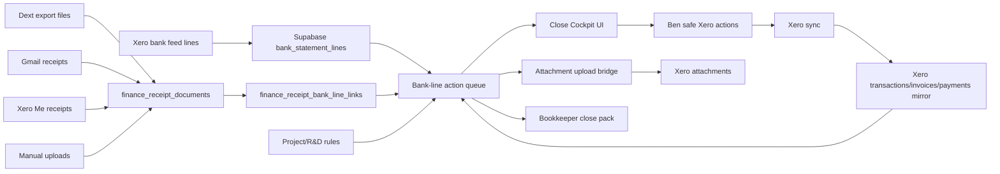

# Plan: Xero Receipt Close Cockpit

> Slug: `xero-receipt-close-cockpit`
> Created: 2026-05-15
> Status: draft
> Owner: Ben + Codex, with Standard Ledger as review gate

## Objective

Build a bank-line-first close system that lets ACT reconcile Q2/Q3 FY26 in Xero with far less confusion: every bank line shows the right receipt evidence, the right Xero action, the right project/R&D tags, and a clear owner. The goal is to make Ben's job a guided review/click workflow, make Codex responsible for evidence, validation, and queue preparation, and make Standard Ledger reviewers rather than data-entry operators.

## Working Principle

The bank line is the source of accounting truth.

Receipts from Dext, Gmail, Xero Me, Xero Files, and manual upload are evidence. They do not become accounting truth until linked to the correct Xero transaction, bill, spend-money item, or approved expense.

## Target User Flow

1. Ben opens Xero NAB Visa reconcile page.
2. Ben copies the visible Xero page rows into the ACT Xero Page Copilot.
3. The cockpit returns one instruction per row: click OK, create safely, find/match bill, transfer, reject Xero suggestion, upload receipt first, or hold for bookkeeper.
4. Ben only performs the safe actions in Xero.
5. Codex reruns Xero sync.
6. The cockpit attaches approved receipt files to newly known Xero targets.
7. The system updates project/R&D tagging and creates the remaining exceptions pack.
8. Standard Ledger receives a packet with what was done, what is unresolved, what needs judgement, and what is unsafe for automation.

## System Modules

### 1. Canonical Bank-Line Action Queue

Create one canonical queue that classifies every bank line into a single `next_action`.

Required fields:

| Field | Purpose |
|---|---|
| `bank_line_id` | Stable bank statement line identity. |
| `quarter` | Q2, Q3, Q4, etc. |
| `date` | Bank line date. |
| `vendor` | Normalized bank vendor. |
| `amount` | Absolute spend/received amount. |
| `direction` | Spend or income. |
| `xero_state` | `unreconciled`, `reconciled_target_known`, `reconciled_target_missing`, `xero_draft`, `xero_deleted_noise`, `unknown`. |
| `evidence_state` | `none`, `candidate`, `approved_file`, `attached_in_xero`, `no_receipt_needed`, `bad_candidate_rejected`. |
| `best_receipt_id` | Best evidence file if any. |
| `xero_target_id` | Exact Xero transaction/bill/spend-money target if known. |
| `project_code` | Current ACT project tag. |
| `rd_category` | `none`, `review`, `supporting`, `core`. |
| `next_action` | Single action for Ben/Codex/bookkeeper. |
| `owner` | `ben`, `codex`, `standard_ledger`, `xero_support`. |
| `reason` | Human-readable why this action was chosen. |

Allowed `next_action` values:

| Action | Meaning |
|---|---|
| `click_ok_existing_match` | Xero suggested match is verified correct. |
| `create_low_value` | Safe low-value create, no receipt required for workflow. |
| `create_with_receipt` | Receipt is visible and correct; create/reconcile in Xero. |
| `find_match_bill` | A Xero bill exists and should be matched. |
| `transfer` | Card repayment/internal transfer. |
| `reject_xero_suggestion` | Xero suggested match is wrong. |
| `reject_receipt_candidate` | Current receipt candidate is wrong. |
| `find_receipt` | Receipt likely exists but is not yet linked. |
| `xero_target_missing` | Receipt is approved but exact Xero target is missing. |
| `upload_attachment` | Exact Xero target exists and receipt file should be attached. |
| `project_rd_review` | Accounting row needs project/R&D judgement. |
| `bookkeeper_review` | Tax/accounting treatment should be decided by Standard Ledger. |

Implementation:

- Add `scripts/build-bank-line-action-queue.mjs`.
- Add API route `apps/command-center/src/app/api/finance/close-cockpit/route.ts`.
- Add UI page `apps/command-center/src/app/finance/close-cockpit/page.tsx`.
- Use existing `v_finance_bank_line_evidence`, `finance_receipt_documents`, `finance_receipt_bank_line_links`, `xero_transactions`, `xero_invoices`, `xero_payments`, project tags, and R&D tags.

### 2. Receipt Evidence Resolver

Purpose: tell the queue whether there is a real file and whether it is trustworthy.

Rules:

| Case | Result |
|---|---|
| Approved link with file and exact Xero target | `upload_attachment` if target lacks attachment, otherwise `attached_in_xero`. |
| Approved link with file but no target | `xero_target_missing`. |
| Candidate with high score but not approved | `create_with_receipt` only after preview confirmation. |
| Candidate with wrong vendor/date/amount | `reject_receipt_candidate`. |
| Old `receipt_emails.matched` with no file | not upload-ready; hide from attachment queue. |
| Dext file imported but no bank-line link | candidate only, never auto-publish. |

Implementation:

- Extend `finance_receipt_bank_line_links` usage with stronger rejection handling.
- Ensure rejected candidates never become "best receipt" again unless explicitly restored.
- Add an API action for `approve_evidence`, `reject_evidence`, `mark_no_receipt_needed`, and `upload_manual_receipt`.
- Keep Dext legacy cleanup evidence-first.

### 3. Xero Page Copilot V2

Purpose: convert the pasted Xero reconciliation page into a safe click list.

Inputs:

- Raw pasted Xero page text.
- Live bank-line action queue.
- Receipt evidence state.
- Xero bill/transaction mirror.
- Vendor/project/R&D rules.

Outputs:

| Column | Example |
|---|---|
| Row | `13 Oct 2025 CODEGUIDE.DEV $44.84` |
| Safe? | `safe`, `hold`, `danger` |
| Action | `create_low_value` |
| Who | `Codeguide` |
| What | `485 - Subscriptions` |
| Why | `Codeguide subscription - invoice/ref in bank line - under $82.50` |
| Tax | `GST Free Expenses` or `GST on Expenses` |
| Project | `ACT-IN` etc. |
| R&D | `supporting`, `review`, `none` |
| Receipt | `attached`, `approved`, `candidate`, `not required`, `missing` |
| Warning | `Do not accept Xero suggested Mighty Networks match; merchant mismatch` |

Rules:

- Never say "click OK" for a Xero match unless the matched Xero object vendor/amount/date/reference are verified.
- Never use amount-only matching.
- Treat Xero green as a suggestion, not truth.
- If receipt exists but target is missing, tell Ben to create/reconcile first, then sync and attach.
- If personal or BAS excluded, say that directly.
- If over threshold and no receipt, choose `hold` unless Ben explicitly chooses BAS excluded/no GST claim.

Implementation:

- Upgrade `apps/command-center/src/app/api/finance/xero-page-copilot/route.ts`.
- Add source links into `/finance/receipt-evidence`.
- Add copyable "Xero fields" block for each safe row.
- Add "wrong suggestion" red warnings.

### 4. Xero Target Linker

Purpose: reduce the current `approved evidence but no Xero target` blocker.

Approach:

- Dry-run first only.
- Link missing targets only when deterministic.
- Never infer a target from amount/date alone.

Deterministic criteria:

| Rule | Required |
|---|---|
| Amount | exact or within 1 cent. |
| Date | same date or justified settlement window. |
| Vendor | normalized vendor score above strict threshold. |
| Uniqueness | one and only one candidate target. |
| State | not deleted, not voided, not duplicate-used. |
| Type | appropriate target type for bank-line reconciliation. |

Implementation:

- Add `scripts/link-bank-lines-to-xero-targets.mjs`.
- Outputs:
  - `safe-target-links.csv`
  - `ambiguous-target-links.csv`
  - `blocked-target-links.csv`
- Add `--apply` only after dry-run review.

### 5. Attachment Upload Bridge

Purpose: attach approved receipt files once the exact Xero target exists.

Existing script:

- `scripts/upload-evidence-receipts-to-xero.mjs`

Needed changes:

- Feed it from the canonical action queue.
- Treat "already attached in Xero" as success, not a problem.
- Write an attachment result back to Supabase mirror.
- Generate one report per batch:
  - uploaded
  - already attached
  - target missing
  - file missing
  - failed

No Xero create/update/reconcile actions in this script.

### 6. Project And R&D Tagging Layer

Purpose: make every reconciled row useful for ACT reporting, R&D support, grant accountability, and bookkeeper review.

Inputs:

- Vendor rules.
- Location/travel context.
- Calendar context.
- Project registry.
- Existing Xero tracking categories.
- Ben overrides.

Outputs:

| Field | Meaning |
|---|---|
| `project_code` | Project/business division allocation. |
| `project_confidence` | automatic, rule, human, bookkeeper. |
| `rd_category` | none, review, supporting, core. |
| `rd_reason` | why the transaction supports R&D or why excluded. |
| `needs_review` | true when broad/default tags like ACT-IN are weak. |

Rules:

- Personal/drawings should be explicit and BAS excluded.
- Travel/hospitality over threshold needs evidence or bookkeeper review.
- R&D claims need stronger provenance than ordinary BAS evidence.
- Project changes in ACT UI should not silently change Xero accounting state until reviewed.

Implementation:

- Keep project/R&D edits in Supabase mirror first.
- Add a "push to Xero tracking" queue later, once mappings are stable.
- Add bulk review for common vendors/projects.

### 7. Bookkeeper Pack Generator

Purpose: make Standard Ledger reviewers, not data entry.

Packet sections:

1. Quarter summary by source of truth.
2. What Ben/Codex reconciled.
3. What receipt evidence was attached.
4. What remains missing.
5. What was BAS excluded.
6. Personal/drawings list.
7. R&D support/review list.
8. Phantom payables/duplicate Dext bill risk list.
9. Project/R&D tagging changes.
10. Exact open questions for Standard Ledger.

Implementation:

- Add `scripts/generate-bookkeeper-close-pack.mjs`.
- Output to `thoughts/shared/reports/bookkeeper-close-pack-YYYY-MM-DD/`.
- Include provenance sidecar.

## Technical Architecture

## Execution Phases

### Phase 1: Stabilise The Queue

Tasks:

- [ ] Build `scripts/build-bank-line-action-queue.mjs`.
- [ ] Generate Q2/Q3 queue CSV.
- [ ] Add action buckets and reason strings.
- [ ] Validate against known bad cases: Qantas wrong date, Avis/Virgin mismatch, Xero wrong Mighty/Anthropic suggestions.
- [ ] Confirm Q2/Q3 counts reconcile with existing receipt evidence reports.

Acceptance criteria:

- Every Q2/Q3 bank line has exactly one `next_action`.
- Rows with known wrong candidates are not marked safe.
- Low-value/no-receipt rows are separate from "receipt attached" rows.
- Approved evidence with no Xero target is visible as its own blocker.

### Phase 2: Upgrade Xero Page Copilot

Tasks:

- [ ] Refactor `/api/finance/xero-page-copilot` to use the canonical action queue.
- [ ] Add red `wrong_xero_suggestion` rows.
- [ ] Add copyable Xero fields for safe rows.
- [ ] Add direct receipt evidence links.
- [ ] Add "after clicking, rerun sync" batch summary.

Acceptance criteria:

- Ben can paste one Xero page and get a safe/hold/danger table.
- The copilot never recommends accepting an amount-only or wrong-vendor Xero suggestion.
- Rows like Codeguide, Squarespace, Linktree, Belong, and under-threshold items produce consistent `Who/What/Why/Tax` output.

### Phase 3: Add Rejection Memory

Tasks:

- [ ] Ensure rejected evidence links are stored.
- [ ] Exclude rejected links from best-candidate scoring.
- [ ] Add "reject and find next" button in receipt evidence UI.
- [ ] Add notes for why a candidate was rejected.

Acceptance criteria:

- Wrong Qantas/Virgin/Avis candidates do not return as best receipt.
- Rejected candidates remain auditable.
- Human rejection improves future ranking.

### Phase 4: Link Missing Xero Targets

Tasks:

- [ ] Build `scripts/link-bank-lines-to-xero-targets.mjs`.
- [ ] Run dry-run for Q2/Q3.
- [ ] Review safe links only.
- [ ] Apply only deterministic links.
- [ ] Regenerate upload queue.

Acceptance criteria:

- The `406` approved-file/no-target blocker reduces without creating false links.
- Ambiguous matches remain blocked.
- Attachment upload queue grows only with exact Xero targets.

### Phase 5: Attachment Upload Batch

Tasks:

- [ ] Feed `upload-evidence-receipts-to-xero.mjs` from action queue.
- [ ] Run `--check-xero` first.
- [ ] Upload only approved files with exact targets and no existing attachment.
- [ ] Write report and mirror result.

Acceptance criteria:

- No file uploads to wrong Xero object.
- Already-attached rows are marked successful.
- Failed uploads are listed with exact error.

### Phase 6: Project And R&D Review

Tasks:

- [ ] Add project/R&D status into close cockpit.
- [ ] Bulk-review broad/default tags like `ACT-IN`.
- [ ] Add vendor/location/calendar/project rules.
- [ ] Produce `project_rd_review.csv`.
- [ ] Hold BAS/R&D-sensitive rows for bookkeeper where needed.

Acceptance criteria:

- Every high-value Q2/Q3 row has a project tag or review owner.
- R&D support claims include reason and source.
- Personal/drawings/BAS-excluded rows are explicit.

### Phase 7: Bookkeeper Pack

Tasks:

- [ ] Generate Q2 and Q3 Standard Ledger pack.
- [ ] Include remaining receipt gaps, unresolved Xero targets, project/R&D review rows, personal/drawings, and Dext duplicate risk.
- [ ] Include "what was changed" and "what was not changed".
- [ ] Include provenance sidecar.

Acceptance criteria:

- Standard Ledger can review exceptions instead of rebuilding the quarter.
- Report separates verified, inferred, and unknown.
- Every open item has an owner and recommended decision.

## Task Ledger

- [ ] Build canonical bank-line action queue.
- [ ] Upgrade Xero Page Copilot to use canonical queue.
- [ ] Add rejected receipt candidate memory.
- [ ] Build deterministic Xero target linker.
- [ ] Feed attachment upload bridge from canonical queue.
- [ ] Add project/R&D review queue.
- [ ] Build Standard Ledger close pack generator.
- [ ] Run Q2 dry-run.
- [ ] Run Q3 dry-run.
- [ ] Review dry-runs with Ben before any write/apply steps.
- [ ] Apply only safe Supabase mirror updates.
- [ ] Perform Xero UI actions only with explicit Ben approval.
- [ ] Sync Xero after every Xero UI batch.
- [ ] Generate final bookkeeper-ready pack.

## Decision Log

| Date | Decision | Rationale | Reversible? |
|------|----------|-----------|-------------|
| 2026-05-15 | Bank-line-first workflow | Xero bank line is the accounting event; receipts are evidence. | Hard to reverse; should be foundational. |
| 2026-05-15 | Dext legacy cleanup is evidence-first | Avoid duplicate bills and phantom payables. | Yes, after Dext publish mode is proven safe. |
| 2026-05-15 | Xero green suggestions are untrusted until verified | Wrong merchant matches were observed in Xero. | No; this should remain a control. |
| 2026-05-15 | No Xero accounting writes from evidence scripts | Prevent accidental accounting-state changes. | No, unless explicitly approved per batch. |

## Verification Log

| Claim | Verified? | How | Date |
|-------|-----------|-----|------|
| Current repo has workbench and Xero page copilot surfaces. | Yes | Read app/API files under `apps/command-center/src/app/finance`. | 2026-05-15 |
| Current repo has Dext import, evidence hub, close queue, and Xero upload scripts. | Yes | Listed scripts matching receipt/Dext/Xero/recon/BAS/project. | 2026-05-15 |
| Receipt system review found 406 approved-file/no-target blockers. | Yes | See `thoughts/shared/reports/receipt-system-review-2026-05-15.md`. | 2026-05-15 |
| Xero UI reconciliation can be automated safely. | No | Xero UI actions change accounting state and require explicit approval. | 2026-05-15 |
| BAS final lodgement figures are correct. | No | Must be checked in Xero BAS report and by Standard Ledger. | 2026-05-15 |

## Changelog

### 2026-05-15 — Plan Created

**Objective:** Convert the messy receipt/Xero/Dext workflow into a single close cockpit plan.
**Changed:** Created this implementation plan.
**Verified:** Existing workbench, Xero page copilot, receipt/Dext/Xero scripts, and receipt-system review artifacts exist.
**Failed/Learned:** The issue is not a single missing script; it is unclear state modelling across bank lines, evidence, Xero targets, and attachments.
**Blockers:** Need implementation of canonical action queue before more large Xero batches.
**Next:** Build Phase 1 as a dry-run script and compare output to known bad Xero rows.

---

## Provenance

- **Data sources queried:** Local repo files, existing receipt system review, BAS cycle skill.
- **Date range:** Q2/Q3 FY26 focus, full FY26 design.
- **Unverified assumptions:** Exact final schema changes may vary after column verification. Some Xero mirror state may be stale until a fresh sync runs.
- **Generated by:** Agent, based on Ben's current close workflow and verified repo/data review from 2026-05-15.
