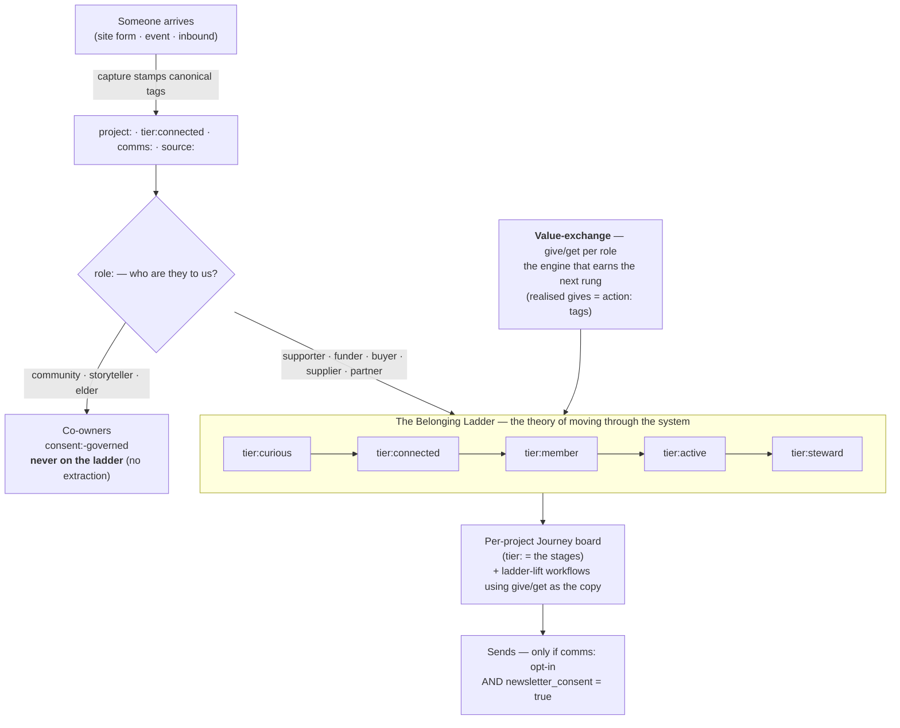
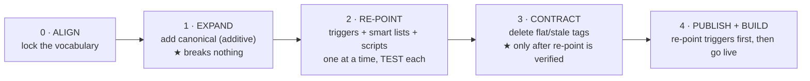

# ACT CRM — Strategy & Method Map

> The whole system in one page. **Strategy** = how a person moves through ACT. **Method** = how we migrate the live CRM onto it without breaking anything.

## The strategy in one line

**A person arrives → gets canonical tags → climbs the belonging ladder → each rung is earned by a real value-exchange (give/get) → per-project workflows nudge the next rung — and community are co-owners, never moved through a funnel.**

## The model (strategy)



**The five tag namespaces that drive it** (one fact = one tag):
`project:` (which project) · `role:` (who they are) · `tier:` (their rung) · `interest:` (what they want) · `comms:`/`consent:` (whether we may send). Plus `source:`/`place:` (report only) and `action:` (gives that actually happened).

## The method (safe migration)



**The one rule that makes it safe:** a flat tag is deleted only after every workflow trigger, smart-list filter, and script that fires on it has been re-pointed to the canonical tag **and tested** — one at a time. EXPAND only adds, so it can never break a live drip, list, or pipeline.

## At a glance (plain text)

```
ARRIVE ──► CANONICAL TAGS ──► role? ──► supporter ──► LADDER ──► workflows ──► send (if consent)
                                  └────► community ──► co-owner (consent:, no ladder)

LADDER:  curious → connected → member → active → steward
ENGINE:  value-exchange (give / get), per role, deepening up the rungs
         the rung is EARNED (action: gives), never seeded

MIGRATION:  ALIGN → EXPAND(+) → RE-POINT(test each) → CONTRACT(gated) → PUBLISH
            EXPAND adds-only · nothing deleted before its trigger is re-pointed
```

## How to read it
- **Tags say who/where; the ladder says how far; the value-exchange says what passes between us.** Three layers, one model.
- **Per project, one Journey board** (Harvest, Goods, JusticeHub…), unified by the cross-project `tier:` tag — see [[../decisions/ghl-ecosystem-journey-architecture]].
- **The community line is non-negotiable** — `role:community`/`storyteller`/`elder` are co-owners by right, governed by `consent:`, and never laddered.
