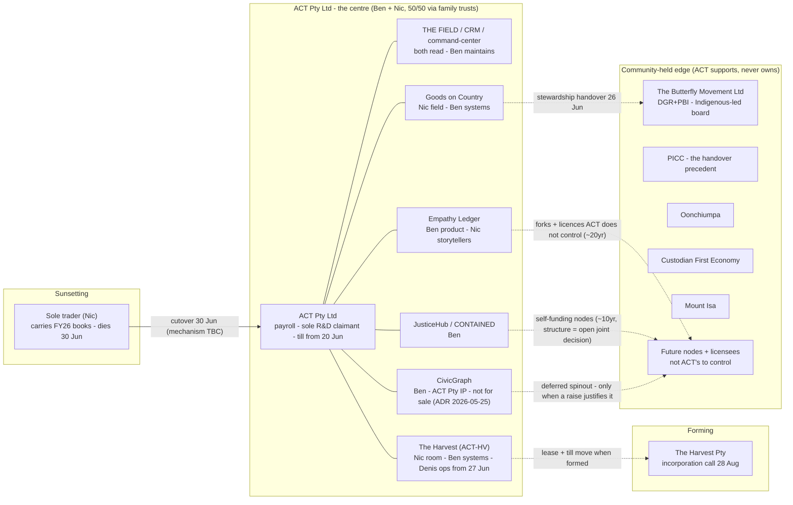
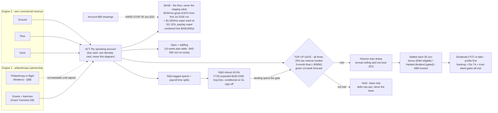
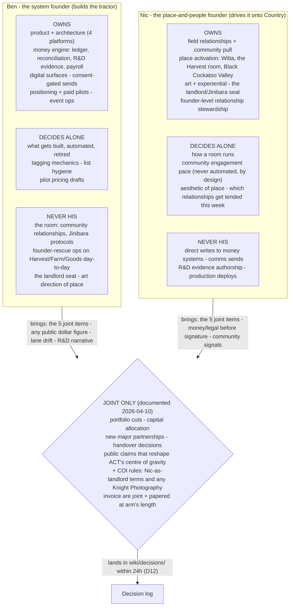
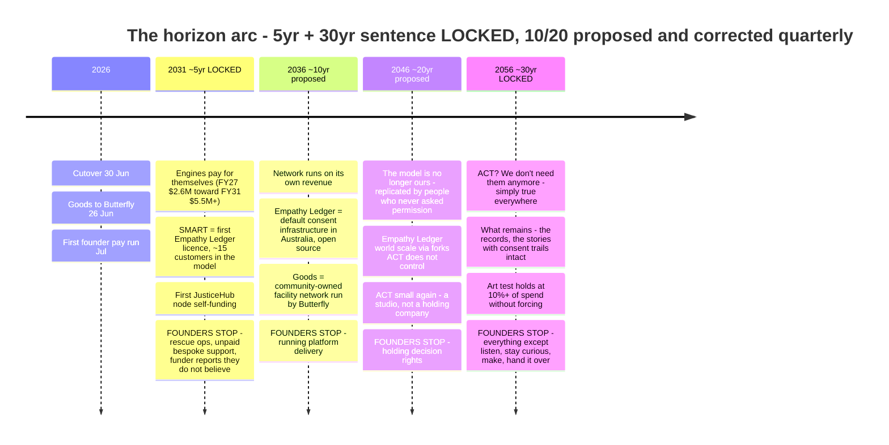
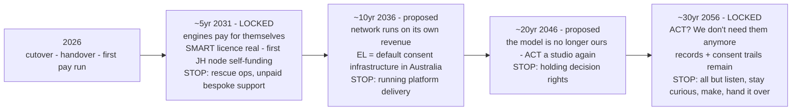
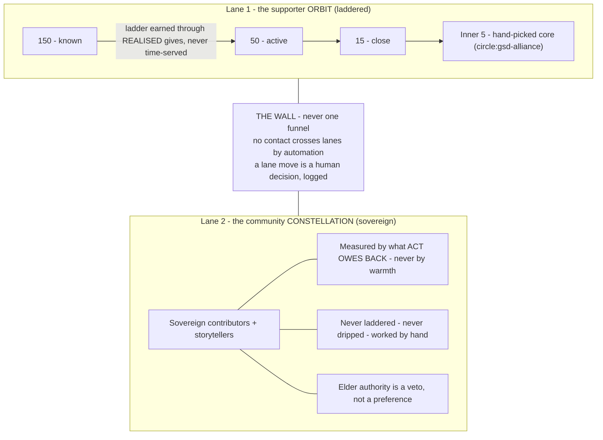
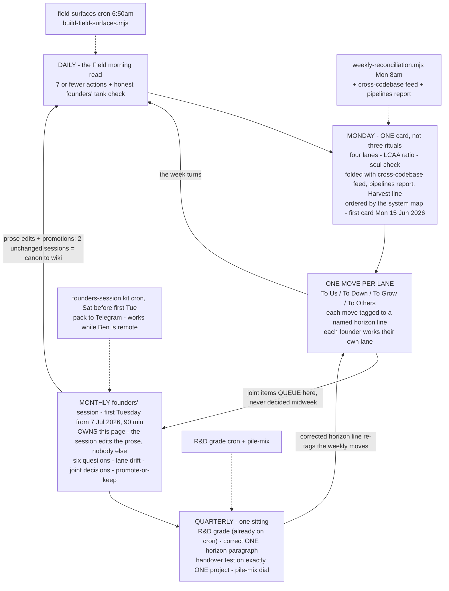

# The Whole Picture — the six diagrams

> Canonical source for every diagram on "A Curious Tractor — The Whole Picture" (page source: `thoughts/shared/plans/2026-06-10-act-whole-picture-founders-os.md`).
> Spec: `thoughts/shared/plans/2026-06-10-whole-picture-visualization-recommendation.md` §2.
> Created 2026-06-11.

Three rules govern the set:

- **Doctrine vs data.** A diagram may carry decided constants (the $10K/mo wage, SG 12%, the gate conditions, handover dates) because those change only by joint decision at the session that already edits the page. It may never carry live figures (cash, run-rate, gate status). Live figures live on the surface (`/api/field/surface?name=whole`) and the Monday card.
- **One canonical source, two renders.** All six blocks live here. GitHub renders them; each is pasted into the matching Notion section as a code block with language set to Mermaid. Repo edited first, Notion re-pasted second, only at the monthly session.
- **Conservative Mermaid only.** Notion pins an older mermaid.js. Flowchart, sequence, gantt, class, ER are safe; timeline is unverified there. Every block is flowchart except the horizon arc, which ships a timeline for GitHub plus a guaranteed flowchart fallback for Notion. No classDef styling (Notion dark mode mangles it), ` ` for line breaks, quoted labels.

When a prose block of the page promotes to a wiki file, its diagram moves alongside it (this file keeps a stub link), so the canon spreads without ever holding two divergent copies.

---

## 1. The system map

Solid edges hold today; dashed edges are the handover doctrine. The 12th table row ("Org frame FY26") is an accounting frame, not an entity: it stays a table row and a surface banner, never a box.

Solid = holds today · dashed = handover direction · partnerships sit on the edge with no ownership edge by design.

Wired to: the page §2 table · `wiki/decisions/act-core-facts.md` · live per-node money states on the whole-picture surface · `thoughts/shared/plans/act-entity-migration-checklist-2026-06-30.md`.
Notion: page §2 · Miro session frame 1.
Refresh: static doctrine; redrawn only when an entity forms, dies, or hands over.

## 2. The money engine

A gate diamond, not a sankey: the gate IS a conditional and a sankey cannot draw one. Structure is decided (D11.2, Standard Ledger 5 May); the session ratifies, it does not redesign.

Wired to: live gate status + cash on the surface and the Monday card · `/finance/money-alignment` and `/company` (both on `apps/command-center/src/lib/finance/ledger.ts`) · `thoughts/shared/handoffs/money-state-of-play/current.md` · `thoughts/shared/data/money-command-snapshots/`.
Notion: page §4 · NOT taken to Miro.
Refresh: static for structure and decided constants. The diagram says where the gate status lives, not what it is.

## 3. The roles split

Two founder columns feeding one joint-gate diamond. The owns / decides-alone / never stack per founder, with "brings to the session" as the labelled edge.

Wired to: `wiki/decisions/2026-04-founder-lanes-and-top-two-bets.md` · the Harvest hub decision gates (`thoughts/shared/drafts/harvest-operating-hub-notion-2026-06-10.md`) · the decision-log convention (page D12).
Notion: page §3 · Miro session frame 2 (the diagram Nic most needs to push back on).
Refresh: static; redrawn only when the founder-lanes decision is updated, which per the promotion rule means a new entry in `wiki/decisions/`.

## 4. The horizon arc

Two blocks: timeline canonical for GitHub, flowchart fallback guaranteed in Notion. The paste test (one paste of the timeline into Notion) settles which one the page carries.

Primary (repo; test once in Notion):

Fallback (guaranteed in Notion):

Wired to: page §6 · the quarterly check (one horizon paragraph corrected per quarter) · weekly moves tagged to a named horizon line on the Monday card · the art-test drift light fed by the LCAA ratio `scripts/weekly-reconciliation.mjs` already emits.
Notion: page §6 (whichever block survives the paste test) · Miro session frame 3.
Refresh: re-cut at most quarterly; promotion target `wiki/decisions/2026-horizon-arc.md` (proposed).

## 5. The two-lane community model

Schematic for the DOCTRINE, hard-linked to the live surfaces for the DATA. Real people are never drawn in Mermaid: `thoughts/shared/orbit-viz.html` is the real thing, refreshed daily at 6:50am.

The drawing is the rule; the people are live on the orbit tending board (daily 6:50am build). Community-line violations (a storyteller in a drip) are a defect class tracked there, not here.

Wired to: `thoughts/shared/orbit-viz.html` + `thoughts/shared/the-field-morning.html` via `/api/field/surface` · builders `scripts/build-orbit-viz.mjs` / `scripts/build-morning-read.mjs` · `scripts/lib/field-warmth.mjs` · `thoughts/shared/plans/2026-06-03-act-network-circle-action-stages.md`.
Notion: page §5, with two links directly under it: the live orbit at `/api/field/surface?name=orbit` and the morning read at `?name=morning`.
Refresh: doctrine static; data refreshes daily via the existing `field-surfaces` PM2 cron.

## 6. The weekly drumbeat loop

This diagram doubles as the automation spec: every dashed edge must correspond to a real cron in `ecosystem.config.cjs`, or the drumbeat is willpower.

Wired to: `scripts/weekly-reconciliation.mjs` (Mon 8am; lanes + LCAA + soul check already emitted) · `scripts/build-field-surfaces.mjs` (daily) · `thoughts/shared/cross-codebase-feed/latest.md` · `thoughts/shared/reports/project-pipelines-latest.md` · `wiki/cockpit/four-lanes-today.md`.
Notion: page §7.
Refresh: static; the dashed feeds are verified against `pm2 jlist` whenever the diagram is re-cut.

---

## Where each diagram lives

| Visual | Canonical source (git) | Notion page | Miro session | Live data companion |
|---|---|---|---|---|
| System map | this file | §2 code block | YES, frame 1 | the-whole-picture.html node board |
| Money engine | this file | §4 code block | no (decided, SL-gated) | Monday card · `/finance/money-alignment` · `/company` |
| Roles split | this file | §3 code block | YES, frame 2 | none needed (doctrine only) |
| Horizon arc | this file (timeline + fallback) | §6, fallback unless timeline passes the paste test | YES, frame 3 | quarterly rider flags the paragraph due |
| Two-lane community | this file | §5 code block + 2 links | no (orbit-viz is the workshop surface) | orbit-viz.html + the-field-morning.html, daily |
| Drumbeat loop | this file | §7 code block | no | `pm2 jlist` is the audit; Monday card is the heartbeat |

Rules: repo edited first, Notion re-pasted second, only at the monthly session. The Miro board is disposable scaffolding; after the session its corrections flow back into this file and the board is archived. Never let Miro become a third copy of the truth.
