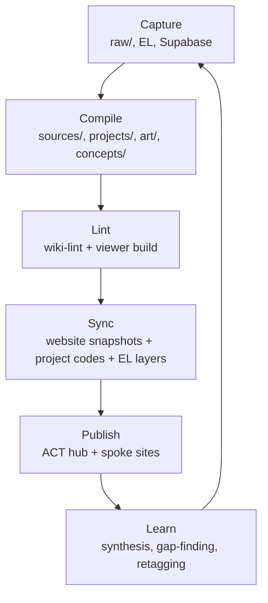

# Knowledge Ops Dashboard

> The working surface for the ACT knowledge loop inside Obsidian. Use this to watch capture, bridge, compile, and sync health without leaving the vault.

**Vault note:** this dashboard assumes `wiki/` is opened as the Obsidian vault root. Paths below are vault-relative.

## The Loop



## Operating Anchors

- [[act-knowledge-ops-loop|ACT Knowledge Ops Loop]]
- [[living-website-operating-system|Living Website Operating System]]
- [[wiki-project-and-work-sync-contract|Wiki Project & Work Sync Contract]]
- [[project-identity-and-tagging-system|Project Identity & Tagging System]]
- [[art/README|ACT Art Domain]]

## Recent Raw Capture

These are the latest things that have landed in `raw/` but are not yet necessarily useful to the compiled wiki.

```dataview
TABLE WITHOUT ID
  file.link as "Raw file",
  file.mtime as "Captured"
FROM "raw"
SORT file.mtime DESC
LIMIT 20
```

## Recent Source Summaries

This is the bridge layer. If this list is thin compared with `raw/`, the knowledge base is capturing faster than it is compiling.

```dataview
TABLE WITHOUT ID
  file.link as "Source summary",
  date as "Date",
  source_system as "System",
  source_table as "Table",
  raw_source as "Raw source"
FROM "sources"
WHERE file.name != "index"
SORT date DESC, file.mtime DESC
LIMIT 20
```

## Latest Synthesis

The compounding layer. Good questions should keep making this list better.

```dataview
TABLE WITHOUT ID
  file.link as "Synthesis note",
  file.mtime as "Updated"
FROM "synthesis"
SORT file.mtime DESC
LIMIT 12
```

## Canonical Project / Work Sync Surface

This is the wiki-side contract the website, Empathy Ledger, and Supabase should be following.

```dataview
TABLE WITHOUT ID
  file.link as "Page",
  canonical_code as "Code",
  entity_type as "Entity",
  tagging_mode as "Tagging",
  public_surface as "Surface",
  website_path as "Website",
  empathy_ledger_key as "EL key"
FROM "projects"
WHERE canonical_code
SORT canonical_code ASC
```

## Latest Health Reports

Open the newest lint report when something feels off. That is where broken links, source-bridge gaps, and frontmatter drift should show up first.

```dataview
TABLE WITHOUT ID
  file.link as "Report",
  file.mtime as "Generated"
FROM "output"
WHERE startswith(file.name, "lint-")
SORT file.mtime DESC
LIMIT 10
```

## Source Bridge Queue

Work the bridge layer from the latest lint report, not from memory. The priority section in `output/lint-YYYY-MM-DD.md` is the backlog for turning captured material into navigable knowledge.

Good default rhythm:

- run `node scripts/wiki-lint.mjs --write-report`
- read `Priority Raw Sources Missing Source Summaries`
- bootstrap a focused batch with `npm run wiki:bootstrap:sources:articles -- --limit 20`
- then work the next non-article queue with `npm run wiki:bootstrap:sources:priority -- --limit 20`
- re-run lint and watch bridge coverage move
- only then treat the wiki as ready to support more site composition

## Commands

```bash
node scripts/wiki-lint.mjs --write-report
node scripts/wiki-build-viewer.mjs
node scripts/wiki-sync-supabase-projects-snapshot.mjs
npm run wiki:bootstrap:sources:articles -- --limit 20
npm run wiki:bootstrap:sources:priority -- --limit 20
cd /Users/benknight/Code/act-regenerative-studio && npm run sync:wiki && npm run sync:project-codes && npm run sync:el-media && npm run sync:el-editorial
```

## Why This Dashboard Exists

- Obsidian should be the window into the system, not a dead note archive.
- `raw/` only matters if it becomes `sources/`, canonical pages, or synthesis.
- Supabase should be visible to the knowledge base as operational state, not a hidden backend the wiki never sees.
- The website should stay thin by reading snapshots generated from this loop.

## Backlinks

- [[tractorpedia|Tractorpedia]]
- [[llm-knowledge-base|LLM Knowledge Base]]
- [[continuous-pipeline|Continuous Pipeline Architecture]]
- [[art/philosophy/art-as-infrastructure|Art as Infrastructure]]
