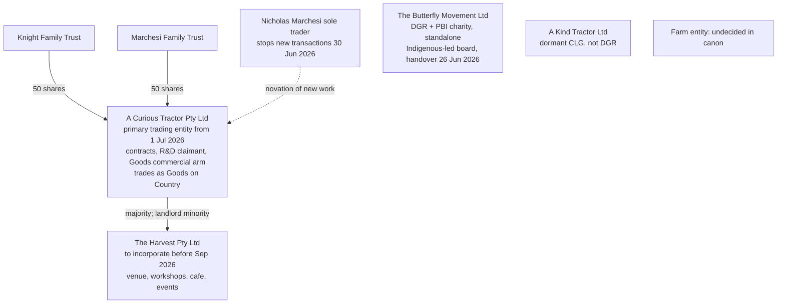
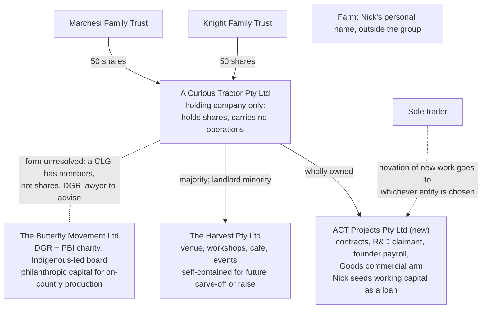

# Holding company + ACT Projects: the proposal on the table

> **Status: proposed, not decided.** From a strategy call with Standard Ledger, filed at [meeting record](../../thoughts/shared/meetings/2026-06-12-standard-ledger-structure-call.md). Canon ([ACT Core Facts](act-core-facts.md)) stays unchanged until Ben and Nick decide and the DGR lawyer answers. This page holds the whole picture so the decision gets made once, not in fragments.
>
> Nothing here is tax, legal, or financial advice. The professional calls sit with Standard Ledger and the DGR lawyer; this page organises the decision.

## The proposal in one paragraph

A Curious Tractor Pty Ltd stops being the operating company and becomes a holding company that only holds shares. A new subsidiary (working name "ACT Projects") takes the contracts, the R&D work, the founder payroll, and the Goods commercial arm: everything the sole trader does today. Nick seeds it with working capital as a loan. The Harvest subsidiary (already decided 2026-05-05) sits beside it. The Butterfly Movement Ltd connects to the group in a form the DGR lawyer still has to confirm. The farm stays outside the group, operating in Nick's personal name.

## What the call confirmed vs what it opened

Most of the call re-confirmed decisions already made. Four things are genuinely open.

| Topic | Status | Where it lives |
|---|---|---|
| Harvest as its own subsidiary | **Already decided 2026-05-05.** One delta: the call said "wholly owned"; the standing decision has the landlord as minority shareholder under profit share. The standing decision holds unless reopened with Nick and the landlord. | [Harvest subsidiary decision](2026-05-harvest-subsidiary-structure.md) |
| FY27 founder pay: $10K/month payroll each + super, top-ups via director loan, settled at year end | **Already decided 2026-05-05 (D11.2).** The call added the Div 7A warning (loan outstanding at year end is treated as income unless put on complying terms with interest) and the option to exit PAYG instalments by moving to payroll. Both consistent with D11.2. | [Migration checklist §D11.2](../../thoughts/shared/plans/act-entity-migration-checklist-2026-06-30.md) |
| Invoice the $100K already transferred | **Already planned (D11.5, Option A confirmed 2026-05-05).** Inv 15078 dated 2025-09-30 matches the 6 Oct 2025 transfers. Still not raised. This is the immediate action regardless of structure. | [Knight Photography invoice plan](../../thoughts/shared/plans/knight-photography-fy26-invoice-proposal.md) |
| Progressive sole trader migration, honest-delay fallback | Canon cutover rules 1 to 4, unchanged. | [ACT Core Facts](act-core-facts.md) |
| Holdco with an ACT Projects operating subsidiary | **New. Open decision 1.** | this page |
| How Butterfly connects to the group | **New question. Open decision 2.** | this page |
| Farm in Nick's personal name, no farm entity | **New. Open decision 3.** | this page |
| FY26 founder draw scale (up to ~$200K each before 30 June) | **Bigger than the standing plan covers. Open decision 4.** | this page |

## Structure today (canon)

## Structure as proposed in the call

The proposal extends the principle canon already holds: each business activity self-contained, each project earning its own right to grow, legibility worth more than minimal compliance. What it changes is where the operating weight sits.

## Open decision 1: which entity trades from 1 July

The cutover is 18 days away. The NAB account for the existing Pty is still waiting on Nick's trust documents. Xero is not open. Novation letters have not gone out.

| Option | What it means | Must be true by 30 June | Cost carried |
|---|---|---|---|
| **A. Trade from A Curious Tractor Pty Ltd** (canon plan) | The Pty operates as planned. Holdco conversion happens later if wanted, ideally at a financial year boundary and before outside investment lands. | NAB account open, Xero live, novation letters name the Pty | A later restructure means a second round of novations, the R&D claimant moves again, and contracts migrate twice |
| **B. Adopt the holdco now; incorporate ACT Projects; trade from Projects** | The Pty never trades. Everything lands in Projects from day one. | New ACN, ABN, GST, bank account, and Xero file for Projects inside 18 days. Banking is the long pole. | Front-loaded paperwork now. The QBE grant is already contracted to the Pty and needs assignment or stays in the holdco. |
| **C. Honest delay** (canon Rule 2) | The sole trader keeps trading until the chosen entity is genuinely live. | Nothing new. This is the standing safety net under either A or B. | More FY27 income in the sole trader and a messier story, but no mis-attribution. |

The one move that is wrong under every option: sending novation letters, or signing new from-1-July contracts, that name an entity which might change within weeks. **Hold the letters until this decision is made.** Canon Rule 1 wording ("new tranches from 1 July invoice to the Pty") gets finalised by this decision.

### What moves with the operating entity

| Item | Today points at | Under option B points at |
|---|---|---|
| R&D Tax Incentive FY27 registration (43.5% refundable offset; contemporaneous records) | A Curious Tractor Pty Ltd | ACT Projects |
| QBE Catalysing Impact contract | Already contracted to the Pty | Assignment to Projects, or stays in holdco (lawyer view needed) |
| "Goods on Country" trading name | Registered against the Pty ABN | Re-register against the Projects ABN |
| Founder payroll employer (D11.2) | The Pty | ACT Projects |
| Knight Photography Phase 3 invoices (D11.5) | The Pty | ACT Projects |
| Justice and storytelling contract revenue (several hundred thousand each, per call) | The Pty | ACT Projects |
| Novation letter wording (Rule 1) | "invoice to the Pty" | "invoice to ACT Projects" |
| Xero file, NAB account, Stripe | The Pty | ACT Projects (one more of each) |

The R&D row is the sharpest: the claimant must be the company that incurs the R&D spend, and the call named getting R&D into the right entity as the point of the structure. Whichever entity is chosen, the work, the costs, and the records have to land in it from day one of FY27.

## Open decision 2: how Butterfly connects

Canon facts: endorsed Item 1 DGR + PBI since 17 Jan 2012, ACNC-registered since Dec 2012, stewardship handover 26 June 2026 (14 days away), Indigenous-led board being installed, DGR runs only through Butterfly, philanthropic capital intended for on-country production facilities, founders not drawing wages from it.

The call sketched "wholly owned subsidiary". Two frictions before that framing can stand:

1. Butterfly appears to be a public company limited by guarantee (verify against the constitution). A CLG has members, not shareholders. There is nothing to own in the share sense; control runs through membership and board appointment rights.
2. Control by a for-profit holdco pulls against the two things that make Butterfly valuable: the Indigenous-led board being installed, and its PBI and DGR standing.

The likely landing zone is Butterfly beside the group rather than inside it, connected by agreements: arm's-length services, grant agreements, and asset-use terms. The lawyer confirms or corrects.

### Questions for the DGR lawyer (answers before August, per the call)

| Question | Why it matters |
|---|---|
| Confirm legal form, constitution, and who the members are after the 26 June handover | Determines whether "subsidiary" is even mechanically possible |
| Can the holdco hold membership or board appointment rights, and what does that do to PBI status, ACNC registration, and DGR endorsement? | The call's open question, stated precisely |
| Is holdco control compatible with the Indigenous-led board commitment? | Governance promise already made; structure should serve it, not dilute it |
| Who owns production plant built with philanthropic capital, and on what terms does the commercial arm use it? | Goods plant is intended to move to community ownership; private benefit rules apply |
| Arm's-length requirements when Butterfly pays an ACT entity for services ("the charity may pay us as a consultant") | Related-party transactions need documented pricing |
| Receipting and auspicing flows Butterfly can run now, ahead of and after handover | Butterfly can receipt today; sequencing donations correctly protects the endorsement |

## Open decision 3: the farm

Per the call: the farm is not a core business entity for now. Income and accommodation run in Nick's personal name. Artists-in-residence may link the farm to Harvest later. Farm accounting stays separate.

Canon currently says "Farm entity: TBD, designing" and lists a planned farm lease to the Pty with Nic as landlord at an arm's-length rate. To close this decision: Nick confirms the personal-name approach, Standard Ledger confirms the treatment of the lease and accommodation income in Nick's hands, and the canon Farm row updates from "designing" to "no entity for now".

## Open decision 4: FY26 founder draw, final numbers

Call targets: up to ~$200K each before 30 June, with ~$300K total as the working figure including the $100K already moved. The standing plan covers Ben's side to ~$250K via Knight Photography invoices 15078 to 15081. Open items:

| Item | Detail |
|---|---|
| Final number for each founder | Set against available cash. Receivables of ~$507K sit unpaid on the sole trader; the new Snow tranche has landed. Drawing ahead of collections needs a cash check. |
| Nick's vehicle | Personal ABN invoice to the sole trader, or partnership. Partnership routing raises the same personal services income attribution question that ruled out trust routing on Ben's side (D11.5). Standard Ledger to confirm. |
| Tax provisioning | Expect close to half at personal marginal rates. ATO payment plans are available. PAYG instalments likely follow in FY27 unless payroll replaces the pattern. |
| Mechanism | Unchanged: D11.5 for Ben, equivalent invoice path for Nick. This decision sets the totals those mechanisms execute. |

## FY26 R&D and founder pay: two separate machines (added 2026-06-12)

A question raised after the call: can moving money out of the sole trader before 30 June, and paying the founders for their FY26 R&D time as if the Pty operated all year, make the full year claimable? Short answer: no for the full year, yes for a ten-week slice, and FY27 is where the full-year machine runs.

[Path C](../../thoughts/shared/plans/rd-tax-incentive-fy2526-path-c.md) (locked 2026-04-27) already settled the shape: sole traders are not eligible R&D entities, so work conducted before the Pty existed cannot enter a claim regardless of how the money is journaled in June. Moving cash moves a deduction; it does not move the activities. The February and March plans that assumed a Pty operating all year were archived for exactly this reason: structural eligibility risk, audit exposure, penalties.

The same applies to any retrospective agency framing, in either direction. If the Pty "acted for the sole trader", agency attributes the work to the principal, the sole trader, which is not an R&D entity: that version is worse, not better. If the sole trader "acted for the Pty", there was no company in existence before 24 April to be the principal, and the R&DTI records requirement is contemporaneous: a June document describing a year of agency nobody wrote down at the time is a reconstruction, not a record. An arrangement assembled now whose purpose is the offset is also the exact profile the joint ATO and AusIndustry integrity checks exist for.

| Slice of FY26 | Who can claim R&DTI | What it takes |
|---|---|---|
| 1 Jul 2025 to 23 Apr 2026 | Nobody. This was sole trader work; forfeited per Path C. | Nothing changes this; the Pty did not exist. Founder invoices to the sole trader (D11.5) still work as ordinary deductions: that is the founder-pay play, not an R&D play. |
| 24 Apr to 30 Jun 2026 (~10 weeks) | A Curious Tractor Pty Ltd | The Pty genuinely engages the founders now (resolutions and agreements dated today, describing the true period, never backdated), the work is documented contemporaneously, and amounts owed to associates are actually PAID by 30 June to land in the FY26 claim. Rough shape on the Path C personnel basis: about $59K (Ben ~$44K at 95% of the $250K basis, Nic ~$15K at 40% of $200K) for roughly $26K of refund, plus any other R&D costs the Pty incurs and pays in the window. Standard Ledger prices it. |
| FY27, full year | The operating entity (decision 1) | Payroll per D11.2 from 1 July, every founder dollar on company books with records. Path C already names FY27 as the big year. |

If the Pty cannot pay by 30 June (NAB is still blocked), the window costs are not lost: expenditure to associates that is incurred but unpaid carries to the year it is actually paid and enters that year's claim. Slower beats sloppy: a late clean payment is worth more than a rushed paper trail. Path C already lists "incurred AND paid" as a Standard Ledger question; treat paid-by-30-June as the working assumption until answered.

The full working plan for the window claim and the FY27 setup, including the June-quarter invoice split at 24 April and the window evidence snapshot (2,506 commits across the five project repos), lives at [rd-fy26-window-and-fy27-setup](../../thoughts/shared/plans/rd-fy26-window-and-fy27-setup.md).

Two repo-level flags this question surfaced:

1. The migration checklist §3 R&D rows contradicted Path C ("grandfathered through 30 June", "claim FY26 in Nic's personal return"). Corrected 2026-06-12 to point at Path C.
2. The FY26 pack carries a tension Path C names but does not resolve: the four-register total ($354,047) and the personnel basis read as full-year figures, while Path C's own timing rule says only activities from 24 April count. The R&D consultant and Standard Ledger need to cut the registers to the defensible window before AusIndustry registration. Better we find this than an AusIndustry reviewer.

One modelling question for Standard Ledger before the FY26 draw is finalised: every extra dollar drawn as a sole-trader invoice is personal income now with no offset attached; every dollar the Pty pays for window R&D work, or FY27 payroll pays next year, sits in claimable territory. The split between the two is a decision, not a default.

On value per dollar, the boring route may also be the bigger one for FY26. A founder invoice deducted against the sole trader's income is worth up to Nic's top marginal rate (about 47 cents), while the R&DTI pays 43.5 cents refundable. So even if a full-year FY26 claim were available, it would chase a smaller number than the deduction already in hand, at far higher risk. The premium flips to the company side from FY27: the payer is a company that can take the refundable offset in cash while in loss, and there is no sole trader income left to deduct against. Standard Ledger to model the exact rates and Nic's absorption before the draw is finalised.

## If adopted: exact canon edits (only after the decision, then run the sync)

| File | Change |
|---|---|
| `wiki/decisions/act-core-facts.md` | Pty row: "Primary trading entity from 1 July 2026" becomes "Holding company; subsidiaries trade". New row for ACT Projects Pty Ltd: contracts, R&D claimant, Goods commercial arm, trades as Goods on Country. Butterfly row: "A Curious Tractor Pty Ltd runs Goods' commercial arm + is the R&D claimant" repoints to Projects. Farm row per decision 3. Rule 1 novation wording names the operating entity. |
| `thoughts/shared/plans/act-entity-migration-checklist-2026-06-30.md` | §3 R&D FY27 re-registration row repoints to Projects. §1 and §2 novation targets repoint. Subscriptions and banking sections gain one column for the extra entity. |
| `thoughts/shared/plans/knight-photography-fy26-invoice-proposal.md` | Phase 3 counterparty becomes ACT Projects. |
| Sync | `node scripts/sync-act-context.mjs --apply` so every repo's CLAUDE.md picks up the new structure. |

## Action items from the call

| # | Action | Owner | When |
|---|---|---|---|
| 1 | Send trust documents to NAB (blocks bank, which blocks Xero) | Nick | Now |
| 2 | Raise Inv 15078 ($100K) per D11.5, then Phase 2 invoices | Ben | This week |
| 3 | Decide the operating entity (decision 1), with Standard Ledger's view in writing | Ben + Nick | By 19 June, so banking and letters can follow before 30 June |
| 4 | Agree FY26 draw totals and Nick's vehicle (decision 4); transfers before 30 June | Ben + Nick + Standard Ledger | By 19 June |
| 5 | Send the DGR lawyer question list (decision 2) | Ben | Before the 26 June handover; answers before August |
| 6 | Confirm farm-stays-personal (decision 3) | Nick | Next founders conversation |
| 7 | Spin up Xero once banking is live | Standard Ledger + Ben | Cutover week |
| 8 | Payroll setup for the FY27 start (D11.2) | Standard Ledger | July |
| 9 | Monthly reporting and forecasting cadence (CFO-style support offered) | Ben + Standard Ledger | Next 6 to 12 months, sharper once Harvest trades |

## See also

- [Meeting record (summary + verbatim transcript)](../../thoughts/shared/meetings/2026-06-12-standard-ledger-structure-call.md)
- [ACT Core Facts](act-core-facts.md): canon, unchanged by this page
- [Migration checklist](../../thoughts/shared/plans/act-entity-migration-checklist-2026-06-30.md): §12 addendum points back here
- [Harvest subsidiary decision](2026-05-harvest-subsidiary-structure.md)
- [Knight Photography FY26 invoice plan](../../thoughts/shared/plans/knight-photography-fy26-invoice-proposal.md)
- [Knight family + ACT pay and entity setup](../finance/knight-family-act-pay-and-entity-setup.md)
- [Visual decision pack (HTML one-pager for the Ben + Nick conversation)](../../thoughts/shared/briefs/entity-structure-decision-pack-2026-06.html)
- Provenance: [sidecar](2026-06-12-holdco-structure-proposal.provenance.md)
