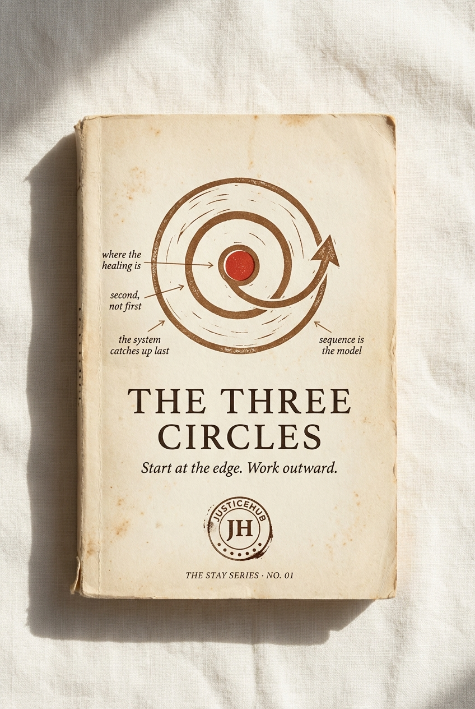

# Chapter 4 · The Three Circles

> *Start at the edge. Work outward.*

*The locked cover for STAY Series Book 01.*

## The diagram

*The locked journal spread for the Three Circles model. Use this version everywhere — funder decks, the book, the per-community volumes, the website.*

**How to read it:**

- The innermost ring is **The Edge** — the people the system has failed hardest. The methodology starts here, first, always. No work begins until the Edge is the centre.
- The middle ring is **The Next** — the kin, workers, advocates, Aunties, mentors immediately around the Edge. This ring is strengthened second, by what comes from the centre. It is not a "support service" — it is the carrying structure for the Edge.
- The outermost ring is **The Rest** — funders, government, sector, public. This ring is changed last, by what travels outward from the centre. The methodology refuses to start here, even when funders ask it to.
- The arrow direction is critical: outward only. **The diagram refuses to draw arrows pointing inward**, because the moment you draw an inward arrow you've inverted the methodology and re-created the hierarchy.

**Diagram status:** locked (Apr 2026). The current version is the journal-spread render. A Gemini re-spin may be needed if the brand wants a higher-contrast wall-poster version for funder meetings — flag for revision.

## The model

| # | Circle | Who | When |
|---|---|---|---|
| 1 | **The Edge** | The people the system has failed hardest. | First. Always. |
| 2 | **The Next** | The kin, workers, advocates immediately around them. | Second. Strengthened by what comes from the centre. |
| 3 | **The Rest** | Funders, government, sector. | Last. Changed by what travels outward. |

## The argument

> *"Authority sits with the people closest to the consequence."* — Tyson Yunkaporta, after sixty-five thousand years.

Documented again by Elinor Ostrom across five continents. Proven at national scale by Fundación Diagrama in Spain over thirty years.

The Three Circles is the methodology: start where the system has failed hardest, and let the work travel outward. Most programs do the opposite. Most programs fail.

## What we have NOT yet said in this chapter (revision notes)

- **The structural critique of how Australian funders operate** — *"Most foundations fund Circle 3 first and wonder why nothing changes."* This needs to be the first move in the long-form chapter.
- **The operating principle of every other ACT project** — Goods on Country starts at the edge, CONTAINED Room 1 was designed by survivors first, Empathy Ledger captures Edge voices first. Show the pattern across the ecosystem.
- **The failure-rate count of centre-out approaches** — there should be a number of how many "evidence-based" centre-out programs have failed in Australia in the last decade
- **The funder challenge** — *"Fund us to start at the edge. We will tell you when the work is ready to travel outward. We will not fund Circle 3 first."*
- **The closing line** — *"The Three Circles is the only methodology in Australian youth justice that has been proven for sixty-five thousand years AND verified by a Nobel Prize."*

## What this chapter produces

- The cover and front matter for [STAY Series Book 01 — THE THREE CIRCLES](../series/) (subtitle: *Start at the edge. Work outward.*)
- The diagram on the journal spread — see `../../output/three-circles-journal-spread.png`
- The opening of every funder pitch from now on — the methodology hook before the cost arithmetic

## Source

Locked §4.1 of [`../../projects/justicehub/the-full-idea.md`](../../projects/justicehub/the-full-idea.md). Open questions in that section: *Does the diagram land? Anything in the back-blurb that needs softening or sharpening?*
