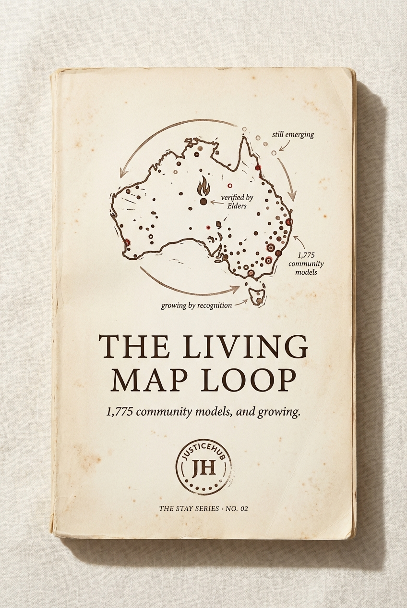

# Chapter 5 · The Living Map Loop

> *How communities grow the Australian Living Map of Alternatives.*

*The locked cover for STAY Series Book 02.*

## The diagram

*The locked journal spread for the Living Map Loop. The four moves arranged as a loop, not a line — because the loop never closes.*

**How to read it:**

- The four nodes are **WITNESS · DOCUMENT · VERIFY · PUBLISH** — arranged clockwise around a central well that holds the Australian Living Map of Alternatives.
- The arrows go around the loop, never in a straight line. There is no "end state" — every published model attracts the next witness, and the loop runs again.
- The central well grows over time. 1,775 community models today. The well is shaped to hold tens of thousands.
- **The verify step is the methodologically distinctive one.** Most evidence pipelines run *capture → analyse → publish*. The Living Map Loop runs *witness → document → verify → publish*, where verify means **community sovereignty over what counts as proof.** Elder review. Kin review. Place-led validation. Not academic peer review. Not government audit.

**Diagram status:** locked (Apr 2026). The journal spread version is the canonical one. A simplified four-node version may be needed for the funder deck — note for Gemini re-spin if wanted.

## The four moves

| # | Step | What happens | Who does it |
|---|---|---|---|
| 1 | **Witness** | Someone notices a working model the formal system has never recognised. | A community member, a worker, anyone willing to look. |
| 2 | **Document** | The model gets captured properly — story, mechanism, conditions, outcomes — in the witness's own voice. | Storyteller plus the person running the model. |
| 3 | **Verify** | Community sovereignty over what counts as proof. Elder-, kin-, place-led validation. **Not** academic peer review. **Not** government audit. | The community itself, on its own terms. |
| 4 | **Publish** | The entry joins the Map. Now searchable, citable, fundable. | The Map (the infrastructure does the rest). |

## The argument

> *the things that work are already happening. we just have to write them down — properly.*

One thousand seven hundred and seventy-five community-led models, and growing. One hundred and twenty-eight already verified by Elders, communities, or trials. The rest are the work — and the Loop is how we move them up the ladder.

The system doesn't know what works because it never asked. The Australian Living Map of Alternatives is the answer to that — built so communities can witness, document, verify and publish *what already works*, on their own terms.

Every entry attracts the next witness. The library grows by recognition, not by extraction.

## What we have NOT yet said in this chapter (revision notes)

- **A direct refutation of "we need more research"** — *"We have one thousand seven hundred and seventy-five community models on file. Verified, voiced, indexed. The research is done. Pick one and fund it."*
- **A counter-method to peer review** — *"Community sovereignty over what counts as proof is not lower-rigour. It is different rigour. Elder review is rigour."*
- **The "who validates whom" politics** — academic peer review excludes most of the people doing the work
- **The funder shortcut** — *"Stop commissioning six-month landscape reviews. Use the map. We did the review. It is free."*
- **The most damning line** — *"Every consultant doing a youth justice landscape review is doing work the Living Map already did."*

## What this chapter produces

- The cover and front matter for [STAY Series Book 02 — THE LIVING MAP LOOP](../series/) (subtitle: *1,775 community models, and growing.*)
- The diagram on the journal spread — see `../../output/alma-loop-journal.png`
- The piece every consultancy that pitches a "landscape review" needs to be handed before the meeting starts

## Source

Locked §4.2 of [`../../projects/justicehub/the-full-idea.md`](../../projects/justicehub/the-full-idea.md). Open questions: *Is the WITNESS / DOCUMENT / VERIFY / PUBLISH naming right? 1,775 / 128 — confirm or update.*
