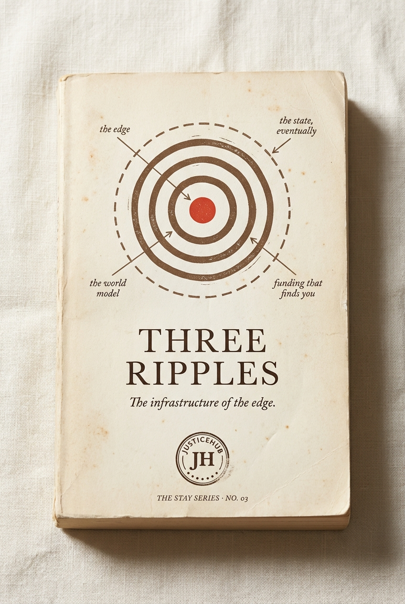

# Chapter 6 · Three Ripples

> *The infrastructure that makes the edge legible to capital.*

*The locked cover for STAY Series Book 03.*

## The diagram

*The locked journal spread for Three Ripples. Concentric rings emanating outward from a young person on Country.*

**How to read it:**

- **Ring 1 — The Edge.** A young person on Country at the centre. Country, kin, the relationship. Where the healing is. Maranguka 23%↓ violent crime. Oonchiumpa 95% diversion.
- **Ring 2 — The World Model.** Around the Edge sits CivicGraph + the Australian Living Map of Alternatives. The legibility layer the hierarchy refused to build. 100,036 entities. 199,001 relationships. 94.1% match accuracy.
- **Ring 3 — Funding That Finds You.** Around the world model sits the capital rail. Two horizons: today's grants routed by the world model so they actually land at the edge, and tomorrow's hypercerts + Impact-Weighted Quadratic Funding via the Allo Protocol.
- **Ring 4 (dashed) — *the state, eventually*.** A faint outermost dashed circle. The state catches up last. The diagram does not give the state a solid line because the state has not yet earned one.
- **The propagation is one-way: outward.** No arrows pointing inward. The Edge is the source of energy; everything else is downstream.

**Earth-tone palette.** Centre slightly off-centre to refuse the false symmetry of a perfect mandala. The off-centre placement is part of the argument — the centre is a real place, not a mathematical idealisation.

**Diagram status:** locked (Apr 2026). Most-referenced visual in the entire methodology. Any Gemini re-spin must preserve the ring 4 dashed line and the off-centre placement.

## The rings

| Ring | Name | What it actually is | Evidence |
|---|---|---|---|
| 1 | **The Edge** | Country, kin, the relationship | Maranguka 23%↓ violent crime · Oonchiumpa 95% diversion |
| 2 | **The World Model** *(CivicGraph)* | The legibility layer the hierarchy refused to build | 100,036 entities · 199,001 relationships · 94.1% match accuracy |
| 3 | **Funding That Finds You** | Capital that follows verified outcomes | 672K contracts indexed · 312K donations · 52K justice funding records |
| 4 *(dashed)* | *the state, eventually* | The hierarchy catches up last | — |

## The two horizons of Ring 3

| | **TODAY — the familiar rail** | **TOMORROW — the new rail** |
|---|---|---|
| What it is | Grants and contracts already in use — but routed by the world model so they actually land at the edge | Capital that follows verified outcomes without going through the hierarchy |
| What changes | Same instrument. Different routing. | The instrument itself changes. |
| Examples | Targeted grants, justice reinvestment, place-based contracts | Hypercerts, ImpactQF, outcomes contracts |

## The argument

> One hundred thousand and thirty-six entities. One hundred and ninety-nine thousand and one relationships. Ninety-four point one percent match accuracy.
>
> The legibility layer the hierarchy refused to build — wired so capital can find the edge two ways: the way you already know, and the way you didn't know was possible yet.
>
> *Funding that finds you, instead of you having to find it.*

## The Block translation table (for funders who think in tech-platform language)

This is the part of the chapter that re-frames the architecture for a particular kind of reader. It is included because some funders read Block essays. It is a translation tool, not a source.

| Block layer | What it is in JusticeHub |
|---|---|
| **Capabilities** | One thousand seven hundred and seventy-five verified community-led models, tagged in the Australian Living Map of Alternatives |
| **World model** | The Australian Living Map of Alternatives + CivicGraph — one hundred thousand and thirty-six entities, one hundred and ninety-nine thousand and one relationships, ninety-four point one percent entity-match accuracy, ninety-four point six billion dollars in funding tracked |
| **Intelligence layer** | Composing capabilities into proactive routing — Hypercerts and Impact-Weighted Quadratic Funding via the Allo Protocol |
| **Interfaces** | justicehub.com.au, the Australian Living Map of Alternatives Chat, the CONTAINED tour |
| **The edge** | The Aunties, Aboriginal Community Controlled Organisations, tribal councils, Elders, mentors who do the work |

The Block essay (Jack Dorsey, *From Hierarchy to Intelligence*, 2026) names this pattern. Block is using it to redescribe how it builds the next layer of financial infrastructure. The pattern is not new. We just got there first, and we built it for the country we live in.

> *"Even fintech caught up."* — demoted from headline because the pattern is older than Block.

## What we have NOT yet said in this chapter (revision notes)

- **The funder challenge** — *"Most foundations are building the same map we already built, six months at a time, two hundred thousand dollars at a time, with a different consultancy each time. Use the map and stop paying twice."*
- **The audit case** — auditors love legibility; the world model is what makes a justice grant defensible to a board that has never been to Mparntwe
- **The next round of grant infrastructure as ACT's product** — *"We are not asking for a grant. We are asking you to use the rail we built so your grants find the edge."*
- **The Ring 4 dashed** form publicly — *"The state catches up last. We are not waiting for the state. We are wiring the rail in front of it."*
- **Specific live funders** — *"Minderoo, Paul Ramsay Foundation, Atlassian Foundation, June Canavan Foundation — every one of them could fund through the rail we built tomorrow. None of them are."*

## What this chapter produces

- The cover and front matter for [STAY Series Book 03 — THREE RIPPLES](../series/) (subtitle: *The infrastructure of the edge.*)
- The diagram on the journal spread — see `../../output/three-ripples-journal-spread.png`
- The Atlassian Foundation pitch hook (the Block table is the conversation-opener for that funder type)
- The single most quotable line in the entire methodology — *"Funding that finds you, instead of you having to find it."*

## Source

Locked §4.3 of [`../../projects/justicehub/the-full-idea.md`](../../projects/justicehub/the-full-idea.md). Open questions: *Hypercerts + ImpactQF — still the right naming or has it shifted? Are CivicGraph numbers OK on the cover?*
