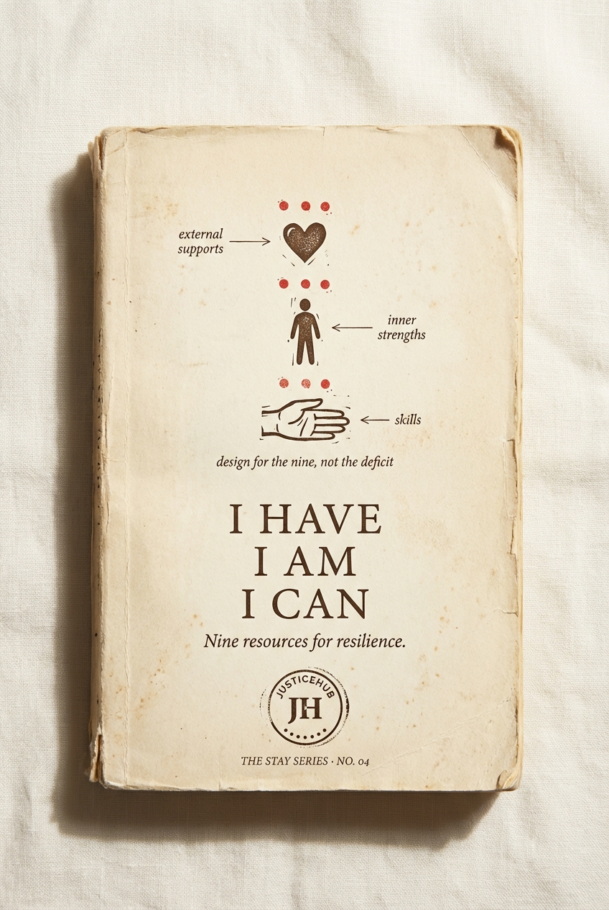

# Chapter 7 · I Have · I Am · I Can

> *Nine resources every child draws on to face adversity.*

*The locked cover for STAY Series Book 04.*

## The diagram

*The locked journal spread for the nine resources. A canvas, not a checklist. The three categories sit alongside each other, not in a hierarchy.*

**How to read it:**

- Three columns side by side: **I HAVE** (external supports) · **I AM** (inner strengths) · **I CAN** (skills). No column is more important than the others. None of them is the "first step."
- Three items in each column: nine resources total. Edith Henderson Grotberg's nine, from the Lima research and twenty other countries before that.
- The canvas is **deliberately not a flowchart**. There is no sequence. A child can be drawing on all nine at once, or just one, or none. The methodology designs for the nine simultaneously.
- The visual register is calmer than the other six diagrams in the series — flatter, less vector, more breathing room — because resilience is not a process; it is a state of having something to draw on. The diagram refuses to make resilience look like a workflow.

**Diagram status:** locked (Apr 2026). The single most likely Gemini re-spin candidate of the seven, because the current version reads slightly more "academic infographic" than the other six. Note for next round of brand review.

## The nine resources

| | Category | What it is | Three items |
|---|---|---|---|
| **I HAVE** | external supports — what's around me | trusting, loving relationships · role models who show what resilient looks like · people who set limits with care |
| **I AM** | inner strengths — what I carry | respectful of myself · confident and optimistic · empathic and caring of others |
| **I CAN** | skills — what I do | solve problems · stay with a task / persevere · reach out for help when I need it |

## The argument

> *Resilience is contagious. Its absence is also contagious.*

Edith Henderson Grotberg studied street children in Lima — kids who'd lived on the streets for months or years, who'd used drugs, who'd been beaten by police, who'd sold sex for food. And she found the same thing she'd found in twenty other countries: the kids who *made it* drew on three pools of resources.

**I have.** External supports — trusting relationships, role models, people who held the line.

**I am.** Inner strengths — self-respect, confidence, empathy.

**I can.** Skills — problem-solving, perseverance, knowing when to ask for help.

Most programs design for the visible deficit. The resilience research says: design for the nine.

And the hardest finding from Lima — from the families displaced by political violence: *resilience is contagious. Its absence is also contagious.* When the parents fled into trauma, the children fell with them. When the parents engaged the new world, the children rose with them. **Whatever you build for a child, build the same thing for the adults around the child — or the child has no model to copy.**

*— after Edith Henderson Grotberg, Resilience in Street Children and in Victims of Political Violence in Peru, Lima 2006.*

## What we have NOT yet said in this chapter (revision notes)

- **A refutation of deficit-based youth justice metrics** — current systems measure absence (no school, no job, no parent). Grotberg measured presence.
- **The "adults around the child" argument as a programmatic ask** — *"Funding that supports a young person without funding the adults around them is funding designed to fail."*
- **A direct critique of risk profiles** — risk profiles measure deficit; resilience research measures resource
- **The Lima story** in the long form — Grotberg's actual fieldwork is one of the most powerful research stories in the entire program and we have not yet told it properly. It deserves a full page of the chapter, not a paragraph.
- **Specific Australian young people by name** — Xavier (Oonchiumpa), MS, CB, Jackqwann — the children whose resilience the system refused to count

## What this chapter produces

- The cover and front matter for [STAY Series Book 04 — I HAVE · I AM · I CAN](../series/) (subtitle: *Nine resources for resilience.*)
- The diagram on the journal spread — see `../../output/intentionality-canvas-journal-spread.png`
- The refutation any funder needs to hear when they ask about "youth at risk": Grotberg measured the kids who *made it*, not the ones who didn't, and the answer was always nine

## Source

Locked §4.4 of [`../../projects/justicehub/the-full-idea.md`](../../projects/justicehub/the-full-idea.md). Original research: Grotberg 2006, Lima. Open questions: *The nine items — keep as-is or swap any? JusticeHub logo placeholder — which logo file should be composited in?*
