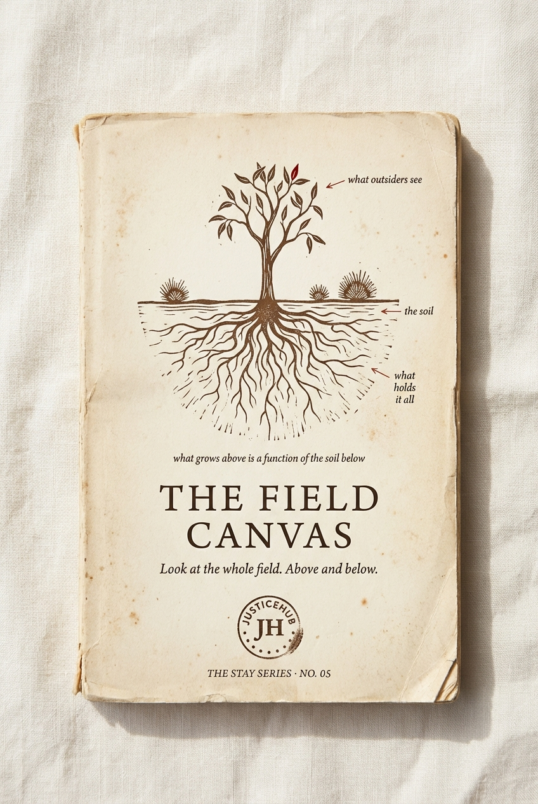

# Chapter 8 · The Field Canvas

> *Look honestly at the whole field — above the soil and below — before you change anything.*

*The locked cover for STAY Series Book 05.*

## The diagram

*The locked journal spread for the Field Canvas. A cross-section of a paddock — the field above the soil, and the soil below.*

**How to read it:**

- The top half of the diagram shows the **field above the ground**: the visible work — projects, revenue, platforms, community, proof. This is what outsiders see.
- The middle layer shows the **soil**: culture, operations, market. This is the layer that's either growing the visible work or rotting it. Most strategic plans never look here.
- The bottom layer shows the **root system**: infrastructure, relationships, philosophy, financial spine. The connective tissue. The Field Canvas insists you read all three layers, not just the top one.
- The 5 P scan — **Projects · People · Pulses · Process · Products** — runs across the diagram as the diagnostic columns. Each column reads what shows up in the soil under what's visible above.
- The PTO discipline (⚡ Drive · 🌱 Field · 🔧 Shed) sits as the action ribbon along the bottom. *The tractor powers one implement at a time.*

**Diagram status:** locked (Apr 2026). The outback eucalyptus visual metaphor is the canonical version — see §4.5 of the-full-idea for the open question on whether to keep it. Possible Gemini re-spin candidate if the eucalyptus reads as too literal in funder contexts.

## The 5 P scan

| Domain | What you read | Hidden pattern |
|---|---|---|
| **Projects** | What's active. What's earning. What's stalled. | Where money comes from vs where energy goes. |
| **People** | Who's here. Who's paid. Who decides. | The unspoken pay gap. The implicit operating agreement. |
| **Pulses** | Operating rhythm. Weekly / monthly / quarterly. | Whether urgency is driving priority instead of strategy. |
| **Process** | How work moves through. Closure rate. | Starting is easy, finishing is hard. WIP creep. |
| **Products** | What's packaged. What's priced. Go-to-market. | "If we build it well enough, they'll come" — they don't. |

## The PTO discipline

> *The tractor powers one implement at a time.*

| Lane | Meaning |
|---|---|
| ⚡ **Drive** | Connect the PTO now. Maximum 3 projects. |
| 🌱 **Field** | Planted. Not powered yet. Hold the line. |
| 🔧 **Shed** | Park, sunset, or hand over. |

## The 90-day Furrow Plan

Six tracks every diagnostic ends in: **Mission · Revenue · People · Product · Partnerships · Rhythm.** Each one with an action verb, a target, and the proof it landed.

## The argument

> *What grows above is a function of the soil below.*

Most strategic plans fail because they describe the field above the ground and ignore the soil below. The Field Canvas is the tool that makes you look at both.

Above: revenue, platforms, community, proof — the things outsiders see.

Below: culture, operations, market — the soil that's either growing the visible work or rotting it.

And under that, the root system: the infrastructure, relationships, philosophy and financial spine that connect everything.

## What we have NOT yet said in this chapter (revision notes)

- **The PTO discipline as a refusal of scale** — the tractor powers one implement at a time. This is the line that funders need to hear when they ask "why not bigger?"
- **The diagnostic story** — a real worked example of running the Field Canvas on a community organisation. Show the soil readings, not just the framework.
- **The 90-day rhythm** as the unit of work — not annual, not quarterly. Ninety days is the only timeframe that holds attention without losing pace.
- **Why most strategic plans miss the soil** — most consultants are trained to look at projects, people, and products. They are not trained to read pulses and process. The hidden patterns live in the missing two columns.

## What this chapter produces

- The cover and front matter for [STAY Series Book 05 — THE FIELD CANVAS](../series/) (subtitle: *Look at the whole field. Above and below.*)
- The diagram on the journal spread — see `../../output/field-diagnostic-journal-spread.png`
- The diagnostic tool any community organisation can use to read its own field — and that any funder can use to read whether the org they are about to fund actually has the soil to grow what they are funding

## Source

Locked §4.5 of [`../../projects/justicehub/the-full-idea.md`](../../projects/justicehub/the-full-idea.md). Open questions: *Is the outback eucalyptus visual the right metaphor or does it need to change? The 5 P spine — lock or change one?*
