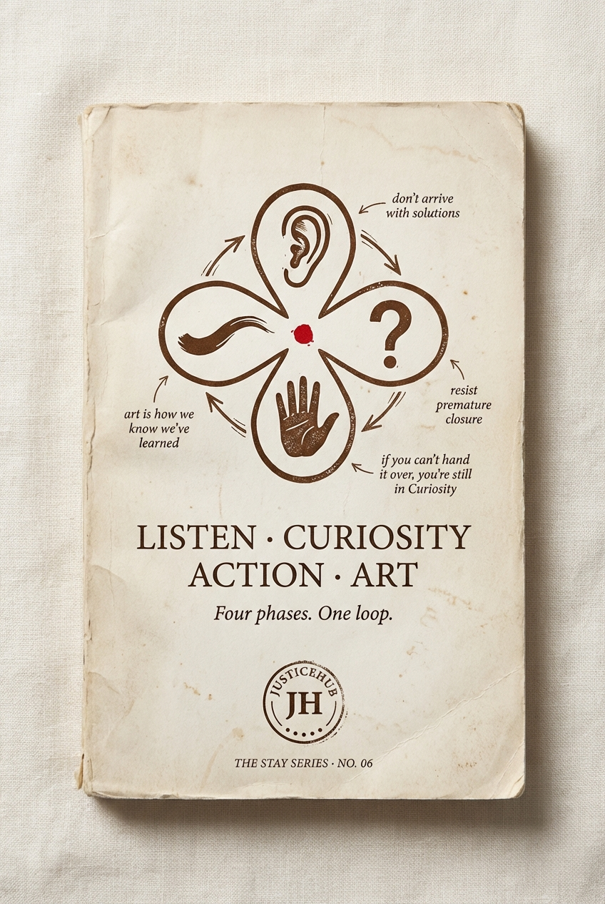

# Chapter 9 · Listen · Curiosity · Action · Art

> *A Curious Tractor's operating system. Four phases. One loop.*

*The locked cover for STAY Series Book 06.*

## The diagram

*The locked journal spread for the LCAA loop. Four phases. One loop. The loop never closes.*

**How to read it:**

- Four nodes around a circle: **Listen → Curiosity → Action → Art → (back to Listen).** The arrow flows clockwise through all four, then the Art phase returns directly to Listen rather than ending the cycle.
- The "return to Listen" arc is the methodologically distinctive move. Most design-thinking and human-centred-design frameworks describe a sequence that terminates ("now ship and iterate"). LCAA refuses to terminate. Art is the form that returns the work to listening.
- The four discipline lines sit on the inside of the loop, one per phase: *don't arrive with solutions* (Listen), *resist premature closure* (Curiosity), *if you can't hand it over you're still in Curiosity* (Action), *art is how we know we've learned something* (Art).
- The acronym **LCAA** is deliberately not used on the cover or in any public material. The book's title spells the four words out, with middle dots, every time.

**Diagram status:** locked (Apr 2026). The journal spread is the canonical version. The loop arrows must always flow in one direction — refuse any version that draws bidirectional arrows because that breaks the discipline.

## The four phases

| # | Phase | What you do | The discipline |
|---|---|---|---|
| 1 | **Listen** | Receive what's already there. Country, Traditional Owners, Community, Elders, Youth, the Silenced. | **Don't arrive with solutions.** |
| 2 | **Curiosity** | Follow the threads. *What if? Who says it has to be this way?* | **Resist premature closure.** |
| 3 | **Action** | Build, prototype, test, iterate. Co-creation. Ship early. Document for handover. | **If you can't hand it over, you're still in Curiosity.** |
| 4 | **Art** | The work made beautiful, meaningful, lasting. | **Art is how we know we've learned something.** |

## The argument

> *Art returns us to Listen. The cycle continues.*

> *If you can't hand it over, you're still in Curiosity.*

Most methodologies are checklists. Listen, Curiosity, Action, Art is a loop — and the loop never closes.

The journal you are holding is art. The CONTAINED tour is art. This story is art. They will all return us to Listen.

## What we have NOT yet said in this chapter (revision notes)

- **The discipline lines as the chapter spine** — don't arrive with solutions, resist premature closure, if you can't hand it over you're still in Curiosity, Art is how we know we've learned something. These four lines are the most quotable thing in the methodology and they should each get a paragraph.
- **The acronym refusal** — internal rule: drop the acronym entirely on covers. The book's title spells the four words out. So does every funder pitch.
- **Worked examples per phase** — show what Listen looks like at Oonchiumpa, what Curiosity looks like at CAMPFIRE, what Action looks like at Goods on Country, what Art looks like at CONTAINED. Each phase deserves a real worked example, not a definition.
- **Why this is not a checklist** — most "design thinking" or "human-centred design" frameworks describe a sequence. This describes a loop that doesn't terminate. The difference is the discipline of not declaring the work done.

## What this chapter produces

- The cover and front matter for [STAY Series Book 06 — LISTEN · CURIOSITY · ACTION · ART](../series/) (subtitle: *Four phases. One loop.*)
- The diagram on the journal spread — see `../../output/lcaa-loop-journal.png`
- The single most-cited methodology document inside ACT — the LCAA loop is the operating system that every other ACT project runs on top of

## Source

Locked §4.6 of [`../../projects/justicehub/the-full-idea.md`](../../projects/justicehub/the-full-idea.md). Canonical concept doc: [`../../concepts/lcaa-method.md`](../../concepts/lcaa-method.md). Open questions: *Drop the acronym entirely on covers? (current rule says yes) Keep all four discipline lines on the right page or trim?*
