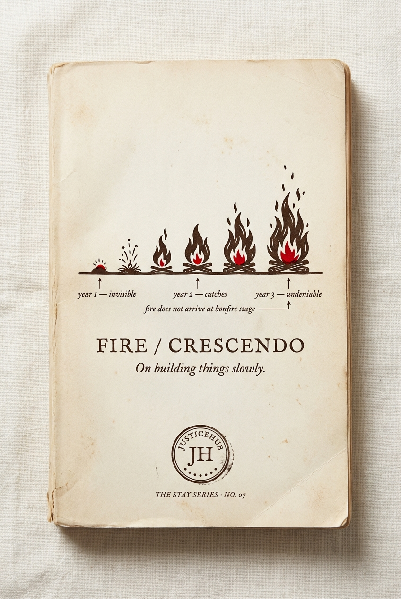

# Chapter 10 · Fire Crescendo

> *On building things slowly. Year 1 to Year 3.*

*The locked cover for STAY Series Book 07.*

## The diagram

*The locked journal spread for Fire Crescendo. Six stages of a fire being built across three years.*

**How to read it:**

- The diagram runs left-to-right as a temporal sequence — but **not** as a project plan. Each stage is named in fire-language because the methodology insists fire is the right metaphor: it cannot be hurried, it cannot be skipped, and it requires attention at each stage to not go out.
- **Year 1: Ember + Tinder.** A single relationship. One Elder. One yarn. Trust. Showing up when you said you would. The visual register is small, intimate, contained.
- **Year 2: Kindling + Campfire.** Small structured work. The first camp. The first cohort. Communities visit each other. Storytellers tell their own stories. The visual opens up — multiple figures, but still close to the original ember.
- **Year 3: Roaring fire + Bonfire.** The work spreads. Other communities ask how. Holding warmth for people who weren't there at the start. The visual opens out fully — the warmth is for everyone now.
- **The diagram refuses to show "Bonfire stage in Year 1."** That refusal is the entire point. Funders ask for bonfire-shaped outcomes from ember-stage work. The diagram is designed so that asking is visibly impossible — you cannot leap from Ember to Bonfire because the temporal axis makes the leap structurally absurd.

**Diagram status:** locked (Apr 2026). The current version is the journal spread. A poster version may be needed for funder meetings — the temporal axis is the most quotable single graphic in the methodology and it deserves a wall-print version.

## The six stages × three years

| # | Stage | Year | What's happening |
|---|---|---|---|
| 1 | **Ember** | Y1 | A single relationship. One Elder. One yarn. |
| 2 | **Tinder** | Y1 | Trust. Showing up when you said you would. |
| 3 | **Kindling** | Y2 | Small structured work. The first camp. The first cohort. |
| 4 | **Campfire** | Y2 | Communities visit each other. Storytellers tell their own stories. |
| 5 | **Roaring fire** | Y3 | The work spreads. Other communities ask how. |
| 6 | **Bonfire** | Y3 | Holding warmth for people who weren't there at the start. |

## The argument

> *Fire does not arrive at bonfire stage. You build it, slowly, with attention.*

Most programs fail because someone tries to light the bonfire in Year 1. Funders ask for bonfire-shaped outcomes from ember-stage work. Boards demand scale before the kindling has even caught.

Fire Crescendo is the diagram that gives funders the language to fund Year 1 properly — and gives the team the language to say *"no, not yet."*

## The CAMPFIRE worked example

Brodie Germaine in Mount Isa is the canonical example of Fire Crescendo running across three years. The CAMPFIRE program has been at every stage of the fire over its lifetime, and the journey is the worked example that this chapter rests on.

The full CAMPFIRE worked example sits as Chapter 10a (pending) and pulls from [`../../projects/campfire.md`](../../projects/campfire.md) and the locked CAMPFIRE notes in `wiki/raw/2025-10-11-article-from-trouble-to-transformation-the-campfire-journey.md`.

**Status:** Confirmed as a separate page after this chapter. To be written next.

## The budget tells the same story as the methodology

The three tiers of the STAY ask — **Foundation · Crescendo · Bonfire** — borrow the fire language because the budget shape and the methodology shape are the same shape. A funder picks where they want to enter the fire.

| | 🔥 **Foundation** | 🔥🔥 **Crescendo** | 🔥🔥🔥 **Bonfire** |
|---|---|---|---|
| 3-year total | ~$1.8M | **~$3.43M** | ~$6.0M |
| Communities | 5 anchor | **10 anchor** | 10 + annual national gathering |
| Versus detaining 1 child for 3 years ($3.9M) | 46% | **88%** | 154% |

**Crescendo is the default.**

## What we have NOT yet said in this chapter (revision notes)

- **The funder pitch line at the moment of Year 1 ask** — *"You are funding ember and tinder. You will not see bonfire-shaped outcomes for twenty-four months. That is the methodology, not a delay."*
- **The internal "no" tool** — *"No, not yet. We are at Kindling. Asking for Bonfire breaks the fire."*
- **The CAMPFIRE worked example in full** — Brodie Germaine's actual fire arc in Mount Isa is the proof that the diagram describes real time
- **The most damning line** — *"Most foundation grant cycles are three years long. Fire Crescendo IS those three years, named correctly."*
- **The rebuttal to scale-first funders** — the diagram is the answer to "how do we know it scales" because the answer is *"because each stage produces the conditions for the next."*

## What this chapter produces

- The cover and front matter for [STAY Series Book 07 — FIRE CRESCENDO](../series/) (subtitle: *On building things slowly.*)
- The diagram on the journal spread — see `../../output/fire-crescendo-journal.png`
- The funder language for the Year 1 ask in every pitch from now on
- The internal "no" tool for resisting scale-first pressure

## Source

Locked §4.7 of [`../../projects/justicehub/the-full-idea.md`](../../projects/justicehub/the-full-idea.md). Worked example: [`../../projects/campfire.md`](../../projects/campfire.md), `wiki/raw/2025-10-11-article-from-trouble-to-transformation-the-campfire-journey.md`. Open questions: *CAMPFIRE worked example (Brodie Germaine, Mount Isa) — separate page after this one. Confirmed. Six stages or three?*
