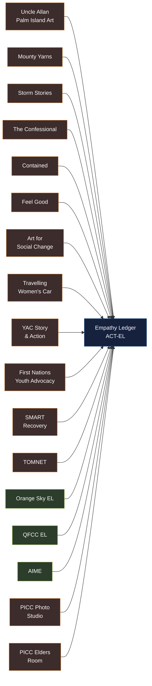
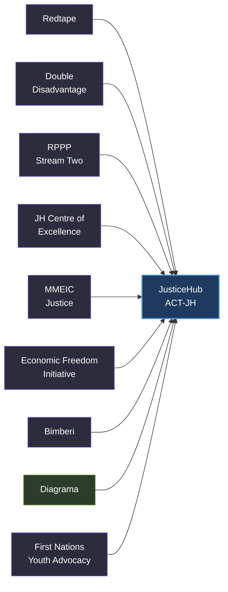
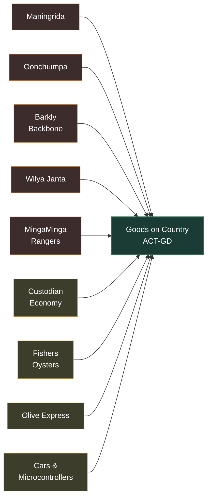
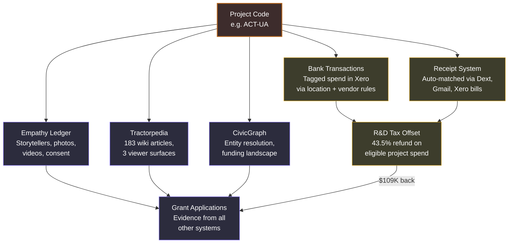
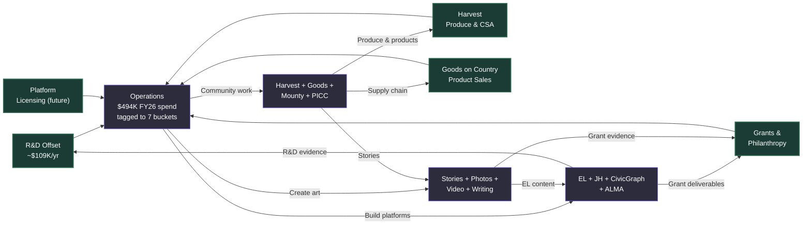
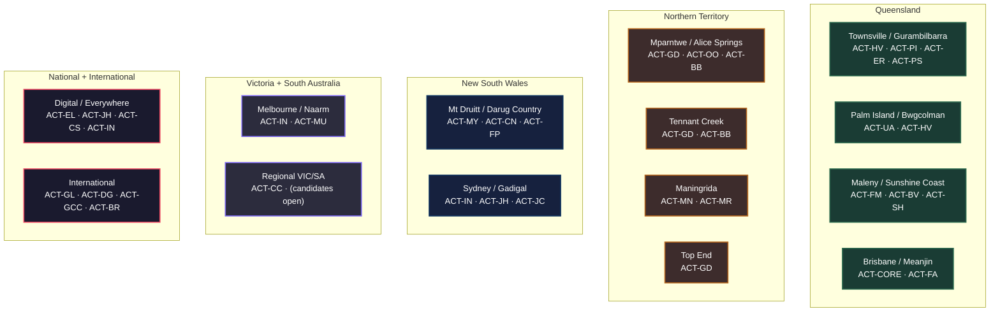
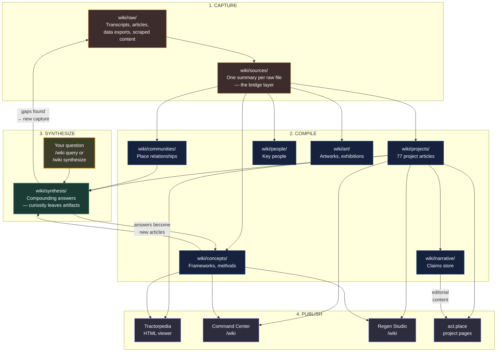

# ACT Ecosystem Map

*How 77 projects, 7 financial buckets, and 6 systems connect.*

---

## The Big Picture

Every project feeds into shared systems. The project code is the thread that connects money, stories, knowledge, and compliance into one legible ecosystem.

```mermaid
graph TB
    classDef hub fill:#1a1a2e,stroke:#e94560,color:#fff,stroke-width:3px
    classDef platform fill:#16213e,stroke:#0f3460,color:#fff,stroke-width:2px
    classDef program fill:#1a3c34,stroke:#2d6a4f,color:#fff,stroke-width:2px
    classDef community fill:#3d2c2c,stroke:#b5651d,color:#fff,stroke-width:1px
    classDef system fill:#2c2c3d,stroke:#7b68ee,color:#fff,stroke-width:2px
    classDef money fill:#3d3d2c,stroke:#daa520,color:#fff,stroke-width:2px

    %% Hub
    CORE["ACT-CORE<br/>Regenerative Studio<br/>act.place"]:::hub

    %% Platforms
    EL["ACT-EL<br/>Empathy Ledger<br/>226 storytellers · 5K media"]:::platform
    JH["ACT-JH<br/>JusticeHub<br/>52K records · legal mapping"]:::platform
    CS["ACT-CS<br/>CivicGraph<br/>100K civic entities"]:::platform
    IN["ACT-IN<br/>Infrastructure<br/>ALMA · AI · Bot · Wiki<br/>$194K spend"]:::platform

    %% Programs
    HV["ACT-HV<br/>The Harvest<br/>Townsville · Palm Island<br/>$97K spend"]:::program
    GD["ACT-GD<br/>Goods on Country<br/>Alice Springs · Tennant Creek<br/>$55K spend"]:::program
    FM["ACT-FM<br/>The Farm / BCV<br/>Maleny · Sunshine Coast<br/>$55K spend"]:::program
    MY["ACT-MY<br/>Mounty Yarns<br/>Mt Druitt · Western Sydney<br/>$26K spend"]:::program
    PI["ACT-PI<br/>PICC Centre<br/>Townsville · winding down<br/>$66K spend"]:::program

    %% Hub connections
    CORE --> EL
    CORE --> JH
    CORE --> CS
    CORE --> IN
    CORE --> HV
    CORE --> GD
    CORE --> FM
    CORE --> MY
    CORE --> PI
```

## How Projects Feed the Platforms

## The Cross-Cutting Systems

Every project code flows through six shared systems. This is how a single project code like ACT-UA (Uncle Allan Palm Island Art) touches everything:

## The Money Flow

How dollars move through the ecosystem and come back:

## Geographic Map

Where the project codes live on Country:

## The Karpathy Knowledge Loop

How raw material becomes durable knowledge and compounds over time:

## The Editorial Flywheel

How community work becomes stories becomes content becomes connections becomes more community work:

```mermaid
graph LR
    classDef work fill:#1a3c34,stroke:#2d6a4f,color:#fff,stroke-width:2px
    classDef story fill:#16213e,stroke:#0f3460,color:#fff,stroke-width:2px
    classDef content fill:#3d3d2c,stroke:#daa520,color:#fff,stroke-width:2px
    classDef connect fill:#2c2c3d,stroke:#7b68ee,color:#fff,stroke-width:2px

    WORK["Community Work<br/>Harvest meals, Goods deliveries,<br/>Mounty builds, PICC sessions"]:::work
    
    STORY["Stories<br/>EL portraits, videos,<br/>transcripts, consent-gated"]:::story
    
    WIKI["Wiki Knowledge<br/>Articles, synthesis,<br/>narrative claims"]:::content
    
    CONTENT["Editorial Output<br/>LinkedIn, grants, pitches,<br/>op-eds, social media"]:::content
    
    CONNECT["New Connections<br/>Funders, partners,<br/>communities, volunteers"]:::connect

    WORK --> |"people share<br/>their experience"| STORY
    STORY --> |"compiled into<br/>durable knowledge"| WIKI
    WIKI --> |"narrative layer<br/>assembles drafts"| CONTENT
    CONTENT --> |"people discover ACT,<br/>want to participate"| CONNECT
    CONNECT --> |"new relationships<br/>new places"| WORK
```

---

*This map is the visual companion to the [[act-operational-thesis|ACT Operational Thesis]]. Project codes are the universal key across all systems. The Karpathy loop is how the wiki stays alive.*
