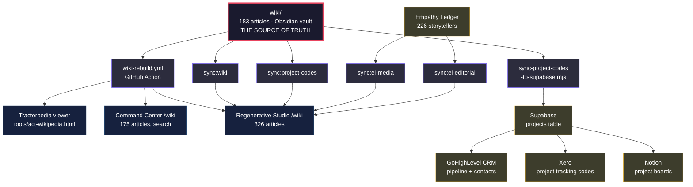

# ACT Operational Thesis

*How we run money, time, intelligence, and art — and why it works.*

---

## 1. The Receipt System: Simple, Automated, Honest

### Philosophy

Every dollar that flows through ACT should be tagged to a project, matched to a receipt, and accounted for — not because compliance demands it, but because **knowing where money goes is how we decide where it should go next.** The system exists to remove the cognitive tax of financial admin so Ben and Nic can focus on the work that matters.

The system is not a reconciliation tool. It is a **spending intelligence layer** — it tells us what we spent, why, whether we got value, and how much the government owes us back.

### How a Perfect Week Looks

**Monday 8am — the system runs itself.**

1. **Bank feed flows in.** NAB pushes new transactions into Xero. Our `bank_statement_lines` table mirrors them.

2. **Auto-tagging fires.** 62 location rules (spend at Palm Island = ACT-HV, spend in Mparntwe = ACT-FM), 26 vendor rules (Xero subscription = ACT-IN, Bunnings = ACT-FM), and 48 subscription patterns catch ~95% of lines without human input. Every line gets a project code. No line is orphaned.

3. **Receipt matching runs.** The Dice-coefficient engine compares unmatched bank lines against `receipt_emails` — Dext imports, Gmail extracts, Xero bill attachments. Anything scoring above 0.75 auto-applies. Below that, it queues candidates for human review. Purchases under $82.50 inc. GST are auto-waived (ATO doesn't require tax invoices below this threshold).

4. **A Telegram message arrives.** "872 debits this quarter. 95.3% receipted by value. 27 gaps ($27K). 3 new rules learned." Ben glances at it over coffee. If the number looks right, the week is done.

**Wednesday — human sweep (10 minutes).**

5. Ben opens `/finance/reconciliation` in Command Center. The inbox shows candidate matches that fell below auto-threshold. Most are obvious — approve, approve, approve. A few need a receipt hunted down. He forwards a couple of emails to Dext and moves on.

**Friday — nothing.** The system is quiet because the system is working.

### What Makes This Work

- **Rules learn.** When Ben manually tags a line, the system proposes a new rule. Next time that vendor appears, it's automatic. The rule library only grows.
- **Multiple receipt sources.** Xero bill connectors (Qantas, Uber, Virgin, Booking.com auto-attach PDFs), Dext email forwarding, Gmail extraction, manual upload. Redundancy means fewer gaps.
- **The $82.50 line.** Below it, we don't chase. The ATO doesn't require a tax invoice, and the time cost of hunting a $12 receipt exceeds the $1.20 GST credit. The system knows this rule natively.
- **Quarterly not daily.** We ingest statement CSVs quarterly, not in real-time. This is deliberate — weekly batch processing is enough cadence for BAS preparation, and it avoids the trap of micro-managing every transaction.

### Current Reality (Q2 FY26)

| Metric | Value |
|--------|-------|
| Total debits | 872 |
| Project-tagged | 100% |
| Receipted by value | 91.6% |
| Receipted by count | ~54% (but low-value lines are auto-waived) |
| Gaps needing action | 27 ($27K) |
| GST forfeited to gaps | $119 |

The gap is small and shrinking. Each quarter adds rules. The trajectory matters more than the number.

---

## 2. The Project Code Map: How Everything Links

### Philosophy

The project code is the universal key. Every dollar, every hour, every story, every wiki article, every photo, every grant application traces back to a project code. The code is what lets us see a bank transaction in Xero and know it funded an Empathy Ledger shoot in Townsville. It's what lets us aggregate R&D spend across 77 projects into four eligible buckets. It's what connects a storyteller's portrait to the project that brought us into their community.

### The Seven Financial Buckets

These are the codes used for spending, R&D, and BAS. Every bank transaction maps to one of these:

| Code | Project | FY26 Spend | Txns | R&D Eligible | What It Covers |
|------|---------|------------|------|-------------|----------------|
| **ACT-IN** | Infrastructure | $194K | 992 | Core R&D | AI systems, ALMA, bot, websites, design, insurance, travel, subscriptions, general ops |
| **ACT-HV** | The Harvest | $97K | 119 | No | Townsville builds, community meals, storage, equipment, travel to Palm Island/Tully |
| **ACT-PI** | PICC | $66K | 8 | No | Precinct builds (Hatch Electrical, RNM Carpentry, Allclass). Winding down |
| **ACT-GD** | Goods on Country | $55K | 197 | Supporting R&D | Alice Springs ops, Tennant Creek, Top End travel, furnishings, fleet, marketplace R&D |
| **ACT-FM** | The Farm / BCV | $55K | 163 | No | Maleny/Sunshine Coast, farm equipment, Woodfordia, Black Cockatoo Valley land |
| **ACT-MY** | Mounty Yarns | $26K | 42 | No | Mt Druitt container build, ground cover, storytelling activations |
| **ACT-JH** | JusticeHub | $1K | 21 | Supporting R&D | Data platform, legal research, Mounty site visits (most JH spend is dev time in ACT-IN) |

**Total tracked: $494K across 1,542 transactions (Q2+Q3 FY26)**

### The Full Project Universe (77 projects)

Every project in the Empathy Ledger, wiki, and ecosystem has a code. The financial buckets above catch spending, but the full taxonomy shows how storytelling, community work, and platforms connect:

#### Flagship Programs (have their own repos, websites, and teams)

| Code | Project | Links To | Surface |
|------|---------|----------|---------|
| ACT-EL | Empathy Ledger | empathyledger.com — 226 storytellers, 5K+ media assets, consent-layered narratives | Primary platform |
| ACT-JH | JusticeHub | justicehub.com.au — 52K funding records, legal service mapping | Primary platform |
| ACT-GD | Goods on Country | goodsoncountry.com — circular economy, Indigenous supply chains | Primary platform |
| ACT-HV | The Harvest Witta | theharvestwitta.com.au — CSA, community meals, Palm Island | Primary program |
| ACT-BV | Black Cockatoo Valley | act-farm repo — regenerative land, biodiversity credits | Primary site |
| ACT-CS | CivicGraph (CivicScope) | civicgraph.app — 100K civic entities, data visualisation | Primary platform |
| ACT-CORE | ACT Regenerative Studio | act.place — the hub, project index, public front door | Hub |

#### Community & Place-Based Projects

| Code | Project | Connected To |
|------|---------|-------------|
| ACT-MY | Mounty Yarns | Mt Druitt storytelling — feeds EL, connects to JH (justice in Western Sydney) |
| ACT-PI | PICC Centre | Townsville precinct — galleries feed EL, elders room (ACT-ER), photo studio (ACT-PS) |
| ACT-ER | PICC Elders Room | Sub-project of PICC — dedicated cultural space |
| ACT-PS | PICC On Country Photo Studio | Sub-project of PICC — portraits feed EL media library |
| ACT-MN | Maningrida | Remote NT community — stories feed EL, connects to GD supply chain |
| ACT-OO | Oonchiumpa | NT community — links to GD and conservation (ACT-CC) |
| ACT-BB | Barkly Backbone | Tennant Creek region — links to GD and community resilience |
| ACT-WJ | Wilya Janta | Indigenous enterprise — connects to GD marketplace |
| ACT-MR | MingaMinga Rangers | Ranger program — connects to conservation, farm, GD |
| ACT-DH | Deadly Homes and Gardens | Housing/gardens program — links to Farm, community wellbeing |
| ACT-UA | Uncle Allan Palm Island Art | Art program — feeds EL, connects to HV (Palm Island travel) |
| ACT-FN | First Nations Youth Advocacy | Youth justice — feeds JH data, EL stories |
| ACT-YC | YAC Story and Action | Youth advocacy — feeds EL, connects to JH |
| ACT-TW | Travelling Women's Car | Women's mobility program — stories feed EL |

#### Partnerships & Collaborations

| Code | Project | Connected To |
|------|---------|-------------|
| ACT-OS | Orange Sky EL | Empathy Ledger for Orange Sky (Nic's co-founded org) — white-label EL proof |
| ACT-QF | QFCC Empathy Ledger | Queensland Family & Child Commission — institutional EL deployment |
| ACT-AI | AIME | Partnership with AIME mentoring — stories feed EL |
| ACT-SE | SEFA Partnership | Social Enterprise Finance Australia — connects to community capital |
| ACT-SF | SAF Foundation | Foundation partnership |
| ACT-GL | Global Laundry Alliance | Orange Sky international network — connects to EL |
| ACT-GCC | Global Community Connections | International community links |
| ACT-MU | Murrup + ACT | Partnership — cultural program |
| ACT-TN | TOMNET | Older men's network — stories feed EL |
| ACT-SM | SMART Recovery | Recovery program — stories feed EL, links to JH justice data |
| ACT-DG | Diagrama | International justice partnership — feeds JH |
| ACT-BM | Bimberi | Youth justice centre — feeds JH, stories feed EL |

#### Creative & Events

| Code | Project | Connected To |
|------|---------|-------------|
| ACT-AS | Art for Social Change | Cross-cutting — feeds EL, informs all storytelling |
| ACT-CF | The Confessional | Art installation — stories feed EL |
| ACT-CN | Contained | Container-based art/activation — links to MY (Mt Druitt container) |
| ACT-SS | Storm Stories | Disaster narratives — feeds EL, connects to community resilience |
| ACT-FA | Festival Activations | Woodfordia etc — connects to FM (farm area), EL content |
| ACT-SX | SXSW 2025 | Conference activation — connects to EL, ACT-IN |
| ACT-WE | Westpac Summit 2025 | Corporate engagement — connects to CP (community capital) |
| ACT-10 | 10x10 Retreat | Team retreat — connects to ACT-IN |
| ACT-BR | ACT Bali Retreat | Team retreat — connects to ACT-IN |
| ACT-MD | ACT Monthly Dinners | Community gathering — connects to FM, HV |
| ACT-FG | Feel Good Project | Wellbeing program — stories feed EL |
| ACT-GP | Gold Phone | Communication/connection project |

#### Research & Systems

| Code | Project | Connected To |
|------|---------|-------------|
| ACT-IN | ACT Infrastructure | Everything — ALMA (AI), bot, wiki, websites, ops |
| ACT-CS | CivicGraph (CivicScope) | JH (data layer), EL (entity resolution), grants landscape |
| ACT-RT | Redtape | Bureaucracy research — feeds JH, informs GD policy work |
| ACT-DD | Double Disadvantage | Justice research — feeds JH |
| ACT-CE | Custodian Economy | Economic model research — informs GD, BV, HV |
| ACT-CP | Community Capital | Funding model — connects to SEFA, informs all projects |
| ACT-DO | Designing for Obsolescence | Design philosophy — cross-cutting |
| ACT-EFI | Economic Freedom Initiative | Economic justice — connects to JH, GD |
| ACT-RP | RPPP Stream Two | Policy research — connects to JH |
| ACT-JC | JusticeHub Centre of Excellence | JH institutional layer |
| ACT-MM | MMEIC Justice | Cultural initiative — connects to PI (precinct) |

#### Enterprise & Food

| Code | Project | Connected To |
|------|---------|-------------|
| ACT-FM | The Farm | BCV land, Maleny base, equipment, Woodfordia |
| ACT-SH | The Shed | Farm workshop — connects to FM |
| ACT-OE | Olive Express | Food enterprise — connects to HV, FM |
| ACT-FO | Fishers Oysters | Food enterprise — connects to HV, GD |
| ACT-CA | Caring for those who care | Wellbeing — connects to HV community meals |
| ACT-BG | BG Fit | Fitness/wellbeing program |
| ACT-CB | Marriage Celebrant | Nic's celebrant work |
| ACT-TR | Treacher | Enterprise project |
| ACT-CC | ACT Conservation Collective | Environmental — connects to BCV, FM, MR (rangers) |
| ACT-FP | Fairfax PLACE Tech | Place-based tech — connects to ACT-IN |
| ACT-MC | Cars and Microcontrollers | Maker/IoT — connects to GD (fleet telemetry R&D) |
| ACT-RA | Regional Arts Fellowship | Arts funding — connects to EL, AS |

### How the Codes Link Across Systems

```
Bank Transaction ($45 at Bunnings Townsville)
    → tagged ACT-HV (location rule: Townsville)
    → receipt matched (Dext import, score 0.82)
    → R&D: No (HV is not R&D-eligible)
    → BAS: GST claimed ($4.09 input credit)

Git Commit ("feat: video player for EL org pages")
    → repo: empathy-ledger-v2 → ACT-EL
    → R&D: Yes (core — novel platform development)
    → evidence: contemporaneous, timestamped, authored

Empathy Ledger Photo (portrait of Uncle Allan, Palm Island)
    → project: ACT-UA (Uncle Allan Palm Island Art)
    → storyteller: linked via project_storytellers
    → gallery: linked via project_galleries → galleries → media_assets
    → cross-org: visible on ACT org page via act_project_code
    → wiki: wiki/projects/uncle-allan-palm-island-art.md

Grant Application (Australia Council, First Nations arts)
    → projects: ACT-UA, ACT-MN, ACT-AS, ACT-EL
    → evidence: EL storyteller count, media assets, wiki articles
    → financials: spend tagged to these codes in Xero
    → R&D overlap: EL platform development is also R&D claim

JusticeHub Entity (Legal Aid Queensland)
    → CivicGraph: entity in 100K civic dataset
    → JH: service mapping, funding data (52K records)
    → EL: storytellers who accessed this service
    → GD: supply chain overlap in same regions
    → Wiki: wiki/organisations/legal-aid-qld.md
```

> **See the full visual map:** [[act-ecosystem-map|ACT Ecosystem Map]] — Mermaid diagrams showing all 77 projects, platform connections, money flow, and geographic spread.

### The Linking Principle

Every project code is a node in a graph. The edges are:

- **Financial:** bank transactions tagged to the code
- **Storytelling:** media assets and storytellers linked via EL
- **Knowledge:** wiki articles cross-referencing the code
- **Data:** CivicGraph entities connected to the code
- **Geographic:** location rules mapping places to codes
- **R&D:** eligible codes aggregated for tax offset claims
- **Grants:** project codes referenced in applications and acquittals

The code is never just a label. It's the thread that connects a $45 hardware store receipt to a $109K R&D tax offset to a storyteller's portrait to a wiki article to a grant application. One code, many systems, one truth.

---

## 3. R&D: Tagging Time to Get Money Back

### Philosophy

The R&D Tax Incentive exists to reward organisations doing genuinely experimental work. ACT qualifies — we're building novel platforms (Empathy Ledger, JusticeHub, CivicGraph, ALMA) where the technical outcomes genuinely can't be known in advance. The 43.5% refundable offset is not a bonus. **It is a revenue stream that funds further R&D.** Treating it as an afterthought leaves money on the table.

### Which Projects Qualify

| Code | Project | R&D Type | Why It Qualifies |
|------|---------|----------|------------------|
| ACT-EL | Empathy Ledger | Core R&D | Novel community narrative platform — consent-layered storytelling, AI-powered tagging, multi-org media management. No existing product does this. |
| ACT-IN | Infrastructure / ALMA | Core R&D | AI agent orchestration, NLP-driven knowledge synthesis, wiki auto-generation. Experimental by nature — each model and pipeline is a hypothesis. |
| ACT-JH | JusticeHub | Supporting R&D | Justice system data platform — 52K funding records, 672K contracts, entity resolution across fragmented public data. |
| ACT-GD | Goods on Country | Supporting R&D | Circular economy marketplace, IoT fleet telemetry, Indigenous supply chain modelling. |

**Not R&D:** ACT-HV (The Harvest — agricultural operations), ACT-FM (Farm — physical infrastructure), ACT-MY (Mounty Yarns — creative/storytelling without technical novelty), ACT-PI (PICC — winding down).

### How to Tag Time Right

The golden rule: **every hour of work should be attributable to a project code.** Not retroactively. Not approximately. At the time.

1. **Git commits are the primary evidence.** Every commit message carries a project context through the repo it lives in. The commit timestamp, author, and description form a contemporaneous record that the ATO accepts.

2. **Calendar events are the secondary evidence.** Design meetings, sprint planning, stakeholder calls — these are R&D time when they're about resolving technical uncertainty. Tag them with the project code.

3. **The spending system does the financial side automatically.** When a bank line is tagged ACT-EL, the system knows that spend is R&D-eligible. The quarterly R&D report aggregates it.

### Current R&D Position (FY26 Q2+Q3)

| Metric | Value |
|--------|-------|
| Eligible R&D spend | $251K |
| Potential 43.5% offset | $109K |
| At-risk (missing receipts on R&D projects) | ~$5.3K spend → ~$2.3K offset |

**$109K is real money.** It funds 3-4 months of operations. The discipline of tagging and receipting directly converts into cash flow.

### How to Maximise the Return

- **Front-load R&D work.** When choosing what to build next, weight projects with R&D codes. Building Empathy Ledger features earns 43.5% back on every dollar spent. Building farm fencing does not.
- **Document the uncertainty.** For each sprint or feature, note what you didn't know at the start. "We hypothesised that Descript transcript metadata could auto-generate video descriptions. We tested X approach. The outcome was Y." This is what AusIndustry wants to see.
- **Never retrofit.** If you forgot to tag time this week, note it and move on. Retrospective time sheets are the #1 red flag in R&D audits.

---

## 3. Where We Place Our Effort: The $200K Thesis

### Philosophy

ACT is not a startup chasing hockey-stick growth. ACT is an ecosystem — a living system where multiple projects sustain each other. The goal is **$200K/year in revenue** that lets Ben and Nic work full-time on things that matter, while building platforms that create value for communities.

Revenue doesn't come from one source. It comes from the ecosystem working together.

### Revenue Architecture

```
                         ACT Ecosystem Revenue
                                 |
        ┌────────────┬───────────┼───────────┬────────────┐
        |            |           |           |            |
   R&D Offset    Grants &    The Harvest   Goods on    Platform
   (~$109K)    Philanthropy    (CSA +      Country     Licensing
                               produce)   (products)   (future)
```

#### Stream 1: R&D Tax Offset (~$109K/yr at current spend)
This is the most reliable stream because it's formula-driven. Spend on R&D, get 43.5% back. The only variables are: how much we spend on eligible projects, and whether we document it properly. The receipt system exists to maximise this.

#### Stream 2: Grants & Philanthropy
GrantScope holds 52K justice funding records and 672K AusTender contracts. We know where the money is. The thesis:
- **Empathy Ledger** attracts arts/culture/social impact grants (Australia Council, Creative Victoria, philanthropic trusts)
- **JusticeHub** attracts justice/legal/government funding (AGDH, state justice departments, Law Foundation)
- **Goods on Country / The Harvest** attract Indigenous affairs, agriculture, and regional development grants
- **CivicGraph / ALMA** attract research and innovation grants (ARC, CRC-P, CSIRO partnerships)

Each project opens a different funding door. The ecosystem breadth is a feature, not a distraction.

#### Stream 3: The Harvest (earned income)
Community Supported Agriculture, produce sales, farm-gate events. This is tangible, seasonal, and builds community trust. It won't hit $200K alone, but it grounds the ecosystem in something people can taste and touch.

#### Stream 4: Goods on Country (product sales)
Circular economy marketplace. Indigenous-led supply chains. Physical products with provenance stories. Revenue scales with the number of producers onboarded and the reach of the distribution network.

#### Stream 5: Platform Licensing (future)
Empathy Ledger and JusticeHub as white-label platforms for other organisations. This is where the R&D investment converts to recurring revenue. Not yet, but the architecture is being built for it.

### Where to Place Effort Right Now

The honest priority stack:

1. **Empathy Ledger + JusticeHub** — These are the R&D engines. Every hour here earns 43.5% back AND builds the platforms that attract grants AND creates the IP for future licensing. Triple return on effort. The video player, the storyteller consent layer, the data visualisation — all of this is simultaneously product development, R&D evidence, and grant deliverables.

2. **CivicGraph / ALMA** — This is the intelligence layer that makes everything else smarter. 100K entities, cross-linked. When a funder asks "what's the justice landscape in North Queensland?", we can answer in seconds. This is our moat. Push the boundaries here — what could it become if we had real-time civic data, automated policy tracking, community sentiment mapping?

3. **The Harvest + Farm** — Grounding work. Revenue is modest but the stories are rich. Every farm day, every CSA box, every community meal is content for Empathy Ledger, evidence for grants, and proof that this ecosystem is real, not theoretical.

4. **Goods on Country** — Scale when the supply chain is ready. Don't force it. The IoT telemetry and marketplace are genuine R&D, so the development cost is partially offset.

5. **Writing, Art, and Experiences** — This is not last in priority. It runs through everything. Every project produces stories. Every interaction is a potential artwork. The Empathy Ledger exists to capture and honour these. The STAY journal is not separate from the "real work" — it IS the work, documented. The creative output is what makes funders, communities, and partners care.

---

## 4. The Wiki: Making It All Findable

### Philosophy

Knowledge that can't be found doesn't exist. ACT generates enormous amounts of information — project updates, meeting notes, research, reflections, financial reports, technical documentation. The wiki system exists to make all of it **searchable, linked, and alive.**

### How It Works

```
Sources (7 repos, meetings, Notion, emails)
    ↓
Ingestion scripts (wiki-* in scripts/)
    ↓
Wiki articles (183 in wiki/, Markdown)
    ↓
Three surfaces:
  - Tractorpedia viewer (standalone HTML)
  - Command Center /wiki (React, runtime search)
  - Regenerative Studio /wiki (326 articles, cross-repo)
```

### What Needs to Happen

- **Every project should have a wiki article.** 15 projects are still missing articles. The `wiki-refresh-project-registry.mjs` script identifies gaps.
- **Meeting notes should auto-ingest.** The `wiki-watch-meetings.mjs` pipeline exists but needs consistent source feeding.
- **Cross-link aggressively.** A wiki article about The Harvest should link to its GrantScope funding landscape, its Empathy Ledger storytellers, its Goods on Country supply chain connections.
- **Keep it simple.** Markdown files in a folder. No CMS. No database. Git is the versioning layer. The viewer is a single HTML file. This is deliberate — the simpler the system, the more likely it survives.

---

## 5. The AI Thesis: Automate the Boring, Amplify the Art

### Philosophy

AI in the ACT ecosystem has one job: **remove the friction between intention and action.** Every minute Ben or Nic spends on admin, tagging, data entry, or report generation is a minute not spent on community engagement, storytelling, design, or creative work. The AI systems should be invisible when they work and obvious when they help.

### What's Already Automated

| System | What It Does | Human Effort |
|--------|-------------|--------------|
| Weekly reconciliation cron | Tags transactions, matches receipts, learns rules, sends Telegram summary | Glance at message |
| Receipt matching engine | Dice-coefficient fuzzy matching across 4 receipt sources | Approve candidates |
| Wiki CI pipeline | Push-triggered rebuild, auto-sync across 3 surfaces | Nothing |
| Xero token sync | Detects drift across 3 token stores, auto-refreshes | Run script on auth errors |
| Telegram bot | 19 agent tools — query projects, search wiki, draft writing | Talk to it |
| Project tagging rules | Self-learning location/vendor/subscription rules | Approve new rules |
| Dext + bill connectors | Auto-extract and attach receipts from Qantas, Uber, Virgin, etc. | Nothing |

### What Should Be Automated Next

1. **Receipt chase automation.** The 27 gaps aren't a system problem — they're a "someone needs to forward an email" problem. An AI agent that scans Gmail for likely receipts, matches them to gaps, and either auto-attaches or asks for confirmation would close this loop.

2. **R&D narrative generation.** At the end of each quarter, generate draft R&D activity reports from git commits + calendar events + project wiki articles. The AI has all the evidence — it just needs to shape it into the format AusIndustry expects.

3. **Grant matching.** GrantScope has 52K records. An AI agent that monitors new funding rounds, cross-references them against ACT's project codes and capabilities, and surfaces "you should apply for this" recommendations. Not auto-applying — just surfacing.

4. **Content syndication.** When a new Empathy Ledger story is published, auto-generate social media posts, newsletter excerpts, and wiki updates. One piece of content, many surfaces.

5. **Meeting intelligence.** Auto-transcribe, extract action items, update project wikis, flag decisions that affect spending or R&D eligibility.

### The Principle

```
Automate: tagging, matching, syncing, reporting, compliance
Amplify:  storytelling, design, community engagement, art
Never:    replace human judgment on relationships, consent, or creative direction
```

The AI doesn't decide which stories to tell. It doesn't decide which communities to work with. It doesn't decide what art to make. It makes sure the receipts are matched, the wiki is current, the R&D claim is documented, and the grant opportunities are visible — so that the humans can do the work that only humans should do.

---

## 6. The Karpathy System: How the Wiki Grows Itself

### Philosophy

The wiki follows the Karpathy LLM second-brain pattern: **humans steer, the LLM compiles.** Raw material goes in one end, durable linked knowledge comes out the other. The critical insight is that questions compound — every time you ask the system something, the answer becomes a permanent article that makes the next question cheaper to answer.

The system is not a documentation project. It is a **knowledge engine that gets smarter the more you use it.**

### How to Actually Use It (the practical bit)

Everything below happens in Claude Code. Open a terminal, type `claude`, and you're in.

#### "I just got back from Palm Island and want to capture what happened"

```
/wiki ingest thoughts/shared/handoffs/palm-island-trip-notes.md
```

Or just paste your notes directly into the chat and say "ingest this into the wiki." The system will:
- Save the raw text to `wiki/raw/2026-04-13-palm-island-notes.md`
- Create a source summary at `wiki/sources/palm-island-notes.md`
- Update `wiki/communities/palm-island.md` with new info
- Update `wiki/projects/the-harvest/the-harvest.md` if relevant
- Cross-link any people, projects, or concepts mentioned
- Add everything to `wiki/index.md`

You can also ingest a URL:
```
/wiki ingest https://some-article-about-justice-reinvestment.com
```

#### "What do we actually know about Goods on Country?"

```
/wiki query what is the full picture of Goods on Country — supply chain, communities, partners, financials?
```

This reads the wiki, pulls together everything across articles, and presents it. If you want the answer to stick permanently:

```
/wiki synthesize what is the full picture of Goods on Country?
```

Now that answer lives at `wiki/synthesis/goods-on-country-full-picture.md` and the next person (or AI agent) who asks a related question builds on top of it instead of starting from scratch.

#### "I need to write a LinkedIn post about JusticeHub"

```
/wiki narrative draft justicehub --frame moral --channel linkedin
```

This pulls from the narrative claim store — every argument, stat, and quote ACT has used about JusticeHub — and assembles a draft. You edit for voice and hit publish. Then log it:

```
/wiki narrative log "tier-pricing beats detention costs" linkedin
```

Now the system knows that claim has been deployed on LinkedIn and won't over-repeat it.

#### "I want to pitch a funder"

```
/wiki narrative funder minderoo
```

Pulls the funder profile from `wiki/narrative/funders.json`, cross-references against ACT's strongest claims and evidence, and assembles a pitch brief tailored to what that funder cares about.

#### "Is the wiki healthy? What's missing?"

```
/wiki lint
```

Returns a health report: broken links, orphaned articles, stubs, missing backlinks, projects without articles. Fix what it flags. Or:

```
/wiki status
```

Quick count — how many articles, how many sources, when was the last operation.

#### "Flesh out a thin article"

```
/wiki enrich goods-on-country
```

Reads the article, identifies thin sections, pulls from other wiki articles + EL data + Supabase, and fills in the gaps.

#### "What's the narrative strategy looking like?"

```
/wiki narrative review justicehub
```

Strategy review: which claims are landing, which channels are working, where are the gaps, what should we say next.

#### "I had a meeting — capture the decisions"

Paste your notes or point to a file:
```
/wiki ingest meetings/2026-04-13-palm-island-council.md
```

The system extracts decisions into `wiki/decisions/`, updates affected project articles, and logs the operation.

#### Shortcuts for common operations

| What you want | What to type |
|--------------|-------------|
| Add something new | `/wiki ingest <path-or-url>` or paste + "ingest this" |
| Ask a question | `/wiki query <question>` |
| Ask + save the answer | `/wiki synthesize <question>` |
| Health check | `/wiki lint` |
| Make an article richer | `/wiki enrich <slug>` |
| Draft content for a channel | `/wiki narrative draft <project> --channel <channel>` |
| Check what we've said publicly | `/wiki narrative status <project>` |
| Weekly editorial review | `/wiki narrative review` |
| See recent wiki activity | `/wiki log 20` |

#### The one habit that makes everything compound

**Ask questions through the wiki, not just in chat.** 

If you're curious about something — "how does the Harvest connect to R&D?" or "what's our strongest evidence for justice reinvestment?" — use `/wiki synthesize` instead of just asking. The answer gets saved. Next time, the system is smarter. Over months, the synthesis layer becomes the richest part of the wiki, and you never have to answer the same question twice.

### The Four Layers

```
1. CAPTURE     raw/, sources/          Immutable inputs — transcripts, articles, data exports
2. COMPILE     projects/, concepts/…   Durable knowledge — named, classified, linked
3. SYNTHESIZE  synthesis/              Compounding answers — questions that leave artifacts
4. PUBLISH     4 surfaces              Public composition — thin shells over rich knowledge
```

Each layer feeds the next. Raw becomes sources. Sources become articles. Articles answer questions. Questions become synthesis. Synthesis informs new articles. The loop never stops.

### The Four Systems and Their Jobs

| System | What it is | What it must never become |
|--------|-----------|--------------------------|
| **Tractorpedia (wiki)** | The brain — durable memory, project truth, concepts, identity | A media bucket or CMS |
| **Empathy Ledger** | The senses + voice — live stories, portraits, galleries, consent | The canonical source of strategic framing |
| **Supabase** | The ledger — operational mirror, sync state, finance, CRM | The place where meaning is invented |
| **Websites** | The face — public composition, navigation, invitation | A second editing surface for truth |

**If wiki and Supabase disagree about identity, the wiki wins and Supabase gets corrected.**

### How to Add New Things

#### New project

```
1. Write wiki/projects/<slug>.md with canonical frontmatter
2. Add to wiki/index.md
3. Assign an ACT-XX code
4. Create storytellers/media in Empathy Ledger
5. Mirror code into Supabase (scripts/sync-project-codes-to-supabase.mjs)
6. Run website syncs → project appears on act.place
```

#### New story or artwork

```
1. Start in Empathy Ledger (consent, media, storyteller link)
2. Only create a wiki article if it becomes load-bearing knowledge
3. Syndicate excerpts to hub/spoke sites
4. Never put the only copy on a website
```

#### New concept, decision, or framework

```
1. Write wiki/concepts/<slug>.md or wiki/decisions/<slug>.md
2. Add wikilinks to related projects and people
3. Add to wiki/index.md
4. The websites render it only when it helps public understanding
```

#### New community relationship

```
1. Write wiki/communities/<slug>.md
2. Link to relevant projects (which project codes operate there?)
3. Link to people (who are the key relationships?)
4. Add location rules to the spending system (suburb → project code)
```

#### New external source (article, report, research)

```
1. Save to wiki/raw/YYYY-MM-DD-<slug>.md (immutable)
2. Create wiki/sources/<slug>.md (one-line summary, key facts, entity links)
3. Update or create affected entity articles
4. Run: node scripts/wiki-lint.mjs to check for broken links
```

Or use the shortcut: `/wiki ingest <path-or-url>` — the skill does all five steps.

### How to Align All Codebases and Domains

The wiki is the single source of truth. Everything else reads from it:



#### What syncs where

| Source | Script/Mechanism | Destination | What flows |
|--------|-----------------|-------------|-----------|
| Wiki → Tractorpedia | `wiki-rebuild.yml` (auto on push) | HTML viewer | All 183 articles |
| Wiki → Command Center | `wiki-rebuild.yml` (auto on push) | `/wiki` route | 175 curated articles |
| Wiki → Regen Studio | `wiki-rebuild.yml` dispatches | `/wiki` route | 326 articles (wiki + generated) |
| Wiki → Supabase | `sync-project-codes-to-supabase.mjs` | `projects` table | Codes, names, slugs |
| EL → Regen Studio | `sync:el-media` + `sync:el-editorial` | Project pages | Featured photos, articles |
| Supabase → GHL | `align-ghl` skill | CRM opportunities | Project codes on contacts |
| Supabase → Xero | Tracking categories | Invoice line items | Project codes on spend |

#### The weekly rhythm to keep it aligned

```
Monday    — weekly-reconciliation cron runs (tags, matches, learns)
Tuesday   — /wiki lint → fix broken links, orphans, stubs
Wednesday — /wiki ingest any new raw material from the week
Thursday  — narrative-refresh → update claim distribution across projects
Friday    — push to main → GitHub Action rebuilds all surfaces automatically
```

### How the System Auto-Researches and Grows

The wiki doesn't just store what you put in. It actively identifies gaps and fills them:

**Gap detection (what's missing):**
- `wiki-lint.mjs` finds orphaned articles, broken links, stubs, missing backlinks
- `wiki-refresh-project-registry.mjs` identifies projects in Supabase with no wiki article
- `wiki-refresh-people-candidates.mjs` finds people mentioned frequently but lacking articles
- `wiki-verify-urls.mjs` checks all external URLs are still live

**Auto-enrichment (what could be deeper):**
- `/wiki enrich <slug>` — reads the article, identifies thin sections, fills from wiki context + EL data + Supabase
- `/wiki synthesize <question>` — answers a question and saves the answer as a permanent synthesis article
- `narrative-ingest.mjs` — scans external content (essays, pitches, LinkedIn posts) and extracts claims, stats, and argument patterns into the narrative store

**The compounding loop:**
```
You ask: "What is ACT's relationship with Palm Island?"
  → System reads wiki/communities/, wiki/projects/the-harvest/, storyteller data
  → Writes wiki/synthesis/act-palm-island-relationship.md
  → Next time anyone asks, the answer already exists AND is linked

You ask: "What's the justice cost of youth detention vs community programs?"
  → System reads wiki/research/, JusticeHub data, narrative claims
  → Writes wiki/synthesis/detention-vs-community-cost-comparison.md
  → This synthesis becomes evidence for the next grant application
```

**Every question makes the system smarter. This is the Karpathy insight — the wiki is not a cost centre, it's a compound interest machine.**

### The Narrative Layer: Driving Connections Through Editorial

The narrative store (`wiki/narrative/`) tracks what ACT has claimed publicly, where, and with what evidence. This is how editorial compounds:

```
wiki/narrative/
  justicehub/
    INDEX.md                              — all claims, channels, evidence scores
    claim-tier-pricing-against-detention-cost.md
    claim-three-circles-start-at-the-edge.md
    claim-staying-is-the-move.md
    STRATEGY-REVIEW.md                    — what's working, what's not
  goods-on-country/
    INDEX.md
    claim-bed-to-courtroom.md
    STRATEGY-REVIEW.md
  empathy-ledger/
    claim-the-tour-is-a-working-tour.md
  sources.json                            — external content sources to watch
  funders.json                            — funder profiles + what resonates
```

**How to use it:**
- `/wiki narrative status justicehub` — see all claims, where they've been published, strength of evidence
- `/wiki narrative draft justicehub --frame moral --channel linkedin` — generate a draft post using the strongest claims
- `/wiki narrative review` — weekly strategy review: what's landing, what's not, where to push next
- `/wiki narrative funder <slug>` — assemble a pitch brief using claims + evidence that match what a specific funder cares about

**The editorial flywheel:**
```
Community work → Stories (EL) → Claims (narrative store) → Content (posts, pitches, articles)
    ↑                                                              ↓
    └──────────── New connections, funding, partnerships ←──────────┘
```

### Systems Still to Wire Up

| System | Current State | What Wiring Looks Like |
|--------|--------------|----------------------|
| **GoHighLevel CRM** | Project codes on contacts, pipeline stages | Auto-sync storyteller count + media count from EL → GHL contact enrichment. When a new EL storyteller is added, update GHL. |
| **Notion** | Project boards, meeting notes | Auto-ingest meeting notes into `wiki/raw/` via scheduled script. Extract action items into narrative claims. |
| **Xero** | Tracking categories match project codes | Already wired via spending intelligence. Next: auto-generate quarterly R&D spend reports per project code. |
| **Gmail** | 4 mailboxes, receipt extraction working | Wire `narrative-ingest` to watch for pitch responses, funder feedback, partnership emails. Auto-extract signals. |
| **Telegram bot** | 19 agent tools, wiki query works | Add `/narrative` command: "what should I post about today?" based on claim freshness + calendar + recent EL activity. |
| **Calendar** | Google Calendar via service account | Auto-tag calendar events with project codes. Feed into R&D time evidence. Weekly summary of time allocation by project. |

### The AI Thesis for This System

The AI agents (Claude Code, the Telegram bot, scheduled crons) exist to:

1. **Keep the wiki growing without Ben having to manually write every article.** Ingest raw material, compile it, link it, lint it. The human steers — "write about this, not that" — the machine does the compilation.

2. **Surface connections humans would miss.** "Did you know that the storyteller you photographed in Townsville also appeared in a JusticeHub funding record? Here's the synthesis." Cross-domain linking at a scale no human can maintain manually.

3. **Generate editorial from evidence.** The narrative layer means you never start a LinkedIn post from a blank page. The claims exist, the evidence scores exist, the funder profiles exist. The AI assembles the draft. The human adds voice and judgment.

4. **Make the boring invisible.** Receipt matching, bank tagging, project syncing, lint checks, URL verification, token refreshing, snapshot generation — all of this should happen without anyone thinking about it. The Monday Telegram message is proof it worked. Silence is success.

5. **Compound curiosity.** Every question asked through `/wiki query` or `/wiki synthesize` leaves an artifact. Over time, the synthesis layer becomes the richest part of the wiki — not because someone sat down and wrote it, but because people kept asking good questions and the answers stuck.

---

## 7. Tying It All Together

This is one system, not seven.

```
Community engagement (The Harvest, Goods, storytelling)
    ↓ produces
Stories, data, art, relationships
    ↓ captured by
Empathy Ledger + Wiki + CivicGraph
    ↓ evidences
R&D activity + grant deliverables
    ↓ funded by
R&D offset ($109K) + grants + product sales
    ↓ enables
More community engagement
```

The receipt system is not separate from the creative work. The receipt system is what proves the creative work happened, which is what unlocks the R&D offset, which is what funds more creative work. The wiki is not separate from the projects. The wiki is how we know what we've done, which is how we decide what to do next.

**The thesis in one sentence:** Build platforms that serve communities, document everything as you go, tag your time honestly, and the financial return takes care of itself.

The $200K target is achievable not by chasing revenue, but by making the ecosystem legible — to funders, to the ATO, to partners, and to ourselves. When every dollar is tagged, every hour is attributed, every story is captured, and every project is linked — the money follows the clarity.

---

*Last updated: 2026-04-13. Source of truth for operational philosophy. Living document — update when systems change.*
